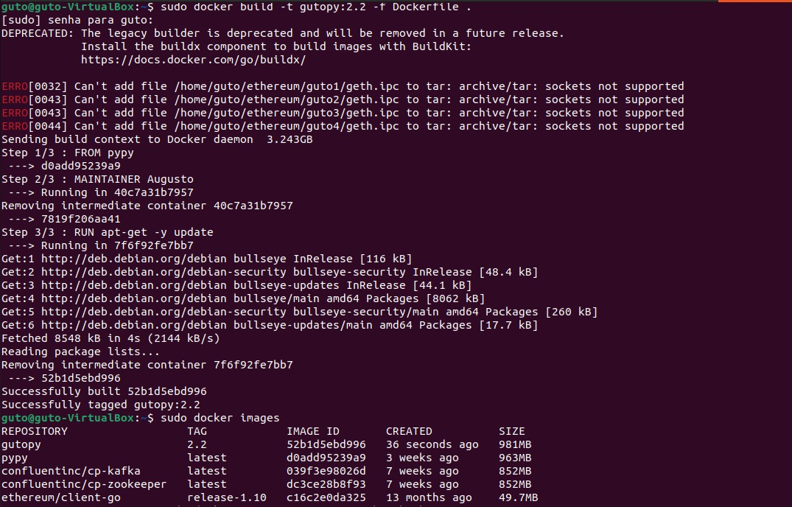
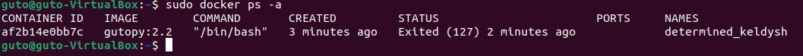
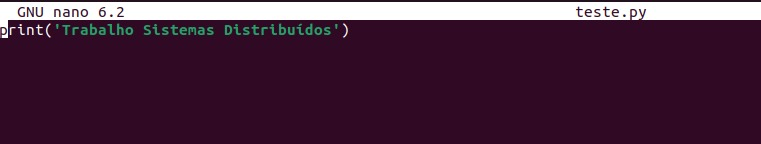

Aluno: Augusto Sisti
Serviço: pypy
# Docker

## Instalar o docker
```
$ sudo apt install docker
$ sudo apt install docker.io
$ sudo apt install docker-compose
```
## Docker Run

1 - Procurar a imagem do docker
```
$ sudo docker search [nome da imagem] 
$ sudo docker search pypy
```

2 - Baixar a imagem
```
$ sudo docker pull [imagem]
$ sudo docker pull pypy
```

3 - Criar um container ativo em backgroud
```
$ sudo docker run -it -d --name [nome] imagem   /bin/bash 
$ sudo docker run -it -d --name guto-pypy pypy   /bin/bash 
```

4 - Ver docker ativo
```
$ sudo docker ps -a
```

5 - Entrar em um container ativo e em backgroud
```
$ sudo docker attach CONTAINER_ID
$ sudo docker attach guto-pypy
```


## DockerFile

1 - Editar o arquivo Dockerfile
```
$ nano Dockerfile
```
FROM pypy

MAINTAINER guto

RUN apt-get -y update


2 - Criar a imagem com arquivo Dockerfile
```
$ sudo docker build -t <nome_da_minha_imagem:versao> <local a ser criado ponto "." é no local atual >
$ sudo docker build -t gutopy:2.2 -f Dockerfile .
```

3- Exibir imagens
```
$ sudo docker images
```

4- Executar um container a partir de uma imagem criada
```
$ sudo docker run -it gutopy:2.2  /bin/bash 
```

6- Exibir dockers
```
$ sudo docker ps -a
```

## Docker Compose

1- Criar pasta pro Docker Compose
```
$ mkdir docker-compose
```

2- Criar o arquivo com docker-compose.yaml
```
$ nano docker-compose.yaml
```

3- Editar o arquivo 

version: '2'
services:
    pypy:
        image: gutopy:2.2
        container_name: guto-py
        stdin_open: true
        tty: true

4- Executar o Docker
```
$ sudo docker-compose up
```


## Testando o Serviço
1- Criar arquivo teste.py
```
$ nano teste.py
```

2- Rodar o script
```
$ pypy teste.py
```
