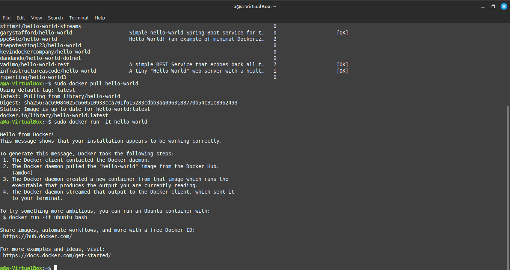
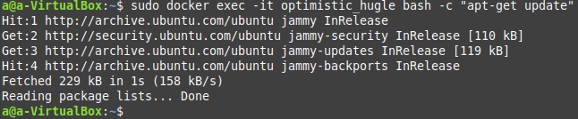

<<<<< INSTALAÇÃO NO HOST >>>>>
    
    Agora que a instalação do docker foi concluída; procuramos, baixamos e executamos a imagem que escolhemos:
    
    Procurar a imagem: sudo docker search hello-world.
    Baixar: sudo docker pull hello-world.
    Criar e executar o container: sudo docker run -it hello-world
    

<<<<< INSTALAÇÃO EM CONTAINER >>>>>
       
    Criar um arquivo com o nome de Dockerfile.
    Dentro do arquivo, colocar as instruções:
    
    No diretório onde está localizado o arquivo Dockerfile, executar: sudo docker build -t hello-world-a:1.0.0 -f Dockerfile .
    

<<<<< INSTALAÇÃO EM CONTAINER VIA COMPOSE >>>>>

    Criar um arquivo chamado docker-compose.yaml
    Dentro do arquivo docker-compose.yaml, colocar as instruções:
    
    Executar no diretório onde está o arquivo docker-compose.yaml: sudo docker-compose up -d.
    
    Executar um comando diretamente no container, sem acessá-lo: sudo docker exec -it optimistic_hugle bash -c "apt-get update".
    

