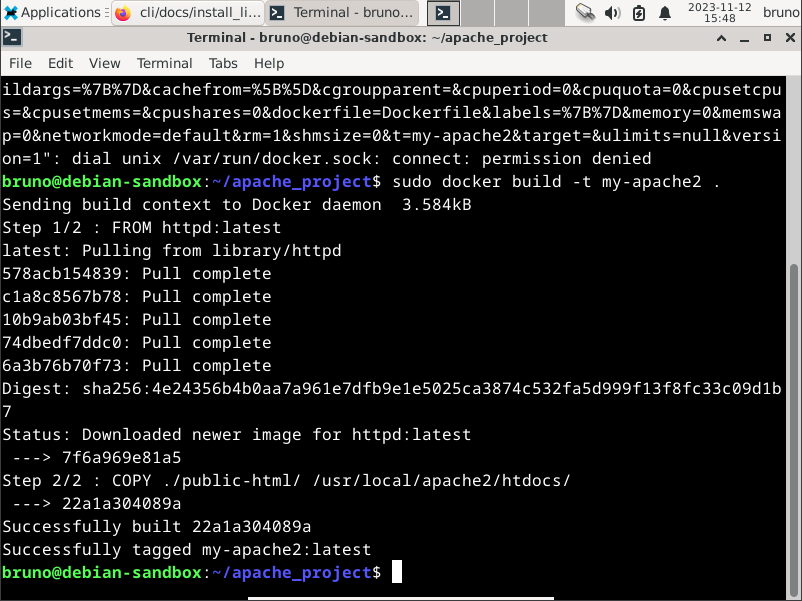

# Docker - Apache Server

## Instalação no Host
Instale o package do Apache Server:
```bash
$ sudo apt install apache2
```

Inicialize o serviço do servidor:
```bash
$ sudo systemctl start apache2
```

Abra o arquivo de configurações do servidor em um editor de texto:
```bash
$ sudo vim /etc/apache2/sites-available/000-default.conf
```

Localize a seguinte linha no arquivo:
```xml
<VirtualHost *:80>
```

Altere o port padrão de 80 para 8080 e salve o arquivo:
```xml
<VirtualHost *:8080>
```
> O port 8080 é um port alternativo ao port 80 para serviços HTTP, ele será utilizado para impedir possíveis conflitos com outros serviços usando o port 80.

Reinicie o serviço do servidor:
```bash
$ sudo systemctl restart apache2
```

Teste o servidor acessando: http://localhost:8080 
> O diretório padrão onde o  Apache Server busca o arquivo index.html é **/var/www/html**

## Instalação com Dockerfile
Crie um diretório raiz para o projeto e acesse-o:
```bash
$ mkdir apache_project
$ cd apache_project
```
> A partir de agora, todos os passos seguintes deverão ser feitos dentro desse diretório.
 
Crie um arquivo chamado **Dockerfile**:
```bash
$ touch Dockerfile
```

Através de um editor de texto, adicione o seguinte trecho ao arquivo Dockerfile:
```dockerfile
FROM httpd:latest
COPY ./public-html/ /usr/local/apache2/htdocs/
```

Crie um diretório para os arquivos HTML, ele deverá ter o nome igual ao especificado após o COPY no Dockerfile:
```bash
$ mkdir public-html
```
> Após o container ser iniciado, esse diretório será montado para dentro do container, no diretório /usr/local/apache2/htdocs/

Adicione um arquivo **index.html** dentro desse diretório:
```bash
$ touch public-html/index.html
```

Através de um editor de texto, adicione o seguinte trecho ao arquivo index.html:
```html
<html>
  <body>
	<h1>Hello, World!</h1>
  </body>
</html>
```

Compile a imagem do container:
```bash
$ docker build -t my-apache2 .
```

Execute o container:
```bash
$ docker run -dit --name my-running-app -p 8080:80 my-apache2
```

Teste o servidor acessando: http://localhost:8080 

## Instalação com Docker-Compose 
Crie um diretório raiz para o projeto e acesse-o:
```bash
$ mkdir apache_project
$ cd apache_project
```
> A partir de agora, todos os passos seguintes deverão ser feitos dentro desse diretório.
 
Crie um arquivo chamado **docker-compose.yml**:
```bash
$ touch docker-compose.yml
```

Através de um editor de texto, adicione o seguinte trecho ao arquivo docker-compose.yml:
```yml
version: '3'

services:
  apache:
    image: httpd:latest
    ports:
      - "8080:80"
    volumes:
      - ./public-html:/usr/local/apache2/htdocs/
```

Crie um diretório para os arquivos HTML, ele deverá ter o nome igual ao especificado em volumes, no docker-compose.yml:
```bash
$ mkdir public-html
```
> Durante a sua execução, esse diretório funcionará como uma interface entre o host e container, sendo montado ao diretório /usr/local/apache2/htdocs/

Adicione um arquivo **index.html** dentro desse diretório:
```bash
$ touch public-html/index.html
```

Através de um editor de texto, adicione o seguinte trecho ao arquivo index.html:
```html
<html>
  <body>
	<h1>Hello, World!</h1>
  </body>
</html>
```

Execute o container:
```bash
$ docker-compose up -d
```
> A flag -d executa o container em background.

Teste o servidor acessando: http://localhost:8080

## Testando o Servidor
- Executando o comando **docker run** sem Dockerfile nem docker-compose:


- Criando o container com **Dockerfile**:



- Criando o container com **docker-compose**:


- Checando o status do servidor e os últimos logs de acesso de fora do container, através do comando **docker exec**:


> Talvez seja necessário alterar algumas configurações do servidor para executar certos comandos!

