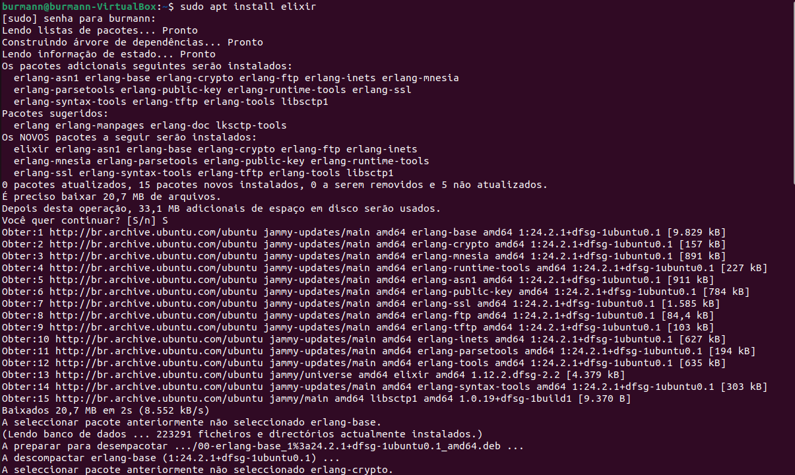
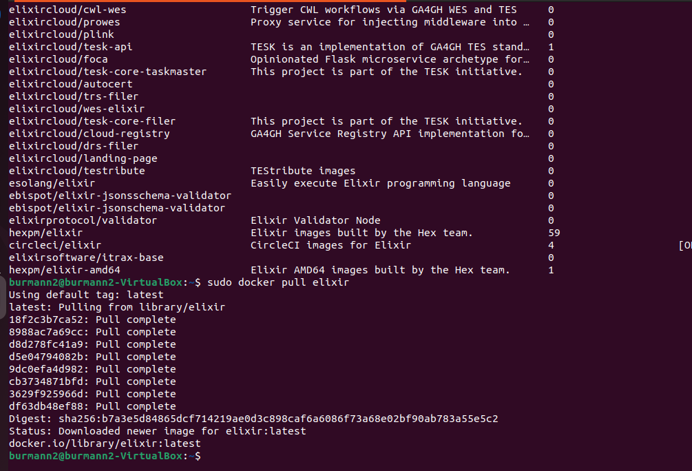
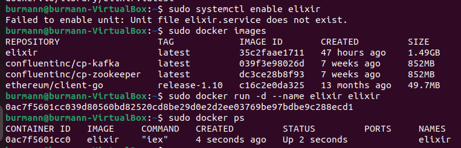
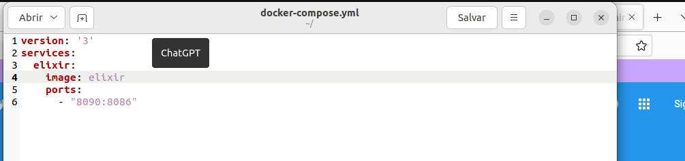
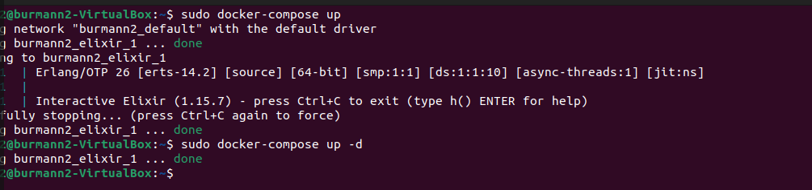

Gabriel Burmann

### Serviço utilizado:
```
https://hub.docker.com/_/elixir
```

### Instalação no Host
### Atualize os componentes:
```
sudo apt update
sudo apt install elixir
```

###Iniciar o serviço:

```
sudo service elixir start
```

### Instalação Docker

`sudo docker install docker.io`

`sudo docker search elixir`

`sudo docker pull elixir`



`sudo docker images`

`sudo docker run -d --name elixir elixir`

`sudo docker ps`



### Docker-compose

`sudo apt install docker-compose`

### Crie um arquivo chamado docker-compose.yml com o seguinte conteúdo:
```
version: '3'
services:
  elixir:
    image: elixir
    ports:
      - "8090:8086"
```

### Executar com Docker Compose
```
docker-compose up -d
```

