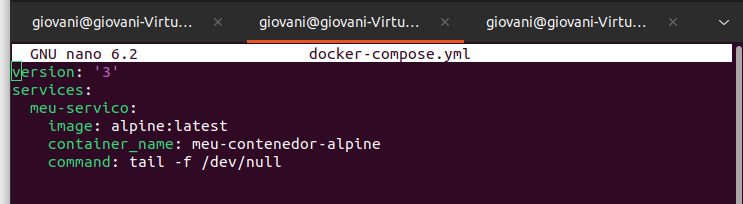

Instalar Alpine no Docker

Primeiramente: 

Instalar o Docker no Linux

apt-get install docker.io

Inice um servico docker com:

service docker start

Caso queira ver a versao do docker:
 
docker version

Ver as imagens disponiveis: docker images

</img>
Baixar a imagem do alpine: docker pull alpine 

Inicie o docker alpine: docker run -t alpine

</img>
use o comando "exit" para sair
 
Proximo passo:

Para criar um contêiner Docker Alpine usando o Docker Compose, você precisará criar um arquivo docker-compose.yml e definir as configurações necessárias.

Crie um arquivo docker-compose.yml
e escreva isso dentro dele:

Certifique-se de que o Docker e o Docker Compose estejam instalados em seu sistema.

Navegue até o diretório que contém o arquivo docker-compose.yml.

Execute o seguinte comando para criar e iniciar o contêiner:

docker-compose up -d

O uso do -d faz com que o Docker Compose execute em segundo plano.

</img>
Você pode verificar se o contêiner Alpine está em execução em segundo plano usando o seguinte comando:

docker ps
</img>

Criar um dockerfile:

Crie um diretório para o seu projeto

mkdir nome-do-seu-projeto
cd nome-do-seu-projeto

com o nano coloque essa informacao dentro do seu dockerfile:

salve o arquivo

Agora, você pode criar uma imagem Docker com base nesse Dockerfile. Certifique-se de estar no diretório onde o Dockerfile está localizado e execute o seguinte comando:

docker build -t meu-contenedor-alpine .

para verficar se a imagem foi criada use o comando

docker images

