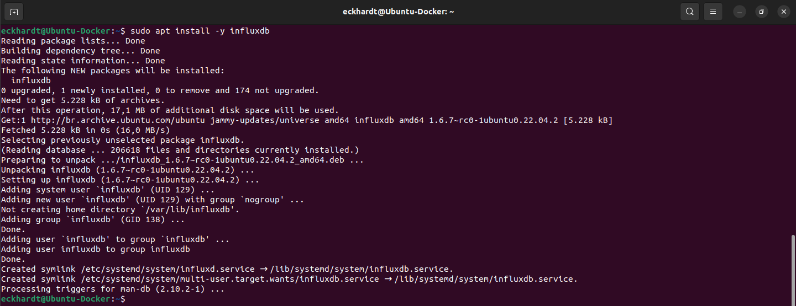
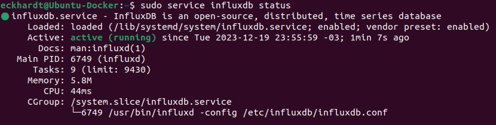
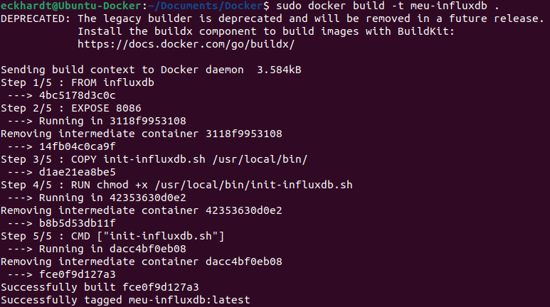
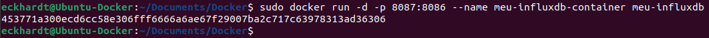
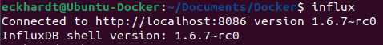
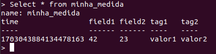
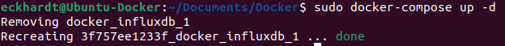

### Aluno: Guilherme Eckhardt

### Serviço utilizado:
```
https://hub.docker.com/_/influxdb
```

### Instalação no Host
### 1. Abra o terminal e adicione o repositório InfluxDB:
```
sudo apt update
sudo apt install -y wget
wget -qO- https://repos.influxdata.com/influxdb.key | sudo gpg --dearmor -o /usr/share/keyrings/influxdb-archive-keyring.gpg
echo "deb [signed-by=/usr/share/keyrings/influxdb-archive-keyring.gpg] https://repos.influxdata.com/ubuntu $(lsb_release -cs) stable" | sudo tee /etc/apt/sources.list.d/influxdb.list > /dev/null
```
### 2. Instalar o InfluxDB:
```
sudo apt update
sudo apt install -y influxdb
```

### 3. Iniciar o serviço:
```
sudo service influxdb start
```
### 4. Verificar se o serviço está em execução:
```
sudo service influxdb status
```


### Instalação via Dockerfile
### 1. Criar um arquivo "Dockerfile" e colocar o conteudo:
```
FROM influxdb

# Expor a porta padrão do InfluxDB
EXPOSE 8086

# Copiar o script de inicialização
COPY init-influxdb.sh /usr/local/bin/

# Tornar o script executável
RUN chmod +x /usr/local/bin/init-influxdb.sh

# Executar o script quando o contêiner for iniciado
CMD ["init-influxdb.sh"]
```
### 2. Crie um script chamado, por exemplo, init-influxdb.sh:
```
#!/bin/bash

# Esperar até que o serviço InfluxDB esteja disponível
until curl -G http://localhost:8086/ping 2>/dev/null; do
    echo "Aguardando o InfluxDB iniciar..."
    sleep 2
done

# Criar um banco de dados
influx -execute 'CREATE DATABASE meu_banco_de_dados'

# Usar o banco de dados criado
influx -database meu_banco_de_dados -execute '
    CREATE RETENTION POLICY "um_ano" ON "meu_banco_de_dados" DURATION 365d REPLICATION 1 DEFAULT
'

# Criar uma tabela
influx -database meu_banco_de_dados -execute '
    CREATE MEASUREMENT minha_medicao
'

# Inserir alguns dados de exemplo
influx -database meu_banco_de_dados -execute '
    INSERT minha_medicao,tag1=valor1,tag2=valor2 field1=42,field2=23
'
```
### 3. Torne o script executável:
```
chmod +x init-influxdb.sh
```
### 4. Reconstrua e execute o contêiner:
```
sudo docker build -t meu-influxdb .
sudo docker run -d -p 8087:8086 --name meu-influxdb-container meu-influxdb
```


### 5. Vamos fazer a visualização de Dados usando o Cliente InfluxDB no Terminal.
### 6. Instalar o Cliente InfluxDB:
```
sudo apt-get install influxdb-client
```
### 7. Conectar ao InfluxDB:
```
influx
```

### 8. Executar Consultas:
```
SHOW DATABASES
USE meu_banco_de_dados
SHOW MEASUREMENTS
SELECT * FROM minha_medicao
```


### Instalação via Docker Compose
### 1. Crie um arquivo chamado docker-compose.yml com o seguinte conteúdo:
```
version: '3'
services:
  influxdb:
    image: influxdb
    ports:
      - "8090:8086"
```
### 2. Executar com Docker Compose
```
docker-compose up -d
```

