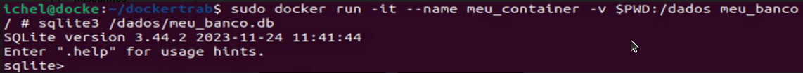

*Guilherme Peukert Michel*

## DOCKER  

- Comandos utilizados para iniciar os trabalhos :

`$ sudo apt install sqlite3`


`$ sudo apt install docker.io`


`$ sudo apt install docker-compose`

> Criação do diretório e entrando no mesmo : 

`$ mkdir docker`


`$ cd docker/`


- Dentro do diretório foi criado 3 arquivos, sendo um o "script.sql", "dcoker-compose.yml" e o Dockerfile: 

> Dentro do script.sql possui criado uma tabela com 4 colunas onde é designado um ID como primary key e demais sendo para informações sobre jogadores de CS :

```
 CREATE TABLE counterstrike (
	id INTEGER PRIMARY KEY,
	time TEXT,
	titulo INTEGER
	);
	
 INSERT INTO brasileirao (time, titulo) VALUES ('Internacional', 55), ('Gremio', 30);
```

> Dentro do Dockerfile é designado para criação de uma imagem na qual inclua tanto o SQLite quanto script com objetivo de startar o BD quando o container iniciar :

```
 FROM alpine:latest
 
 RUN apk --no-cache add sqlite
 
 COPY script.sql /docker-entrypoint-init.d/
```


> Dentro do docker-compose.yml é designado para configurações :

```
 version: '3'
 
 services:
  meu_container:
 	image: meu_banco:latest
 	volumes: 
 	- ./script.sql/docker-entrypoint-init.d/script.sql
 volumes:
  meu_volume: 
```

- Terminado de configurar os arquivos do diretório precisamos iniciar o serviço e começar buildar a imagem do Docker: 


`$ sudo docker-compose up`


`$ sudo docker build -t meu_banco:latest .`


- Com imagem buildada é preciso realizar a execução do container e copiar o script para dentro dele :


`$ sudo docker run -it --name meu_container -v $PWD:/dados meu_banco`


`$ sudo docker cp script.sql meu_container:/dados/script.sql`


- Feito os passos anteriores necessário entrar no console do SQLite e executar o script: 


`$ sudo docker exec -it meu_container sqlite3 /dados/meu_banco.db`

> Realizado um SELECT * FROM para exibir os dados

`$ SELECT * FROM`


- Criação container usando docker run :


- Criação container usando dockerfile :


- Criação container usando docker-compose :


- Execução do serviço fora container :


