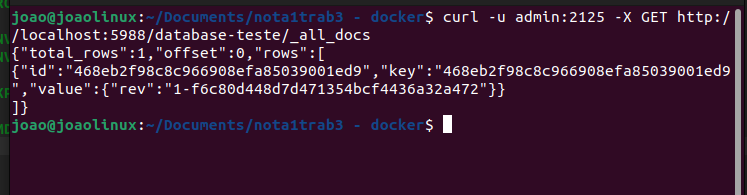

#### João Gabriel Foletto Schefer
### Apache CouchDB

##### Para fazer esse trabalho, foi escolhido o serviço Apache CouchDB, que é um serviço de banco de dados de código-aberto que pode ser usado via web.

### <<<<< INSTALAÇÃO NO HOST >>>>>
#### Instalação do serviço no computador sem docker

##### Primeiro temos que adicionar o repositório PPA do CouchDB:
	sudo add-apt-repository ppa:couchdb/stable

##### Depois temos que atualizar os repositórios:
	sudo apt update

##### Agora instale o CouchDB:
	sudo apt install couchdb

##### Durante a instalção, será pedido para configurar uma senha para o usuário admin.

##### Após a instalação, o CouchDb vai estar funcionando e para acessar o painel de controle dele, devemos abrir o navegador e colocar o seguinte link:
	http://localhost:5984/_utils/

### <<<<< INSTALAÇÃO EM CONTAINER >>>>>
#### Instalação do serviço em um container com Dockerfile           

##### Para fazer a instalação via conteiner é necessário instalar o Docker, que nessa máquina já está instalado.

##### Após feito isso, crie um documento com o nome Dockerfile e coloque o seguinte cnteúdo:

	FROM couchdb:latest

	ENV COUCHDB_USER=admin
	ENV COUCHDB_PASSWORD=2125

	EXPOSE 5988

	CMD ["couchdb"]
	
##### Após feito isso, você pode rodar o comando abaixo para construir a imagem:
	docker build -t my-couchdb .

##### Agora execute o conteiner:
	docker run -p 5988:5984 -d --name my-couchdb-container my-couchdb

##### Para acessar o CouchDB criado no conteiner, abra o navegador e coloque o seguinte link:
	curl http://localhost:5988/

##### (OBS: a porta que será usado no link vai depender da porta que você colocou no comando para iniciar o docker)

##### Criei a tabela

##### Listar os dados
	curl -u admin:2125 -X GET http://localhost:5988/database-teste/_all_docs

##### Listar informações de um banco
	curl -u admin:2125 -X GET http://localhost:5988/database-teste/468eb2f98c8c966908efa85039001ed9	

### <<<<< INSTALAÇÃO EM CONTAINER VIA COMPOSE >>>>>
#### Instalação do serviço em um container com Docker-compose           

##### Crie um arquivo docker-comopose.yml com o seguinte conteúdo:

	version: '3'

	services:
  	couchdb:
    	image: couchdb
    	container_name: my-couchdb-com
    	ports:
      	- "5990:5984"
    	environment:
      	COUCHDB_USER: joao
      	COUCHDB_PASSWORD: 2125
    volumes:
      	- couchdb_data:/opt/couchdb/data

volumes:
  couchdb_data:
  
##### Você deve substituir a porta, o conteiner_name, COUCHDB_USER e COUCHDB_PASSWORD.

##### Abra um terminal onde está esse arquivo

##### Execute o seguinte comando:
	docker-compose up -d

##### Agora acesse o seguinte link no navegador:
	http://localhost:5990/_utils

##### Login com as crdenciais definidas no arquivo docker-compose.yml

##### Painel do CouchDB

