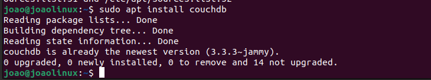

#### Instalação do serviço no computador sem docker

##### Primeiro temos que adicionar o repositório PPA do CouchDB:
- sudo add-apt-repository ppa:couchdb/stable

##### Depois temos que atualizar os repositórios:
- sudo apt update

##### Agora instale o CouchDB:
- sudo apt install couchdb

##### Durante a instalção, será pedido para configurar uma senha para o usuário admin.

##### Após a instalação, o CouchDb vai estar funcionando e para acessar o painel de controle dele, devemos abrir o navegador e colocar o seguinte link:
- http://localhost:5984/_utils/

