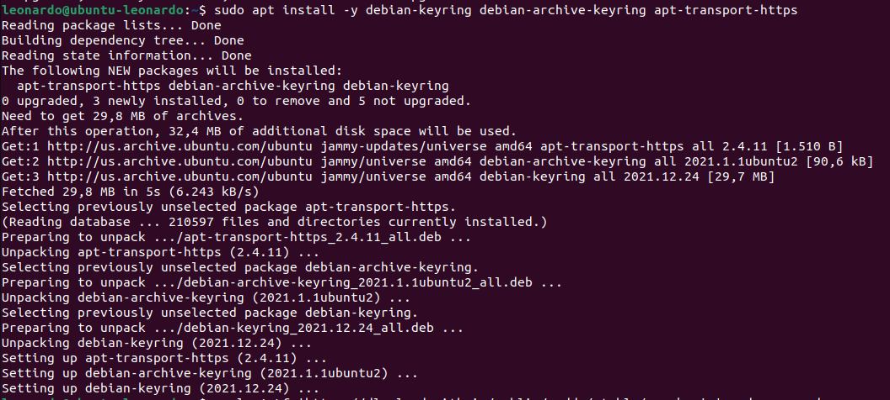
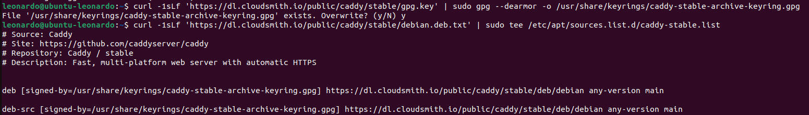
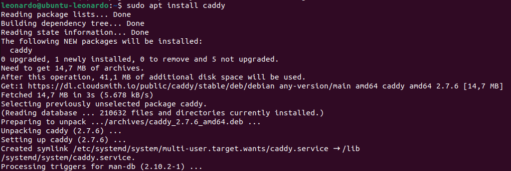
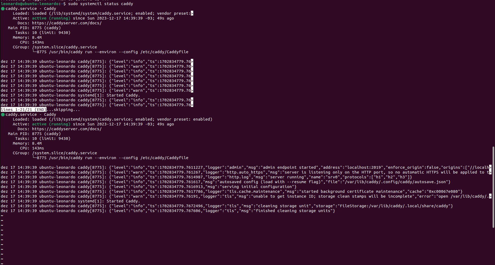
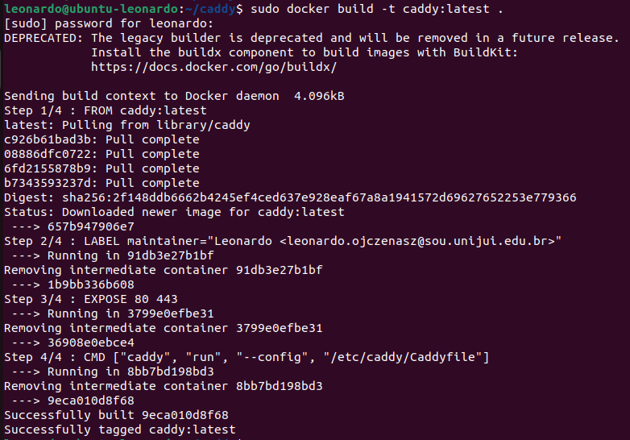
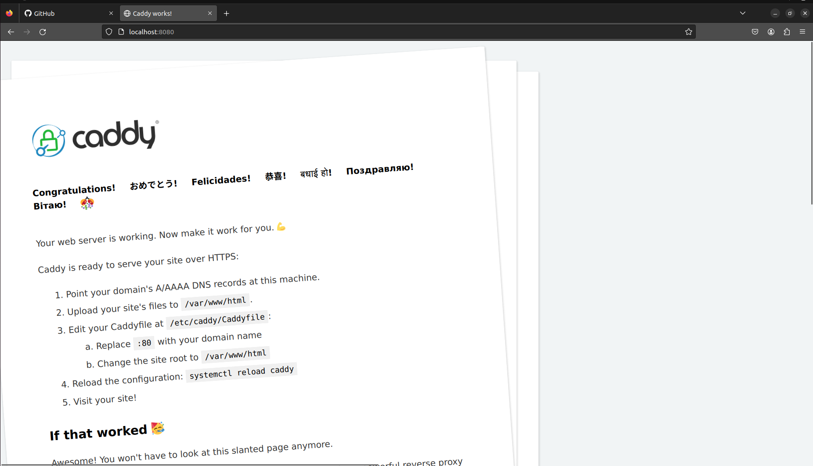
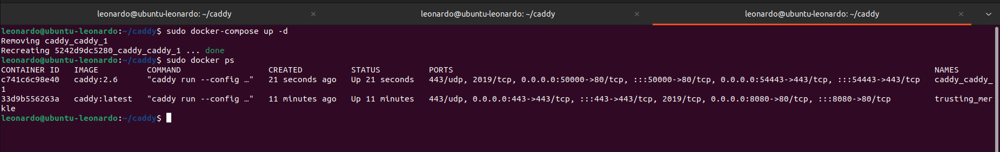
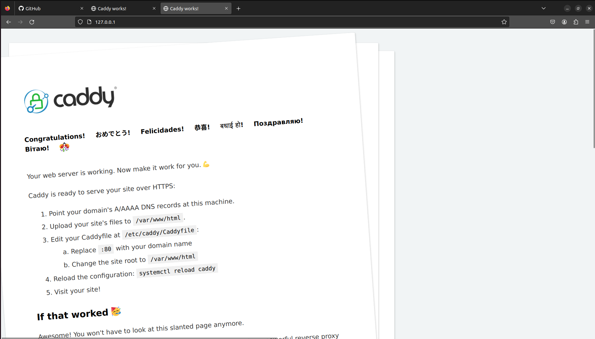

# Instalação do Caddy no Host

1. **Instale as dependências:**

    ```bash
    sudo apt install curl
    sudo apt install -y debian-keyring debian-archive-keyring apt-transport-https
    ```

2. **Adicione a chave GPG do repositório do Caddy e configure o repositório:**

    ```bash
    curl -1sLf 'https://dl.cloudsmith.io/public/caddy/stable/gpg.key' | sudo gpg --dearmor -o /usr/share/keyrings/caddy-stable-archive-keyring.gpg
    curl -1sLf 'https://dl.cloudsmith.io/public/caddy/stable/debian.deb.txt' | sudo tee /etc/apt/sources.list.d/caddy-stable.list
    ```

    
    

3. **Atualize e instale o Caddy:**

    ```bash
    sudo apt update
    sudo apt install caddy
    ```

    
    

# Instalação usando Dockerfile

1. **Crie um Dockerfile para o Caddy:**

    ```bash
    cd caddy/
    nano Dockerfile
    ```

2. **No Dockerfile, adicione o seguinte conteúdo:**

    ```yaml
    FROM caddy:latest

    LABEL maintainer="Leonardo <leonardo.ojczenasz@sou.unijui.edu.br>"

    # Exposicao da porta padrão do Caddy
    EXPOSE 80 443

    # Comando padrão para iniciar o servidor Caddy
    CMD ["caddy", "run", "--config", "/etc/caddy/Caddyfile"]
    ```

3. **Construa e execute o contêiner Docker do Caddy:**

    ```bash
    docker build -t caddy:latest .
    sudo docker run -p 8080:80 -p 443:443 caddy:latest
    ```

    
    
    

# Instalação usando docker-compose

1. **Crie um arquivo `docker-compose.yml`:**

    ```bash
    cd caddy/
    nano docker-compose.yml
    ```

2. **No arquivo `docker-compose.yml`, adicione o seguinte conteúdo:**

    ```yaml
    version: "3.7"

    services:

      caddy:
        image: caddy:2.6
        restart: unless-stopped
        ports:
          - "50000:80"
          - "54443:443"

        volumes:
          - ./Caddyfile:/etc/caddy/Caddyfile
          - ./site:/srv
          - caddy_data:/data
          - caddy_config:/config

    volumes:
      caddy_data:
      caddy_config:
    ```

3. **Execute os comandos docker-compose:**

    ```bash
    sudo docker-compose up -d
    sudo docker-compose ps
    sudo docker-compose down
    ```

    
    
