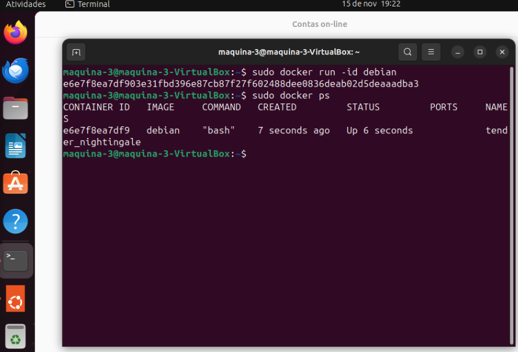

## Instalação do docker e imagem
Primeiramente foi criado 1 nova VM chamada maquina-3. Após a inicialização da máquina foi necessário instalar o docker para realizar os testes. Os seguintes comandos foram utilizados:

`sudo apt install docker`

`sudo apt install docker.io`

`sudo apt install docker-compose`

Após realizar a instalação do docker foi necessário realizar o download da imagem utilizada para testes. No  meu caso foi utilizado a imagem do debian (https://hub.docker.com/_/debian) . Para realizar o download da imagem foi utilizado o comando: 

`sudo docker pull debian`

## <<<<< INSTALAÇÃO NO HOST >>>>>
Após realizar o download da imagem basta subir o docker através do comando: 

`sudo docker run -id debian`

Obs:

As flags utilizadas são para:

`-i`: Manter o contêiner aberto mesmo se não estiver conectado.

`-d`: Executa o contêiner em segundo plano.

E após isso utilizei o comando sudo docker ps para verificar os containers em execução.

## <<<<< INSTALAÇÃO EM CONTAINER >>>>>
Para subir um container com um Dockerfile foi necessário primeiramente criar um arquivo chamado Dockerfile e alimentar o mesmo com as configurações que deseja.

Após criar o arquivo e configurar da maneira que deseja, basta executar o comando:

`sudo docker build -t teste:1 -f Dockerfile /home/maquina-3`

O comando vai construir a imagem que futuramente vai ser utilizada para subir um container normalmente.

Após realizar a build da imagem é utilizado o comando `sudo docker images` para visualizar as imagens que possui.

Para subir a imagem recém construída é utilizado o comando `sudo docker run -it teste:1`

Para visualizar o container que foi criado foi utilizado o comando `sudo docker ps`.

## <<<<< INSTALAÇÃO EM CONTAINER VIA COMPOSE >>>>>
Para instalar em container via compose é necessário primeiramente criar um arquivo nomeado docker-compose.yaml e definir as configurações que deseja para a imagem existente.

Após salvar foi utilizado o comando `docker-compose up -d` dentro da pasta que está o arquivo criado (flag -d é para rodar em segundo plano).

Para visualização do container criado é utilizado o comando sudo docker ps ou docker ps caso esteja com usuário root.

Para executar um comando de fora do container é necessário utilizar o comando sudo docker exec. No meu caso foi utilizado o comando `sudo docker exec -it docker-debian bash -c “apt-get update”` para realizar o update do debian que está sendo executado no container.

