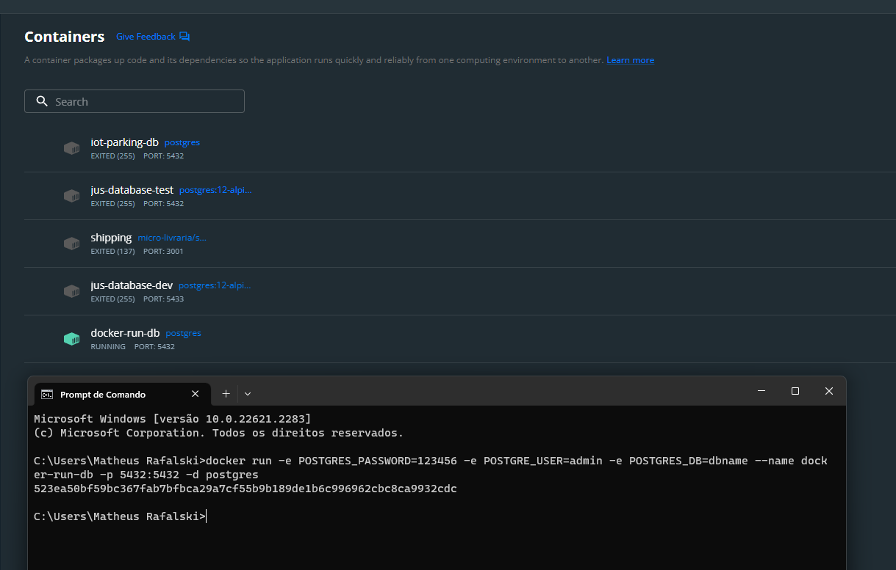
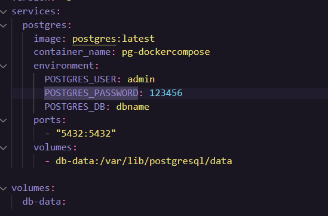
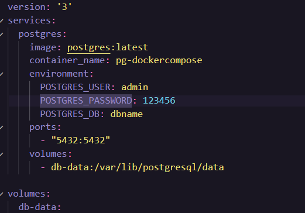
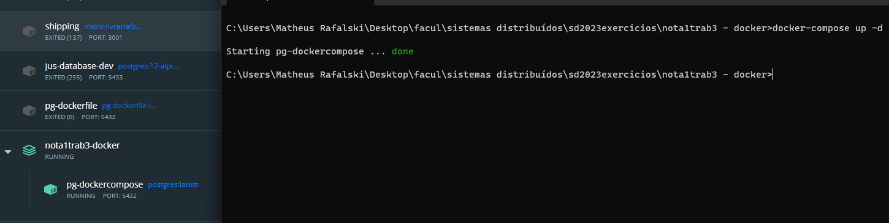
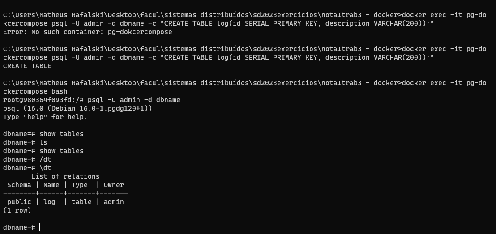

## INSTALAÇÃO NO HOST
```bash 
    docker run -e POSTGRES_PASSWORD=123456 --name {nome do container} -p 5432:5432 -d postgres
```
O comando vai buscar a imagem do postgres local, se não houver ele irá fazer o download automático.



## Instalação via Dockerfile
1. Crie um arquivo com o nome Dockerfile
2. Digite na primeira linha a partir de que imagem você quer rodar o container, neste caso **FROM postgre:latest**
3. Digite as variáveis a partir do comando **ENV**, para o banco demonstradas na página da imagem no docker hub, no caso do postgree seriam elas:
    * POSTGRES_PASSWORD: Senha do usuário
    * POSTGRES_USER: Nome do usuário
    * POSTGRES_DB: Nome do banco de dados
4. Por fim a porta para expor o banco de dados a conexões no nosso caso a porta padrão do postgree então ficaria **EXPOSE 5432**
5. Portanto nosso arquivo ficaria desta forma: 

    ![Rodando o container com Dockerfile]

## Instalação via Docker Compose
1. Crie um arquivo com o nome docker-compose.yml
2. Primeira linha seria a versão do docker compose instalado: **version: 3**,
3. A próxima linha são os serviços que serão instalados nosso caso ficaria como na imagem a seguir:

4. O arquivo final ficaria desta forma:





## Testando o serviço

    