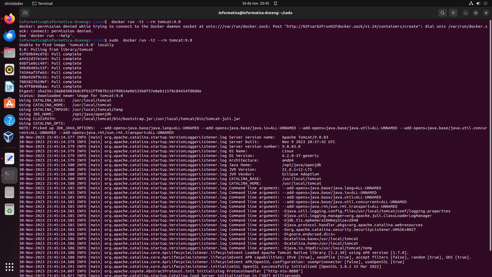
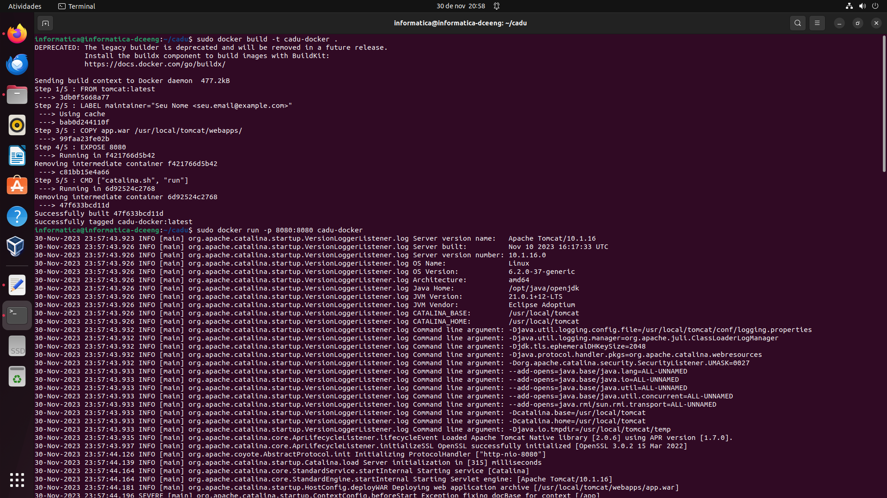
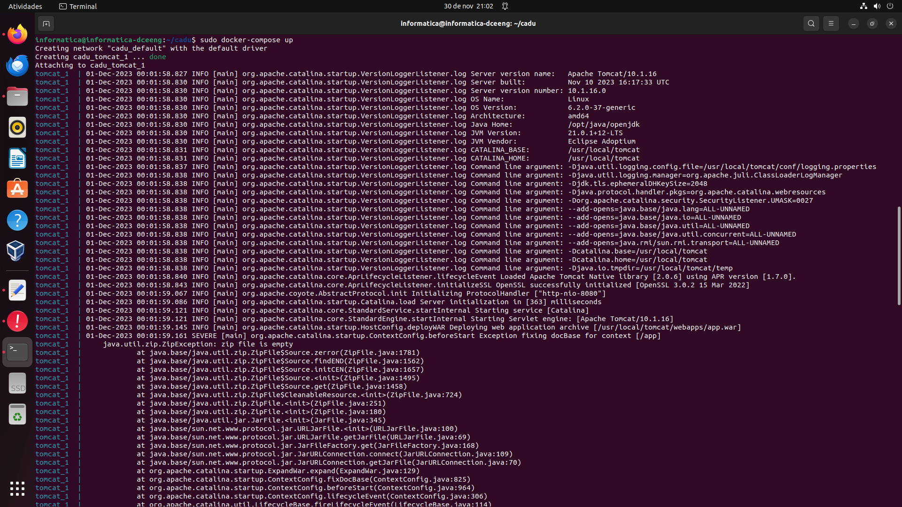
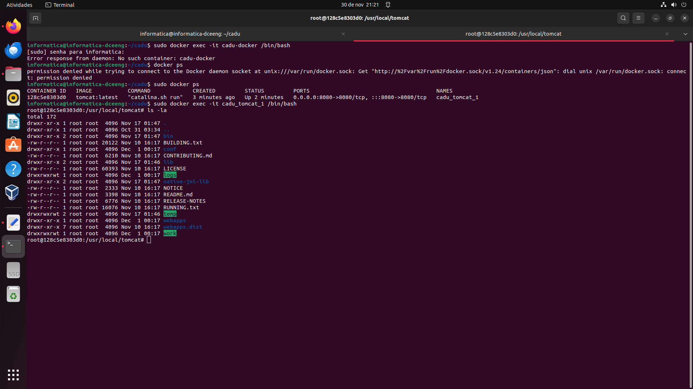

# Docker - Tomcat

## Instalação no Host

Instale o package do Tomcat:
```bash
$ sudo apt install tomcat9
```

Inicie o serviço do servidor:
```bash
sudo systemctl start tomcat9
```

Copie o arquivo sample.war para o diretório webapps do Tomcat:
```bash
$ sudo cp sample.war /var/lib/tomcat9/webapps/
```

Reinicie o serviço do servidor:
```bash
$ sudo systemctl restart tomcat9
```

Teste o servidor acessando: http://localhost:8080/sample 

## Instalação com Dockerfile

Compile a imagem do container:
```bash
$ docker build -t tomcat-server .
```

Execute o container:
```bash
$ docker run -dit --name sample-tomcat -p 8080:8080 tomcat-server
```

Teste o servidor acessando: http://localhost:8080/sample 

## Instalação com Docker-Compose 

Execute o container:
```bash
$ docker-compose up
```

Teste o servidor acessando: http://localhost:8080/sample 

## Testando o Servidor
- Executando o comando **docker run** sem Dockerfile nem docker-compose:


- Criando o container com **Dockerfile**:


- Criando o container com **docker-compose**:


- Acessando o terminal de fora do container através do comando **docker exec**:


