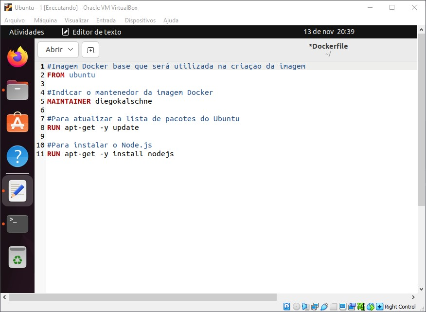
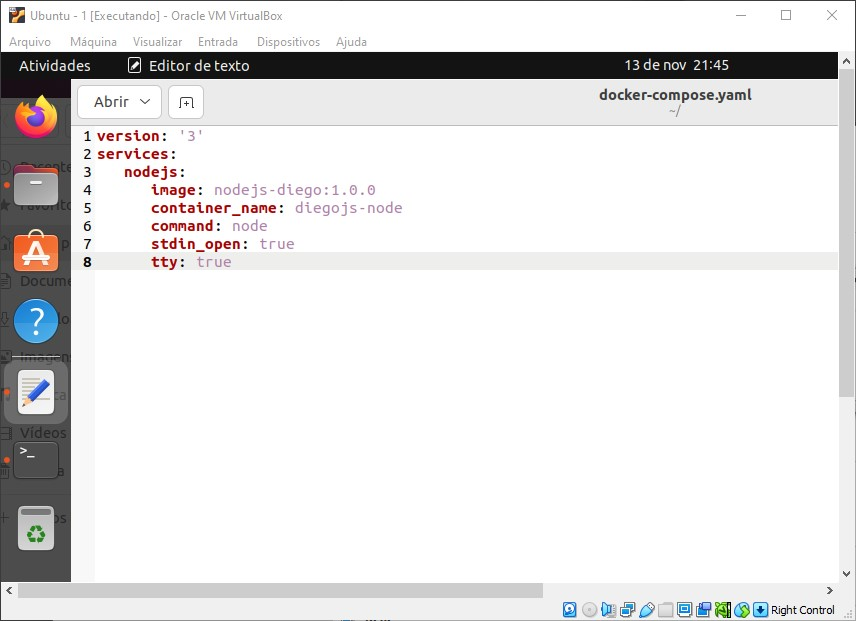

# Docker
Serviço escolhido: Node.js

# Instalação no Host - Ubuntu
1. Atualizar as dependências e repositórios (lista de pacotes) do Ubuntu: `sudo apt update`
2. Instalar o Docker com: `sudo apt install docker`
3. Instalação do Docker.io com: `sudo apt install docker.io`
4. Instalação do Docker Compose com: `sudo apt install docker-compose`

# Instalação do container via Docker run
1. Procurar uma imagem com: `sudo docker search [NOME_IMAGEM]`.
2. Baixar a imagem desejada utilizando: `sudo docker pull [NOME_IMAGEM]`. No meu caso, foi `sudo docker pull node`
3. Criar e executar o container diretamente com: `sudo docker run -it [NOME_IMAGEM] /bin/bash`. No meu caso. foi: `sudo docker run -it node /bin/bash`


# Instalação em container via Dockerfile
1. Criar um arquivo com o nome de `Dockerfile`. Importante ter apenas um arquivo Dockerfile por diretório
2. Dentro do arquivo Dockerfile, colocar as instruções para criação da imagem Docker:
```
#Imagem Docker base que será utilizada na criação da imagem
FROM ubuntu

#Indicar o mantenedor da imagem Docker
MAINTAINER diegokalschne

#Para atualizar a lista de pacotes do Ubuntu
RUN apt-get -y update

#Para instalar o Node.js
RUN apt-get -y install nodejs
``` 


3. No diretório onde está localizado o arquivo Dockerfile, executar: `sudo docker build -t [NOME_IMAGEM]:[VERSAO] -f Dockerfile [DIRETORIO_PARA_SALVAR]`. No meu caso, foi: `sudo docker build -t nodejs-diego:1.0.0 -f Dockerfile .`


4. O container pode ser agora executado normalmente utilizando docker run, por exemplo


# Instalação em container via Docker-Compose
1. Criar um arquivo chamado `docker-compose.yaml`
2. Dentro do arquivo docker-compose.yaml, informar as instruções necessárias para criação do container:
```
version: '3'
services:
    nodejs:
        image: nodejs-diego:1.0.0
        container_name: diegojs-node
        command: node
        stdin_open: true
        tty: true
```


> Os argumentos `stdin_open` e `tty` servem para deixar o container sempre ativo
3. Executar no diretório onde está o arquivo docker-compose.yaml: `sudo docker-compose -d`. A flag "-d" servirá para rodar o comando em background.


4. `sudo docker ps` para verificar os containers rodando
5. Executar um comando diretamente no container, sem acessá-lo: `sudo docker exect -it diegojs-node node -e "console.log(1+1)"`
