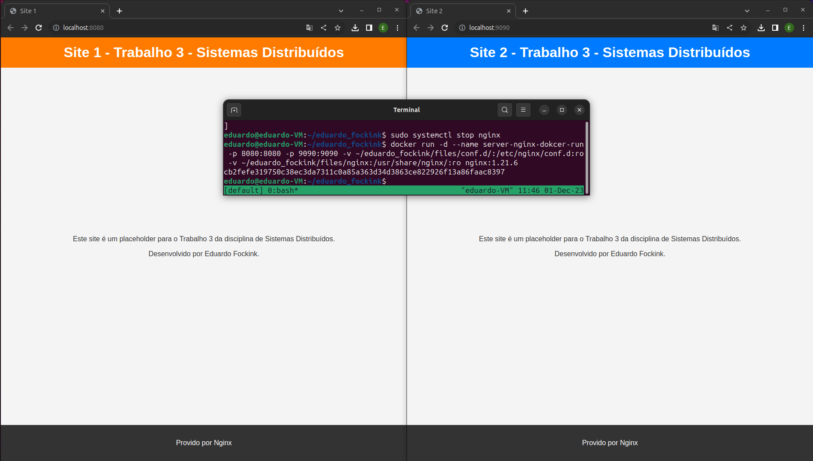
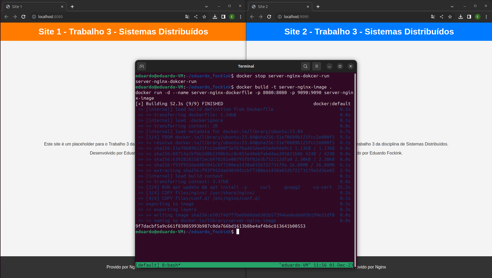
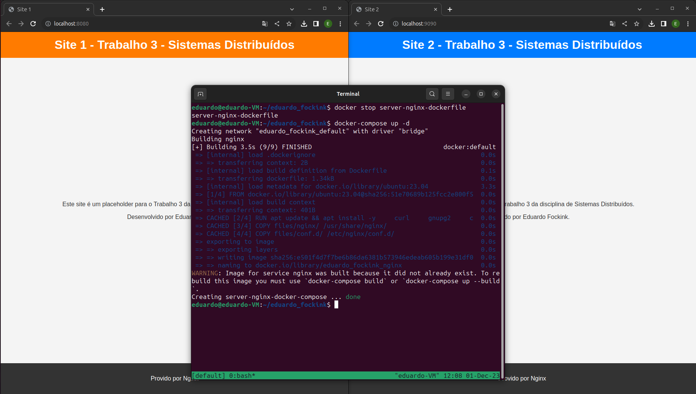
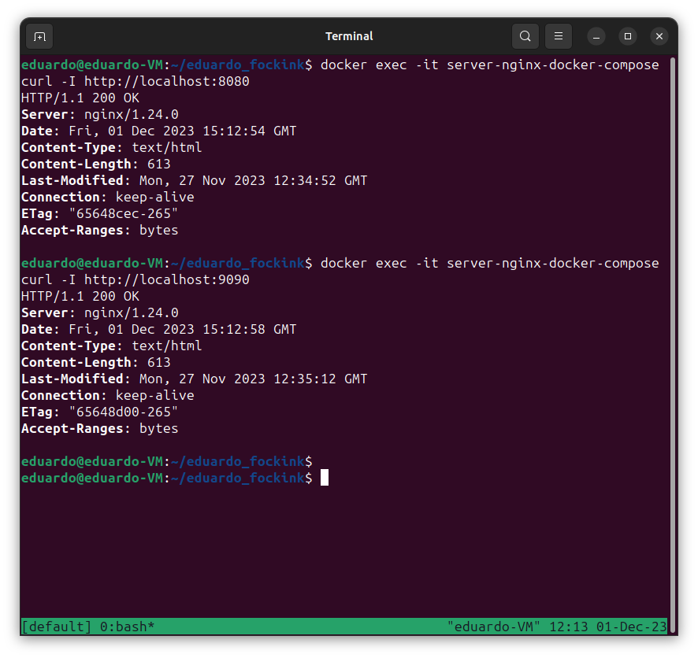

# README.md

## Eduardo Fockink Silva - Trabalho 3 Nota 1 - Dezembro / 23

Este documento detalha a instalação e configuração do Nginx em diferentes ambientes: host, contêiner Docker e Docker Compose em um sistema Ubuntu.

**Sumário:**

1. Instalação no Host
2. Instalação em Contêiner
3. Instalação com Dockerfile
4. Instalação com Docker Compose
5. Testando o Serviço

## 1. Instalação no Host

Para detalhes sobre a instalação do Nginx, Docker e Docker Compose no host, consulte [instalacao.md](instalacao.md).

## 2. Instalação em Contêiner

### Adquirindo imagem

1. **Pesquise pela imagem**

    ```bash
    docker search nginx
    ```

2. **Baixe e verifique a imagem**

    ```bash
    docker pull nginx:1.21.6
    docker images
    docker image inspect IMAGE_ID   # Subustitua o IMAGE_ID
    ```

### Cirando o contêiner

1. **Pare o seviço do Nginx**

    Antes de iniciar o contêiner, pare o serviço Nginx no host para evitar conflitos de porta:

    ```bash
    sudo systemctl stop nginx
    ```

    - Verifique se os sites estão offline:

        [Link Site 1](http://localhost:8080/)

        [Link Site 2](http://localhost:9090/)


2. **Inicie o contêiner**

    ```bash
    docker run -d --name server-nginx-docker-run -p 8080:8080 -p 9090:9090 -v ~/eduardo_fockink/files/conf.d/:/etc/nginx/conf.d:ro -v ~/eduardo_fockink/files/nginx:/usr/share/nginx/:ro nginx:1.21.6
    ```

    - Verifique se os sites estão online:

        [Link Site 1](http://localhost:8080/)

        [Link Site 2](http://localhost:9090/)

**Print 1 do contêiner criado com docker run**


## 3. Instalação com Dockerfile

Para a criação do Dockerfile, foi utilizada a imagem base do Ubuntu com a instalação manual do Nginx.

[Documentação do Dockerfile](https://docs.docker.com/engine/reference/builder/)

- [Arquivo Dockerfile](./Dockerfile)

### Execução

1. **Pare o contêiner docker run:** 

    ```bash
    docker stop server-nginx-docker-run
    ```
    - Verifique se os sites estão offline:

        [Link Site 1](http://localhost:8080/)

        [Link Site 2](http://localhost:9090/)

2. **Execute o Dockerfile:**

    ```bash
    docker build -t server-nginx-image .
    docker run -d --name server-nginx-dockerfile -p 8080:8080 -p 9090:9090 server-nginx-image
    ```
    - Verifique se os sites estão online:

        [Link Site 1](http://localhost:8080/)

        [Link Site 2](http://localhost:9090/)

    - Caso precise faz attach no contêiner use:
    
        ```bash
        docker exec -it server-nginx-dockerfile /bin/bash
        ```
**Print 2 do contêiner criado via Dockerfile**


## 4. Instalação com Docker Compose

- [Documentação docker-compose](https://docs.docker.com/compose/)
- [Arquivo docker-compose](./Docker-compose.yml)

### Execução

1. **Pare o contêiner docker Dockerfile:** 

    ```bash
    docker stop server-nginx-dockerfile
    ```
    - Verifique se os sites estão offline:

        [Link Site 1](http://localhost:8080/)

        [Link Site 2](http://localhost:9090/)

2. **Execute o docker-compose:**

    ```bash
    docker-compose up -d
    ```
    - Verifique se os sites estão online:

        [Link Site 1](http://localhost:8080/)

        [Link Site 2](http://localhost:9090/)

**Print 3 do contêiner criado via compose**



## 5. Testando o Serviço

1. **Testando contêiner com exec:**

    ```bash
    docker exec -it server-nginx-docker-compose curl -I http://localhost:8080
    docker exec -it server-nginx-docker-compose curl -I http://localhost:9090
    ```
**Print 4 testando serviço de fora do contêiner**

