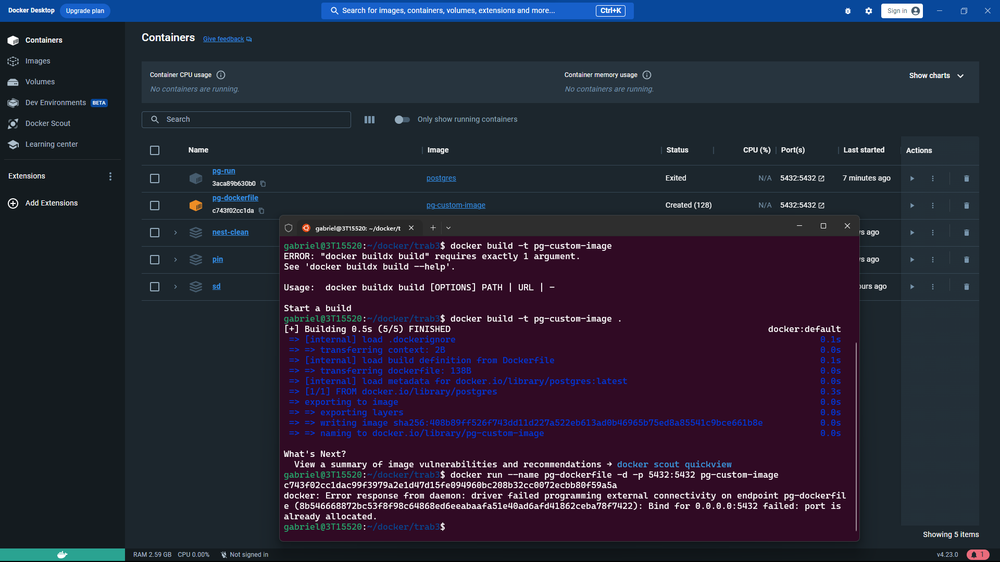
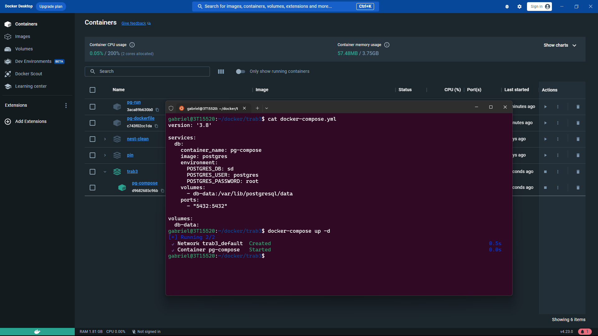
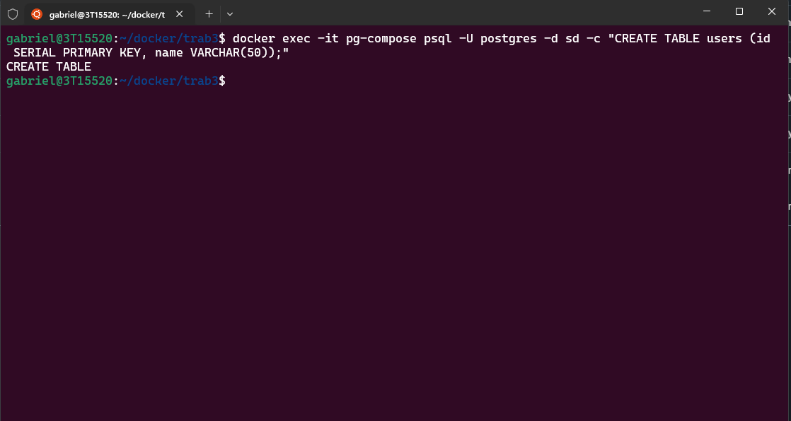
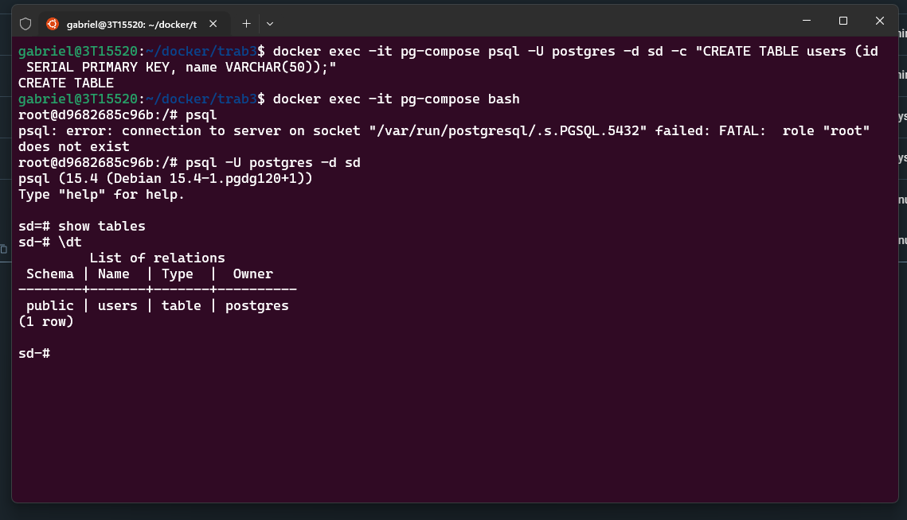

## <<<<< INSTALAÇÃO NO HOST >>>>>
### arquivo instalacao.md  

## <<<<< INSTALAÇÃO EM CONTAINER >>>>>
### arquivo Dockerfile

## <<<<< INSTALAÇÃO EM CONTAINER VIA COMPOSE >>>>>

### arquivo docker-compose.yml!

### Criado uma tabela sem entrar no container através do comando Docker exec

