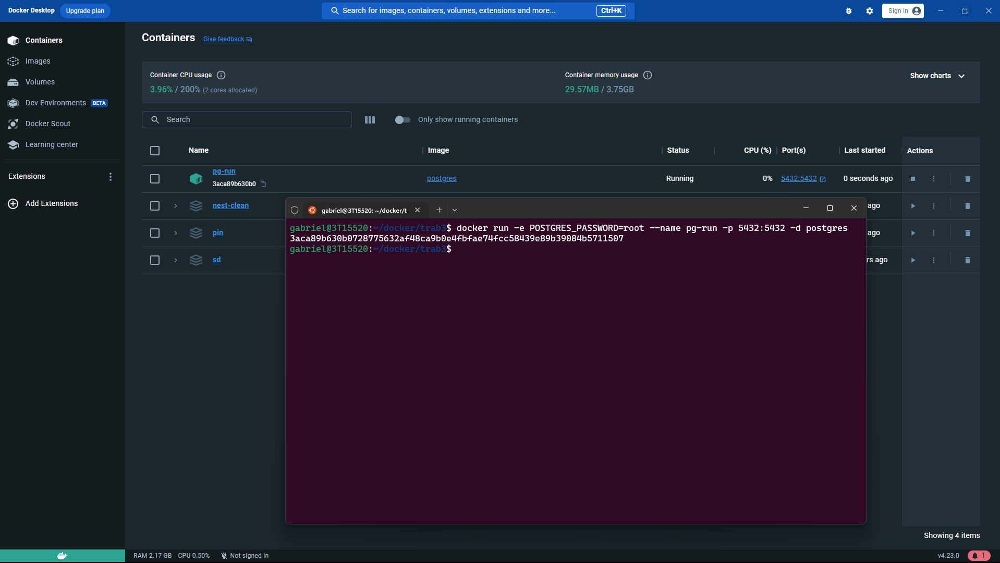

### Para criar um container com o Postgres, basta executar o comando

```bash
docker run -e POSTGRES_PASSWORD=root --name {nome do container} -p 5432:5432 -d postgres
```

Caso a imagem não esteja baixada, o docker irá fazer o pull da imagem do postgres

