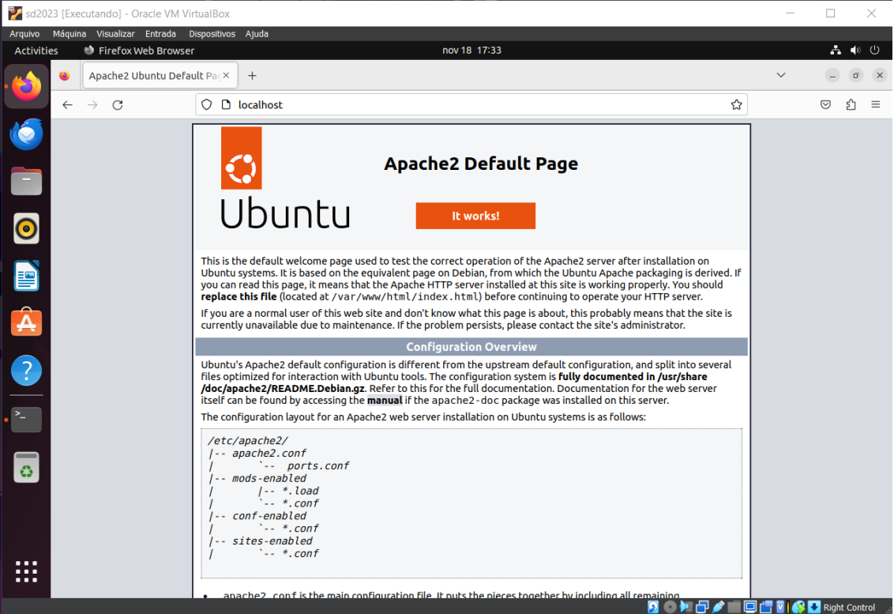
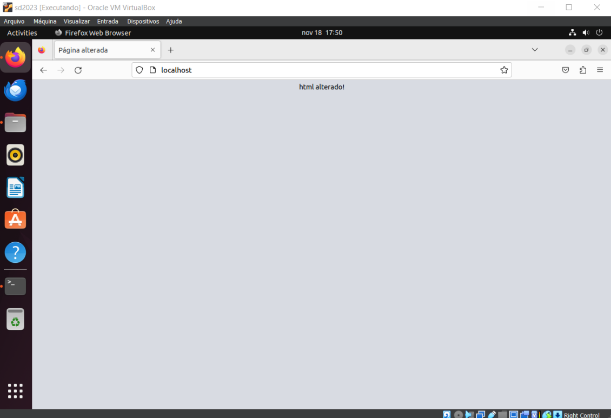
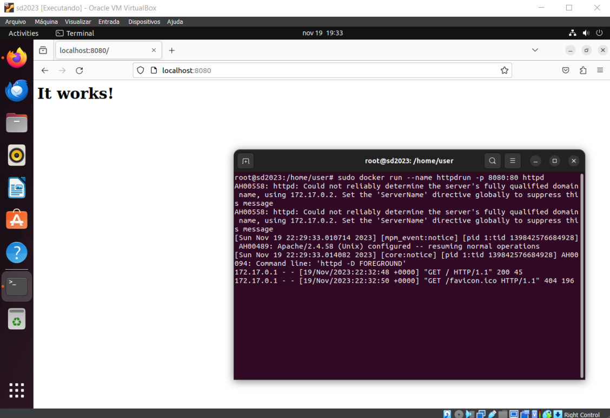
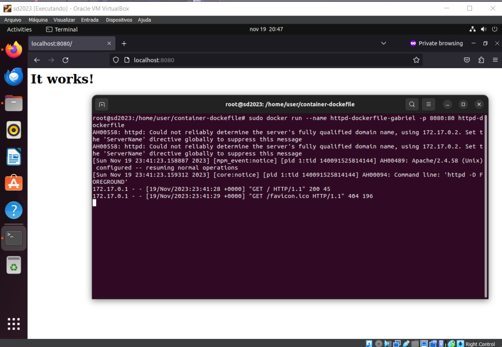
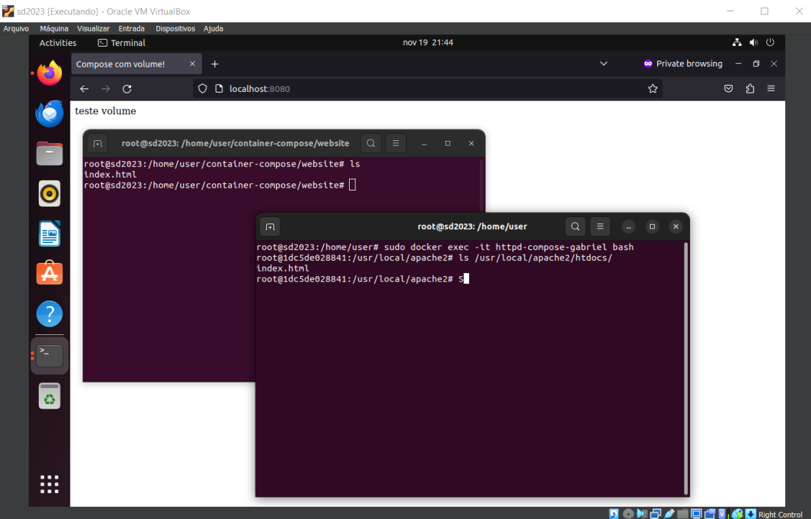

# Serviço escolhido:
apache http server (httpd - https://hub.docker.com/_/httpd)


# Instalação no host:
para instalar o serviço no host:
```
sudo apt install apache2
```
para checar se está ativo
```
sudo systemctl status apache2
```
para parar o servidor
```
sudo systemctl stop apache2
```
para iniciar o servidor quando ele estiver parado
```
sudo systemctl start apache2
```
para reiniciar o servidor
```
sudo systemctl restart apache2
```
para recarregar o servidor (utilizado normalmente após alterar configurações)
```
sudo systemctl reload apache2
```
por padrão, o servidor será iniciado junto com o sistema. Para desabilitar
```
sudo systemctl disable apache2
```
para reativar o serviço de inicialização no boot
```
sudo systemctl enable apache2
```
O conteúdo padrão do serviço está apresentado no print 1, o conteúdo editado no print 2.Para alterar o conteúdo mostrado, é necessário editar o conteúdo do arquivo index.html que está no caminho /var/www/html/

### print 1


### print 2


# Instalação em conteiner:
Instalar o docker:
```
sudo apt install docker
sudo apt install docker.io
```

## Usando docker run:
para baixar a imagem a ser utilizada:
```
sudo docker pull httpd
```
para criar um contêiner utilizando a imagem (nesse caso, também está sendo passado como parâmetro um nome para o contêiner e também está conectado a porta 80 do contêiner com a 8080 do host):
```
sudo docker run --name httpdrun -p 8080:80 httpd
```
### Print em execução:


## Usando dockerfile:
criar uma pasta que vai conter o Dockerfile
```
mkdir container-dockerfile
```
para criar o Dockerfile
```
nano Dockerfile
```
escrever dentro do Dockerfile
```
FROM httpd

MAINTAINER gabriel
```
para construir a imagem do docker
```
sudo docker build -t httpd-dockerfile .
```
para criar um container utilizando essa imagem (novamente sendo passado como parâmetro um nome para o contêiner e também está conectado a porta 80 do contêiner com a 8080 do host)
```
sudo docker run –name httpd-dockerfile-gabriel -p 8080:80 httpd-dockerfile
```

### Print em execução:



# Instalação com docker-compose:
para instalar o docker compose
```
sudo apt install docker-compose
```

para criar uma pasta separada onde ficará o docker compose
```
mkdir docker-compose
```

criar o arquivo docker-compose.yml
```
nano docker-compose.yml
```

escrever dentro do arquivo
```
version: '2.4'
services:
    apache:
   		image: httpd:latest
   		container_name: httpd-compose-gabriel
    	ports:
    	- '8080:80'
    	volumes:
    	- ./website:/usr/local/apache2/htdocs/

```
para rodar o docker com o docker-compose.yml (em background)
```
sudo docker-compose up -d
```

criar um arquivo html para testar volumes
```
nano website/index. html
```

nele escrever
```
<html><title>Compose com volume!</title>teste volume</html>
```

acessar página no navegador para validar alteração (localhost:8080)

entrar na linha de comando do docker
```
sudo docker exec -it httpd-compose-gabriel bash
```
validar presença do arquivo no volume compartilhado
```
ls  /usr/local/apache2/htdocs/
```

### Print em execução com alteração:
