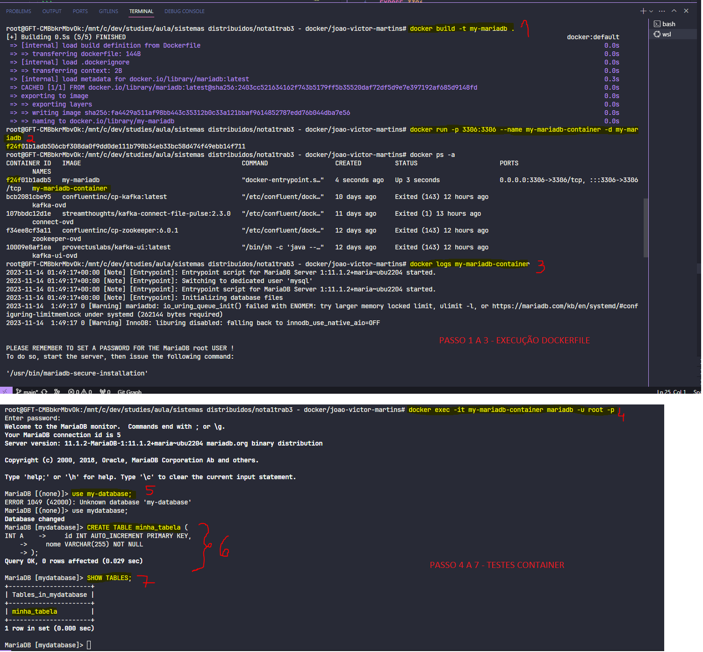
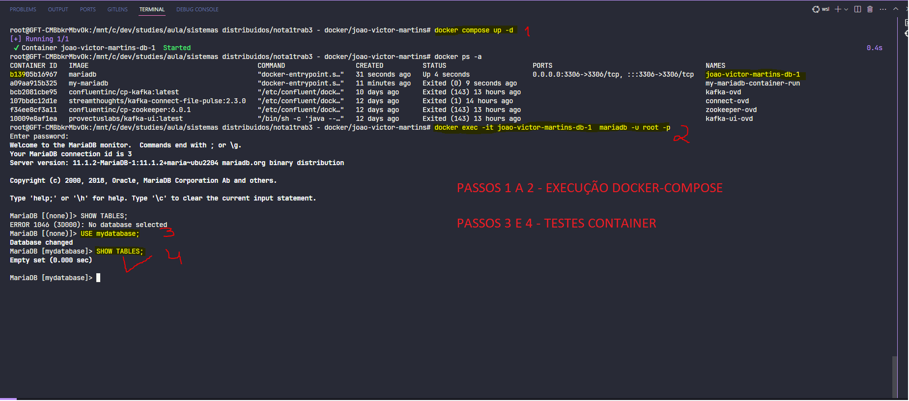

## Instalação do MariaDB no Host

### Para sistemas baseados em Debian/Ubuntu:
1. Atualize o índice do pacote: `sudo apt update`
2. Instale o MariaDB: `sudo apt install mariadb-server`
3. Após a instalação, execute o script de segurança: `sudo mysql_secure_installation`
4. Inicie o serviço do MariaDB: `sudo systemctl start mariadb`
5. Habilite o MariaDB para iniciar na inicialização do sistema: `sudo systemctl enable mariadb`

## Instalação com Dockerfile

### Instalação do Docker

### Docker
- Baixe e instale o Docker seguindo as instruções em https://docs.docker.com/get-docker/

### Passos:
1. Crie um arquivo `Dockerfile` com o conteúdo abaixo:
   ```Dockerfile
   FROM mariadb:latest
   ENV MYSQL_ROOT_PASSWORD=my-secret-pw
   ENV MYSQL_DATABASE=mydatabase
   EXPOSE 3306

### Execução
- Construa a imagem com `docker build -t my-mariadb .`
- Rode o container com `docker run -p --name my-mariadb-container -d my-mariadb`
- Execute o comando `docker ps -a` para visualizar se o container foi criado. Se o container estiver com o status `up` então você pode prosseguir com o passo abaixo
- Execute `docker exec -it my-mariadb-container mariadb -u root -p`
- Preencha a senha, no nosso caso escolhemos como senha: `my-secret-pw`
- Pronto! Se a senha foi informada corretamente, você irá se conectar



## Instalação com Docker-Compose

### Docker-Compose
- Baixe e instale o Docker-Compose seguindo as instruções em https://docs.docker.com/compose/install/


### Passos:
1. Crie um arquivo `docker-compose.yml` com o conteúdo abaixo. Não se esqueça que a **IDENTAÇÃO É MUITO IMPORTANTE NESSE PROCESSO!**:
   ```yaml
    version: '3.1'
      services:
        db:
          image: mariadb
          restart: always
          environment:
            MYSQL_ROOT_PASSWORD: my-secret-pw
            MYSQL_DATABASE: mydatabase
          ports:
            - "3306:3306"

### Execução
- Execute `docker compose up -d` para iniciar o serviço em segundo plano (modo detached) 
- Em sequência verifique se o container foi criado com sucesso `docker ps -a`. Se foi, siga com o passo abaixo
- Execute `docker exec -it 'nome-do-container' mariadb -u root -p`
- Preencha a senha, no nosso caso escolhemos como senha: `my-secret-pw`
- Pronto! Se a senha foi informada corretamente, você irá se conectar


