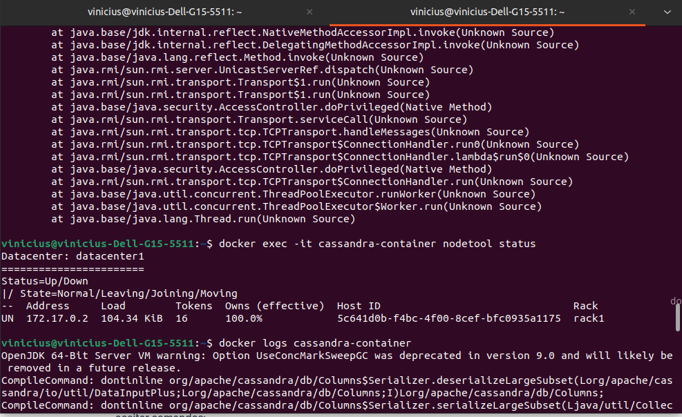
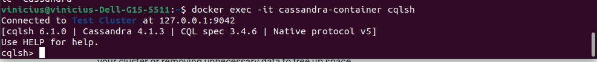
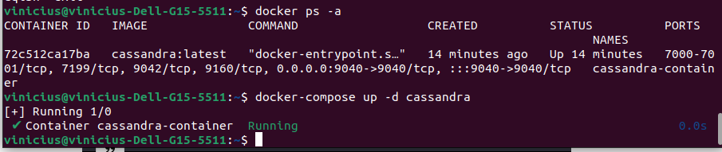
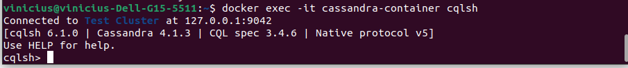

### 1.Instalar o Apache Cassandra em um host com sistema baseado em Debian/Ubuntu

##### -> Atualize o índice do pacote: sudo apt update
##### -> Instale o Apache Cassandra: sudo apt install cassandra
##### -> Verifique o status do serviço: sudo systemctl status cassandra
##### -> Para interagir com o Cassandra: cqlsh

### 2.Instalação com Dockerfile

Instalação do Docker
##### -> sudo apt update
##### -> sudo apt install docker.io

Crie um arquivo Dockerfile com o conteúdo abaixo:
	
	# Use a imagem oficial do Cassandra
	FROM cassandra:latest

	# Exponha a porta padrão do Cassandra
	EXPOSE 9042

##### -> Construir a imagem Docker: docker build -t cassandra-docker.

##### -> Executar o contêiner Docker: docker run -p 9042:9042 --name cassandra-container -d cassandra-docker

##### -> Verificar o status do contêiner: docker ps

### 3.Instalação com Docker-Compose

##### -> Baixe a versão mais recente do Docker Compose: sudo curl -L "https://github.com/docker/compose/releases/latest/download/docker-compose-$(uname -s)-$(uname -m)" -o /usr/local/bin/docker-compose

##### -> Torne o binário executável: sudo chmod +x /usr/local/bin/docker-compose

Criação do arquivo docker-compose.yml com o conteúdo abaixo:

	version: '3'

	services:
	  cassandra:
	    image: cassandra:latest
	    container_name: cassandra-container
	    ports:
	      - "9040:9040"
	    environment:
	      - MAX_HEAP_SIZE=2G
	      - HEAP_NEWSIZE=1G
	    volumes:
	      - /path/to/local/data:/var/lib/cassandra
	      
##### -> Execução do Docker Compose: docker-compose up -d
##### -> Verifique se o container foi criado com sucesso: docker ps -a

