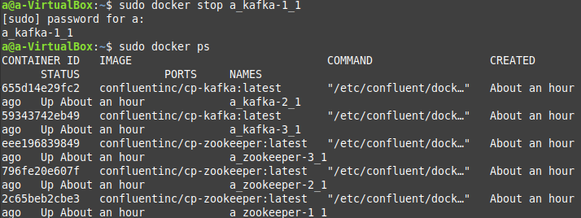
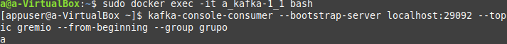
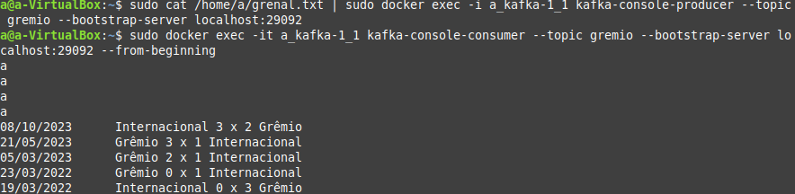

# Aldrei

Instalar serviços do docker: 
`sudo apt install docker-compose`

Criar documento "docker-composer.yml" com as seguintes informações:

```markdown
version: '2'
services:
zookeeper-1:
    image: confluentinc/cp-zookeeper:latest
    environment:
    ZOOKEEPER_SERVER_ID: 1
    ZOOKEEPER_CLIENT_PORT: 22181
    ZOOKEEPER_TICK_TIME: 2000
    ZOOKEEPER_INIT_LIMIT: 5
    ZOOKEEPER_SYNC_LIMIT: 2
    ZOOKEEPER_SERVERS: localhost:22888:23888;localhost:32888:33888;localhost:42888:43888
    network_mode: host
    extra_hosts:
    - "moby:127.0.0.1"

zookeeper-2:
    image: confluentinc/cp-zookeeper:latest
    environment:
    ZOOKEEPER_SERVER_ID: 2
    ZOOKEEPER_CLIENT_PORT: 32181
    ZOOKEEPER_TICK_TIME: 2000
    ZOOKEEPER_INIT_LIMIT: 5
    ZOOKEEPER_SYNC_LIMIT: 2
    ZOOKEEPER_SERVERS: localhost:22888:23888;localhost:32888:33888;localhost:42888:43888
    network_mode: host
    extra_hosts:
    - "moby:127.0.0.1"

zookeeper-3:
    image: confluentinc/cp-zookeeper:latest
    environment:
    ZOOKEEPER_SERVER_ID: 3
    ZOOKEEPER_CLIENT_PORT: 42181
    ZOOKEEPER_TICK_TIME: 2000
    ZOOKEEPER_INIT_LIMIT: 5
    ZOOKEEPER_SYNC_LIMIT: 2
    ZOOKEEPER_SERVERS: localhost:22888:23888;localhost:32888:33888;localhost:42888:43888
    network_mode: host
    extra_hosts:
    - "moby:127.0.0.1"

kafka-1:
    image: confluentinc/cp-kafka:latest
    network_mode: host
    depends_on:
    - zookeeper-1
    - zookeeper-2
    - zookeeper-3
    environment:
    KAFKA_BROKER_ID: 1
    KAFKA_ZOOKEEPER_CONNECT: localhost:22181,localhost:32181,localhost:42181
    KAFKA_ADVERTISED_LISTENERS: PLAINTEXT://localhost:19092
    extra_hosts:
    - "moby:127.0.0.1"

kafka-2:
    image: confluentinc/cp-kafka:latest
    network_mode: host
    depends_on:
    - zookeeper-1
    - zookeeper-2
    - zookeeper-3
    environment:
    KAFKA_BROKER_ID: 2
    KAFKA_ZOOKEEPER_CONNECT: localhost:22181,localhost:32181,localhost:42181
    KAFKA_ADVERTISED_LISTENERS: PLAINTEXT://localhost:29092
    extra_hosts:
    - "moby:127.0.0.1"

kafka-3:
    image: confluentinc/cp-kafka:latest
    network_mode: host
    depends_on:
    - zookeeper-1
    - zookeeper-2
    - zookeeper-3
    environment:
    KAFKA_BROKER_ID: 3
    KAFKA_ZOOKEEPER_CONNECT: localhost:22181,localhost:32181,localhost:42181
    KAFKA_ADVERTISED_LISTENERS: PLAINTEXT://localhost:39092
    extra_hosts:
    - "moby:127.0.0.1"
```

# Iniciar o serviço:
`sudo docker-compose up -d`

Verificar execução:
`sudo docker-compose ps`


Acessar um container:
`sudo docker exec -it a_kafka-1_1 bash`

Criar um tópico:
`kafka-topics --create --bootstrap-server localhost:29092 --replication-factor 3 --partitions 3 --topic gremio`


# Produtor e Consumidor normal (Nodos ON)
Criar produtor:
`kafka-console-producer --broker-list localhost:29092 --topic gremio`


Acessar outro container e criar consumidor:
`kafka-console-consumer --broker-list localhost:29092 --topic gremio`


Conferir se todos os nodes estão on:
`sudo docker ps`


# Produtor e Consumidor com um dos nodos off (derrubar um nodo)
Derrubar o nodo:
`sudo docker stop a_kafka-1_1`
Conferir se o nodo foi derrubado:
`sudo docker ps`


# Produtor e Consumidor com um nodo novo (adicionar um nodo)
Iniciar o nodo:
`sudo docker start a_kafka-2_1`
Conferir se o nodo foi iniiciado:
`sudo docker ps`
Acessar um container:
`sudo docker exec -it a_kafka-2_1 bash`
Visualizar o consumidor:
`kafka-console-consumer --broker-list localhost:29092 --topic gremio`


# Consumidor com leitura em grupo
Acessar um container:
`sudo docker exec -it a_kafka-1_1 bash`
Criar o consumidor com leitura em grupo:
`kafka-console-consumer --bootstrap-server localhost:29092 --topic calor --from-beginning --group grupo`


# Novidade
Ler um arquivo .txt
Usando os comandos:
Para a leitura:
`sudo cat /home/a/grenal.txt | sudo docker exec -i a_kafka-1_1 kafka-console-producer --topic gremio --bootstrap-server localhost:29092`

Consumidor:
`sudo docker exec -it a_kafka-1_1 kafka-console-consumer --topic gremio --bootstrap-server localhost:29092 --from-beginning`


