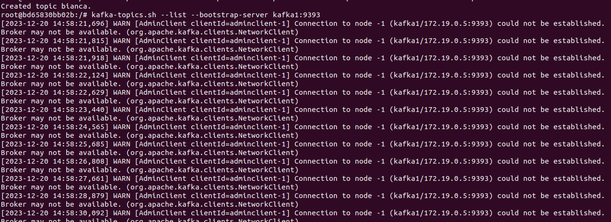
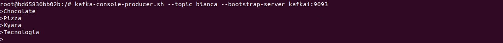
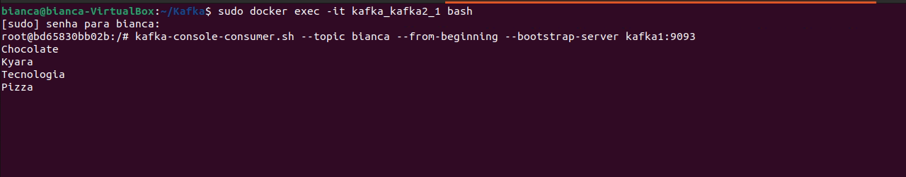
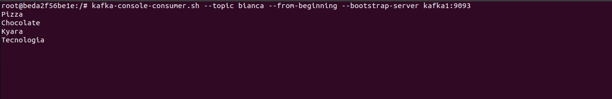
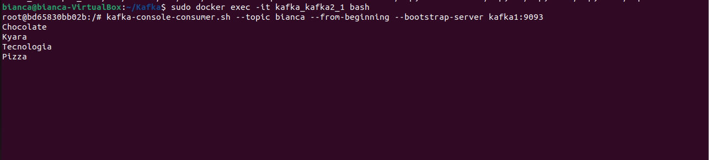
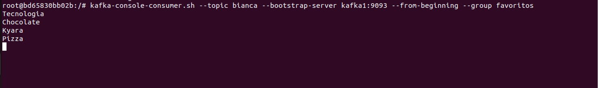
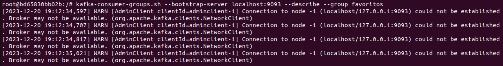
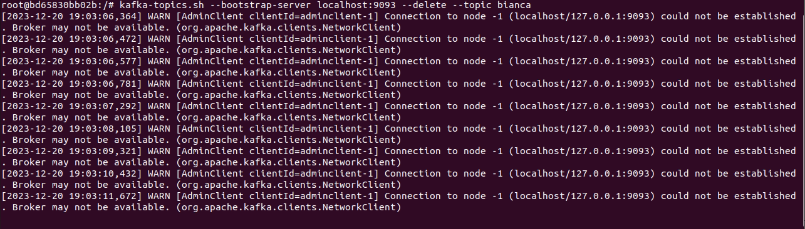
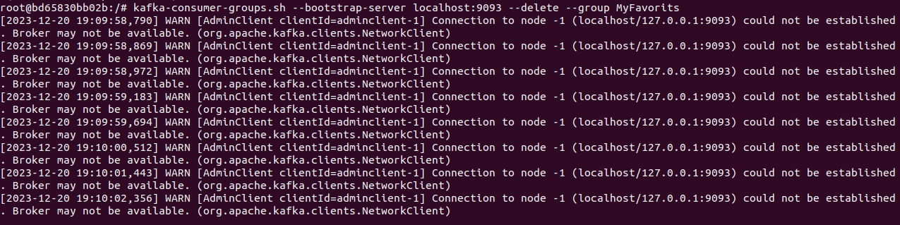
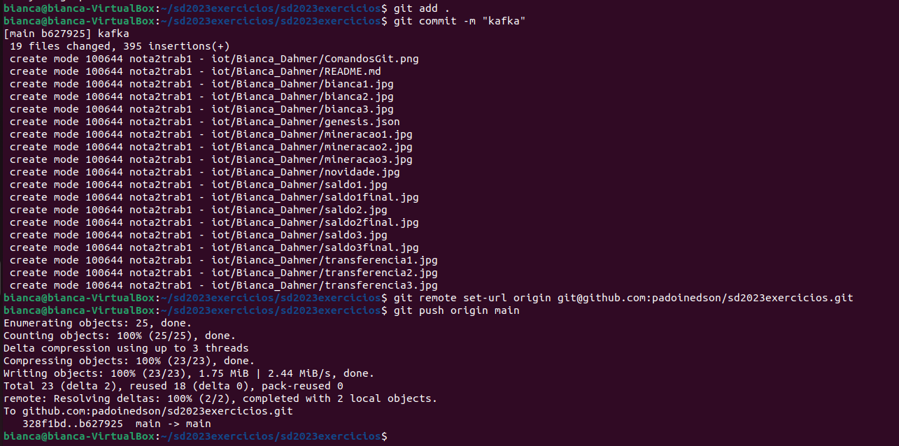

# BIANCA CAROLINA DAHMER

## KAFKA

### INSTALAÇÃO DOCKER/COMPOSE

Primeiro vamos instalar o Docker e o Docker Compose com os seguintes comandos abaixo:

    $ sudo apt install docker

    $ sudo apt install docker-compose

### DOWNLOAD KAFKA

    $ wget https://archive.apache.org/dist/kafka/3.3.1/kafka_2.13-3.3.1.tgz

Vamos verificar se deu certo a instalação do Kafka. Para isso, basta dar o comando abaixo:

    $ ls -l

Descompacte a pasta utilizando o comando abaixo:

    $ tar -xzf kafka_2.13-3.3.1.tgz

Caso queira remover os arquivos ou diretórios, escreva o comando abaixo:

    $ rm kafka_2.13-3.3.1.tgz

## PASTA KAFKA

Agora vamos criar uma pasta para o Kafka.

    $ mkdir Kafka

Vamos entrar na pasta

    # cd Kafka

## ARQUIVO DOCKER-COMPOSE.YML

Para cirar um arquivo docker compose basta atribuir o comando abaixo no terminal.

    $ nano docker-compose.yml

Logo após criar o arquivo compose vamos atribuir a configuração abaixo dentro do arquivo yml.

    services:
        zookeeper:
            image: wurstmeister/zookeeper:latest
            ports:
              - "2181:2181"

         kafka1:
            image: wurstmeister/kafka:latest
             ports:
                - "9292:9292"
            expose:
                - "9292"
            environment:
                KAFKA_ADVERTISED_LISTENERS: INSIDE://kafka1:9093,OUTSIDE://localhost:9092
                KAFKA_LISTENER_SECURITY_PROTOCOL_MAP: INSIDE:PLAINTEXT,OUTSIDE:PLAINTEXT
                KAFKA_LISTENERS: INSIDE://0.0.0.0:9093,OUTSIDE://0.0.0.0:9092
                KAFKA_INTER_BROKER_LISTENER_NAME: INSIDE
                KAFKA_ZOOKEEPER_CONNECT: "zookeeper:2181"
                KAFKA_BROKER_ID: 1
                KAFKA_NUM_PARTITIONS: 3
                KAFKA_REPLICATION_FACTOR: 3

    kafka2:
        image: wurstmeister/kafka:latest
        ports:
             - "9494:9494"
    expose:
         - "9494"
    environment:
        KAFKA_ADVERTISED_LISTENERS: INSIDE://kafka2:9095,OUTSIDE://localhost:9094
        KAFKA_LISTENER_SECURITY_PROTOCOL_MAP: INSIDE:PLAINTEXT,OUTSIDE:PLAINTEXT
        KAFKA_LISTENERS: INSIDE://0.0.0.0:9095,OUTSIDE://0.0.0.0:9094
        KAFKA_INTER_BROKER_LISTENER_NAME: INSIDE
        KAFKA_ZOOKEEPER_CONNECT: "zookeeper:2181"
        KAFKA_BROKER_ID: 2
        KAFKA_NUM_PARTITIONS: 3
        KAFKA_REPLICATION_FACTOR: 3

    kafka3:
        image: wurstmeister/kafka:latest
        ports:
            - "9696:9696"
    expose:
        - "9696"
    environment:
        KAFKA_ADVERTISED_LISTENERS: INSIDE://kafka3:9097,OUTSIDE://localhost:9096
        KAFKA_LISTENER_SECURITY_PROTOCOL_MAP: INSIDE:PLAINTEXT,OUTSIDE:PLAINTEXT
        KAFKA_LISTENERS: INSIDE://0.0.0.0:9097,OUTSIDE://0.0.0.0:9096
         KAFKA_INTER_BROKER_LISTENER_NAME: INSIDE
        KAFKA_ZOOKEEPER_CONNECT: "zookeeper:2181"
        KAFKA_BROKER_ID: 3
        KAFKA_NUM_PARTITIONS: 3
        KAFKA_REPLICATION_FACTOR: 3

Salve o arquivo e inicie os serviços do Docker Compose. Logo após, confirme que os serviços entrarem em execução.

    $ sudo docker-compose up -d
    $ sudo docker-compose ps

Vamos acessar o container

    $ sudo docker exec -it kafka_kafka2_1 bash

## CRIAÇÃO DO TÓPICO

Para criar um tópico basta seguir o seguinte comando, irei criar o Tópico "bianca". Mas você poderá criar o tópico com qualquer nome, basta substituir o "bianca" por outra coisa.

    $ kafka-topics.sh --create --topic bianca --partitions 3 --replication-factor 3 --bootstrap-server kafka1:9093

Caso deseja visualizar o tópico criado, ou a lista de tópicos, basta seguir o seguinte comando abaixo:

    $ kafka-topics.sh --list --bootstrap-server kafka1:9093

## PRODUTOR E CONSUMIDOR (nodos on)

Primeiro iremos encaminar os dados para o Kafka, para isso siga o comando abaixo:

    $ kafka-console-producer.sh --topic bianca --bootstrap-server kafka1:9093

Não esqueça de trocar o nome "bianca" pelo nome do tópico que você criou.

Agora vamos abrir um segundo terminal. E digitar o seguinte comando nele, para executar um contêiner Docker.

    $ sudo docker exec -it kafka_kafka2_1 bash

Logo após vamos utilizar o comando,

    $ kafka-console-consumer.sh --topic animes --from-beginning --bootstrap-server kafka1:9093

Para consumir as mensagens de um tópico no Apache do Kafka a partir da linha de comando.

## PRODUTOR E CONSUMIDOR (nodos off)

Vamos então derrubar um nó utilizando o comando abaixo:

    $ sudo docker stop kakfa_kafka2_1

E iremos verificar os containers que estão em execução ainda.

    $ sudo docker-compose ps

Vamos verificar se as mensagens ainda estão rodando, porém acessando outro container. 

    $ sudo docker start kafka_kafka1_1
    $ kafka-console-consumer.sh --topic bianca --from-beginning --bootstrap-server kafka1:9093

## PRODUTOR E CONSUMIDOR (nodos novos)

Vamos iniciar o nó primeiro e verificar se está executando.

    $ sudo docker start kafka_kafka2_1
    $ sudo docker-compose ps

Iremos entrar em outro container e verificar se as mensagens permanecem rodando mesmo em um novo nó.

    $ sudo docker exec -it kafka_kafka2_1 bash
    $ kafka-console-consumer.sh --topic bianca --from-beginning --bootstrap-server kafka1:9093

 

## CONSUMIDOR COM LEITURA EM GRUPO

Vamos utilizar o comando abaixo para iniciar um consumidor de console Kafka

    $ kafka-console-consumer.sh --topic bianca --bootstrap-server kafka1:9093 --from-beginning --group favoritos

# NOVIDADE

Para descrever um grupo de consumidores basta digitar o comando abaixo, não esqueça de alterar o nome "favoritos" pelo qual você deseja.

    $ kafka-consumer-groups.sh --bootstrap-server localhost:9093 --describe --group favoritos

Para deletar um tópico

    $ kafka-topics.sh --bootstrap-server localhost:9093 --delete --topic bianca

Para deletar um grupo

    $ kafka-consumer-groups.sh --bootstrap-server localhost:9093 --delete --group favoritos

# COMANDOS GIT
### GIT ADD, GIT COMMIT E GIT PUSH

