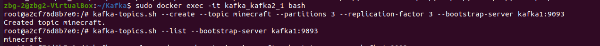
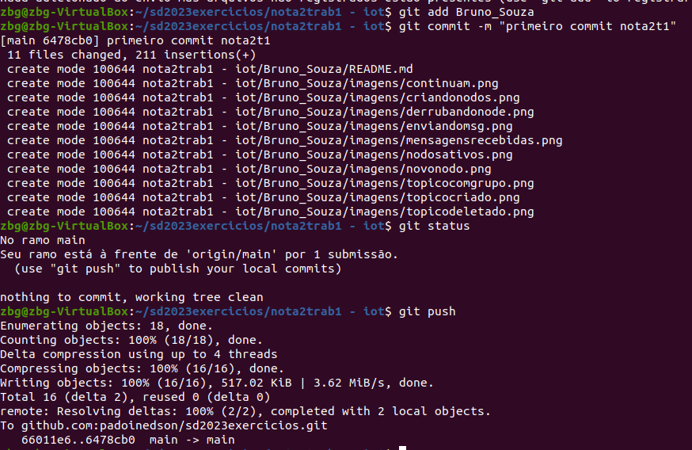

## Nota2 Trab1 - Kafka

## Autor
Bruno César Guisso de Souza

## Instalação

1. Instalando o Docker & Docker-Compose:
```
sudo apt install docker
```

```
sudo apt install docker-compose
```

2. Baixando o Kafka:
```
wget https://archive.apache.org/dist/kafka/3.3.1/kafka_2.13-3.3.1.tgz
```

3. Descompactando o Kafka:
```
tar -xzf kafka_2.13-3.3.1.tgz
```

4. Entrando no Diretório do Kafka:
```
cd  kafka_2.13-3.3.1
```

5. Criar o docker-compose:

```
nano docker-compose.yml
```

```
services:
  zookeeper:
    image: wurstmeister/zookeeper:latest
    ports:
     - "2181:2181"

  kafka1:
    image: wurstmeister/kafka:latest
    ports:
     - "9292:9292"
    expose:
     - "9292"
    environment:
      KAFKA_ADVERTISED_LISTENERS: INSIDE://kafka1:9093,OUTSIDE://localhost:9092
      KAFKA_LISTENER_SECURITY_PROTOCOL_MAP: INSIDE:PLAINTEXT,OUTSIDE:PLAINTEXT
      KAFKA_LISTENERS: INSIDE://0.0.0.0:9093,OUTSIDE://0.0.0.0:9092
      KAFKA_INTER_BROKER_LISTENER_NAME: INSIDE
      KAFKA_ZOOKEEPER_CONNECT: "zookeeper:2181"
      KAFKA_BROKER_ID: 1
      KAFKA_NUM_PARTITIONS: 3
      KAFKA_REPLICATION_FACTOR: 3

  kafka2:
    image: wurstmeister/kafka:latest
    ports:
     - "9494:9494"
    expose:
     - "9494"
    environment:
      KAFKA_ADVERTISED_LISTENERS: INSIDE://kafka2:9095,OUTSIDE://localhost:9094
      KAFKA_LISTENER_SECURITY_PROTOCOL_MAP: INSIDE:PLAINTEXT,OUTSIDE:PLAINTEXT
      KAFKA_LISTENERS: INSIDE://0.0.0.0:9095,OUTSIDE://0.0.0.0:9094
      KAFKA_INTER_BROKER_LISTENER_NAME: INSIDE
      KAFKA_ZOOKEEPER_CONNECT: "zookeeper:2181"
      KAFKA_BROKER_ID: 2
      KAFKA_NUM_PARTITIONS: 3
      KAFKA_REPLICATION_FACTOR: 3

  kafka3:
    image: wurstmeister/kafka:latest
    ports:
     - "9696:9696"
    expose:
     - "9696"
    environment:
      KAFKA_ADVERTISED_LISTENERS: INSIDE://kafka3:9097,OUTSIDE://localhost:9096
      KAFKA_LISTENER_SECURITY_PROTOCOL_MAP: INSIDE:PLAINTEXT,OUTSIDE:PLAINTEXT
      KAFKA_LISTENERS: INSIDE://0.0.0.0:9097,OUTSIDE://0.0.0.0:9096
      KAFKA_INTER_BROKER_LISTENER_NAME: INSIDE
      KAFKA_ZOOKEEPER_CONNECT: "zookeeper:2181"
      KAFKA_BROKER_ID: 3
      KAFKA_NUM_PARTITIONS: 3
      KAFKA_REPLICATION_FACTOR: 3
```

6. Iniciar o docker:
```
sudo docker-compose up -d
```

7. Verificar se os serviços estão em execução:
```
sudo docker-compose ps
```

8. Acessar o conteiner:
```
sudo docker exec -it kafka_kafka2_1 bash
```

9. Criar o tópico:
```
kafka-topics.sh --create --topic minecraft --partitions 3 --replication-factor 3 --bootstrap-server kafka1:9093
```



10. Visualizar tópicos existentes:
```
kafka-topics.sh --list --bootstrap-server kafka1:9093
```

- Todos os nodos ON.

11. Enviar dados para o kafka:
```
kafka-console-producer.sh --topic minecraft --bootstrap-server kafka1:9093
```


12. Abra outro terminal para receber as mensagens:
```
sudo docker exec -it kafka_kafka2_1 bash
```

13. Comando para receber as mensagens:
```
kafka-console-consumer.sh --topic minecraft --from-beginning --bootstrap-server kafka1:9093
```


- Produtor e Consumidor com um dos Nodos OFF.
1. Derrube um nó:
```
sudo docker stop kakfa_kafka2_1
```

2. Verifique os containers em execução
```
sudo docker-compose ps
```

3. Entre em outro container e veja se as mensagens continuam lá:
```
sudo docker start kafka_kafka1_1
```

```
kafka-console-consumer.sh --topic minecraft --from-beginning --bootstrap-server kafka1:9093
```


- Criando um novo nodo.

1. Inicie o nó:
```
sudo docker start kafka_kafka2_1
```

2. Verifique os containers em execução
```
sudo docker-compose ps
```

3. Entre em outro container e veja se as mensagens continuam lá:
```
sudo docker exec -it kafka_kafka2_1 bash
```

```
kafka-console-consumer.sh --topic minecraft --from-beginning --bootstrap-server kafka1:9093
```


- Consumidor com leitura em grupo
```
kafka-console-consumer.sh --topic minecraft --bootstrap-server kafka1:9093 --from-beginning --group jogos
```


## Comandos GitCommit




## Novo Comando

1. Deletar o Tópico:
```
kafka-topics.sh --bootstrap-server localhost:9093 --delete --topic minecraft
```


