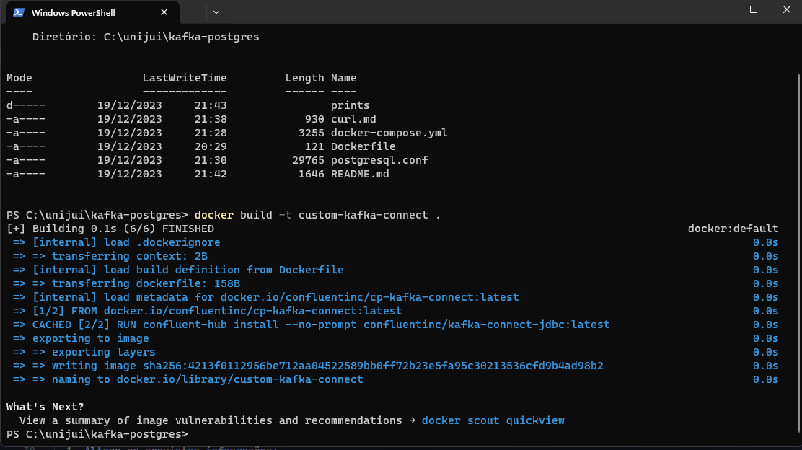
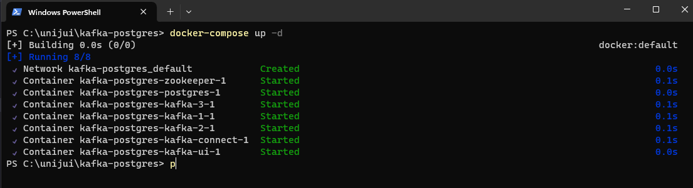
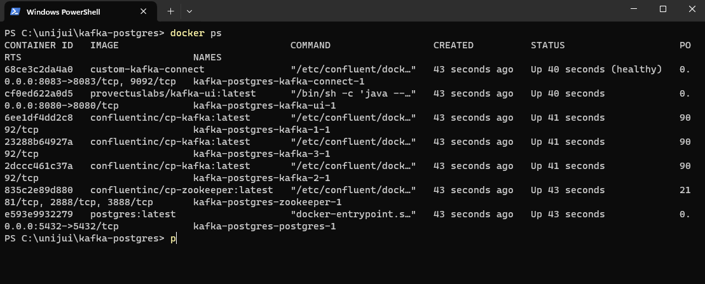
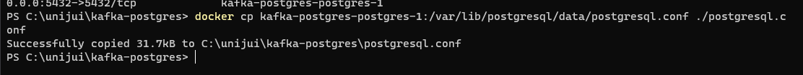
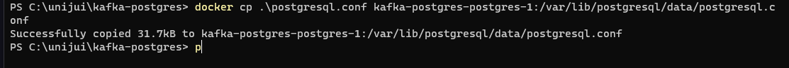
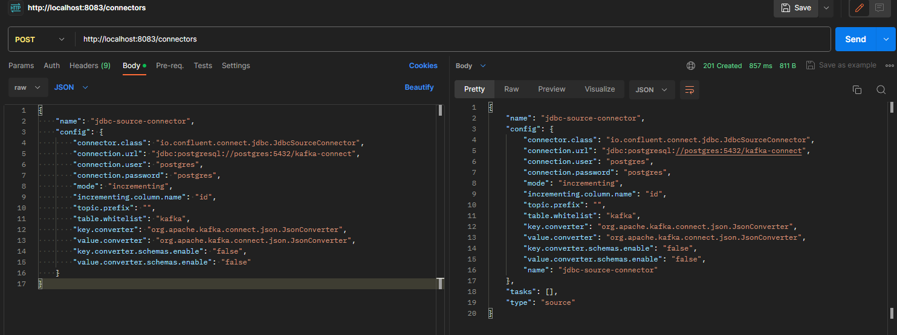
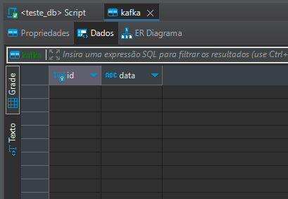
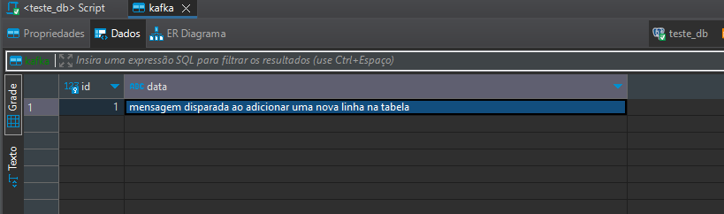
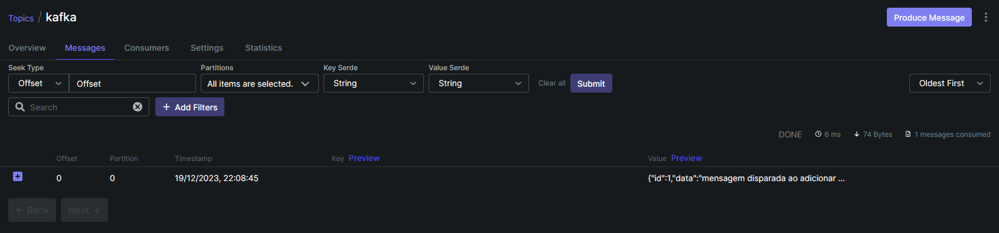
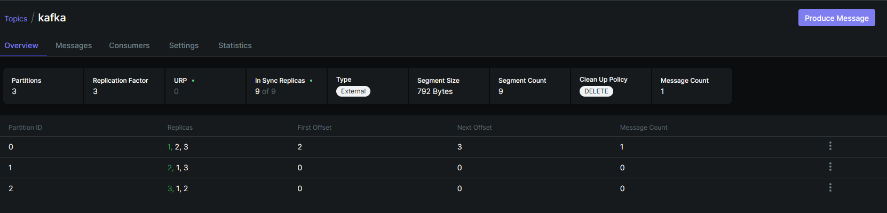

Carlos Eduardo

Este é um trabalho usando kafka integrado com postgres via kafka connect

Diferenciais:
- Kafka Connect
- Kafka JDBC Connect
- Integração com Postgres

Requisitos:
- docker
- curl ou outra ferramenta para enviar requisições
- dbeaver ou outro sgbd
- terminal

Instalação
1. No diretório do trabalho, faça a build da imagem no arquivo Dockerfile
   ```sh
    docker build -t custom-kafka-connect .
   ```
   

2. Crie os container com o docker-compose
   ```sh
   docker-compose up -d
   ```
   

3. Após os containers subirem, copie o arquivo postgresql.conf do container para sua máquina local
  1. Primeiro encontre o nome ou id do container responsável pelo postgres
   ```sh
   docker ps
   ```
   

  2. Copie o arquivo de configuração do postgres
  ```
  docker cp <nome_ou_id_do_container>:/var/lib/postgresql/data/postgresql.conf ./postgresql.conf
  ```
  

  3. Altere as seguintes informações:
  - wal_level = logical
  - max_wal_senders = 1
  - max_replication_slots = 3

  4. Substitua o arquivo de configuração do postgres
  ```
  docker cp ./postgresql.conf <nome_ou_id_do_container>:/var/lib/postgresql/data/postgresql.conf
  ```
  

4. Reinicie o container do postgres
5. No arquivo [curl.md](prints/curl.md) copie o comando para criar a conexão com o postgres, e coloque no campo "table.whitelist" a tabela a ser escutada
6. Execute o comando no terminal ou em outro software de requisições
   
7. Utilizando o dbeaver ou manualmente, crie a tabela com uma coluna "id" autoincremental e as demais colunas desejadas
   
8. Adicione dados na tabela e verifique no Kafka-ui (localhost:8080) se as mensagens foram enviadas
   
   

opcional:
Após o tópico ser criado autoticamente pelo kafkaconnector, é possível editar o tópico para setar o fator de replicação e a quantidade de partições.


OBS: Caso o tópico seja criado manualmente, o kafka connect não irá receber as mensagens