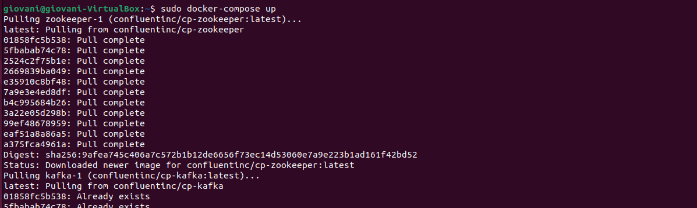
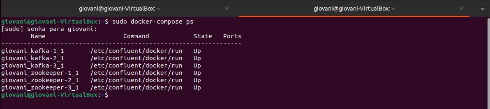
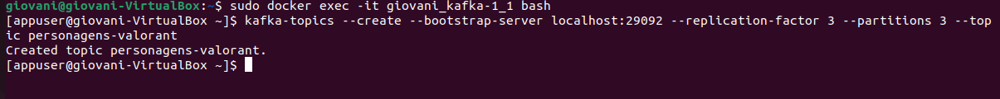
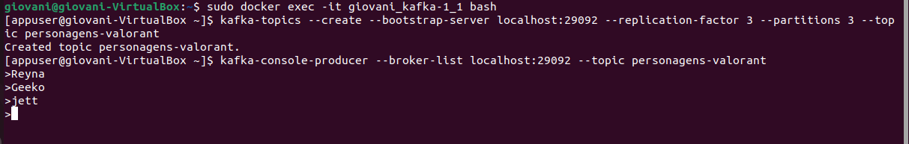
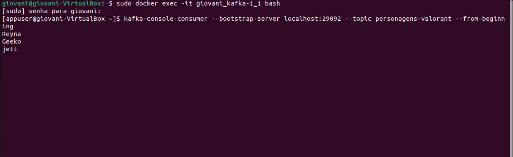
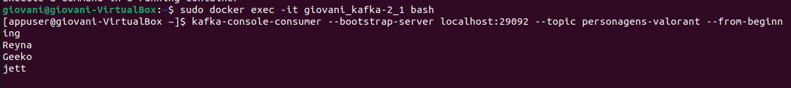
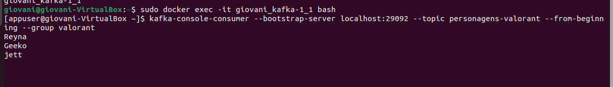
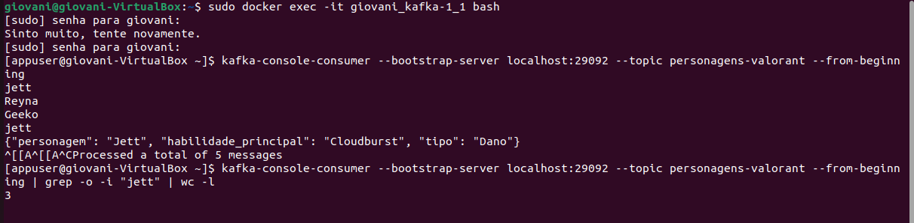

Passos a passo para instalação

Primeiro passo e copiar o conteudo desse arquivo .yml desse repositorio, link: https://github.com/confluentinc/cp-docker-images/tree/5.3.3-post/examples/kafka-cluster 

Instalar o docker e docker compose

sudo apt install docker.io

sudo apt install docker-compose

Criando o ambiente:
sudo docker-compose up

Status:
sudo docker-compose ps

Produtores e Consumidores:
acessando um container em um terminal

sudo docker exec -it <nome do user>_kafka-1_1 bash

E criar um tópico. Neste exemplo vamos utilzar o nome dos personagens de valorant

kafka-topics --create --bootstrap-server localhost:29092 --replication-factor 3 --partitions 3 --topic "nome do tópico"

Em outro terminal podemos acessar novamente o container com o comando

sudo docker exec -it <nome do user>_kafka-1_1 bash

Dentro dele podemos criar o produtor

kafka-console-producer --broker-list localhost:29092 --topic "nome do tópico"

Em seguida podemos digitar o conteúdo

Enquanto isso em outro terminal criamos um consumer

sudo docker exec -it <nome do user>_kafka-1_1 bash

kafka-console-consumer --bootstrap-server localhost:29092 --topic personagens-valorant --from-beginning

Esse terminal deve mostrar o conteúdo inserido no producer

Com um nodo off

Derrubamos um nodo com o comando

sudo docker stop <nome do user>_kafka-1_1

Em seguida usamos outro nodo

sudo docker exec -it <nome do user>_kafka-1_1 bash

kafka-console-consumer --bootstrap-server localhost:29092 --topic personagens-valorant --from-beginning

A saida deve ser a mesma

Com um novo nodo

Subimos o nodo que derrubamos anteriormente

sudo docker start <nome do user>_kafka-1_1

sudo docker exec -it <nome do user>_kafka-1_1 bash

Acessando esse nodo é possível realizar qualquer comando utilizado anteriormente para testa-lo

Também é possível realizar a leitura por meio de grupos:

kafka-console-consumer --bootstrap-server localhost:29092 --topic valorant --from-beginning --group tcg

Novidade:

Na novidade, eu coloquei como teste valores repetidos, como no meu caso e de personagens do valorant eu coloquei o nome 'jett' em formas diferentes como textos e objetos na parte do produtor e usei esse comando: kafka-console-consumer --bootstrap-server localhost:29092 --topic personagens-valorant --from-beginning | grep -o -i "jett" | wc -l, para filtrar os nomes repetidos dos personagens. 
Como podemos ver no print, existe a palavra jett 3x.

