Guilherme Bonfada

### Atualização e Instalação

### 1- Vamos atualizar os pacotes com o comando:
```
$ sudo apt update
```
### 2- Após isso, baixe o kafka pelo link abaixo:
```
$ https://downloads.apache.org/kafka/3.6.0/kafka_2.13-3.6.0.tgz
```
### 3- assim que baixar o kafka, extraia ele parra o uso.

### 4- na pasta extraida, clica com o bootão direito e abrir no terminal.

### 5- Para iniciar o Zookeeper usa o comando:
```
$ sh bin/zookeeper-server-start.sh config/zookeeper.properties
```
### 6- Para executar o kafka usa o comando:
```
sh bin/kafka-server-start.sh config/server.properties
```
### Criação de brokers

### 7- use o comando abaixo para entrar na pasta config
```
cd config
```
### 8- use os comando abaixo para criar os 3 arquivos: (lembrando que eu usei gui1, gui2, gui3, Mas pode ser qualquer nome ali)
```
cp server.properties gui1.properties
cp server.properties gui2.properties
cp server.properties gui3.properties
```
### 9- Dentro desses arquivos, temos que fazer algumas alteração, como id, listeners=PLAINTEXT, segue exemplo abaixo:
```
broker.id=
listeners=PLAINTEXT://:PORT
```
lembrando de colocar id diferente e portas diferente, no meu caso, usei portas 9090, 9093, 9094

### 10- executa CD pra sair da pasta

### 11- Inicia cada broker com o comando:
```
bin/kafka-server-start.sh config/gui1.properties
bin/kafka-server-start.sh config/gui2.properties
bin/kafka-server-start.sh config/gui3.properties
```
cada um em um terminal diferente

### 12- Pode ver se foi criado com o comando abaixo:
```
./bin/zookeeper-shell.sh localhost:2181 <<<"ls /brokers/ids"
```
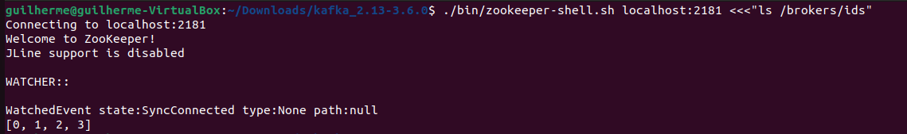

### Criando Tópicos

### 13- Para criar o topico, usa o comando:
```
./bin/kafka-topics.sh --create --bootstrap-server localhost:9092 --replication-factor 3 --partitions 3 --topic SEU-TOPICO
```
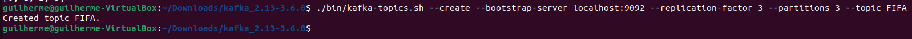

### 14- Após isso, para verificar se ele criou, en todos os broken corretamente, usa o comando abaixo: obs: mudando a porta no final 
```
./bin/kafka-topics.sh --list --botstrap-server localhost:PORT
```

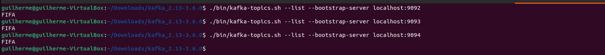

### 15- Para verificar as partições, usa o comando abaixo:
```
kafka-topics.sh --describe --topic TOPICO --bootstrap-server localhost:PORT
```


### 16- Visualizando a saída de um consumer, imagem mostra na porta 9092, usando o comando abaixo:
```
bin/kafka-console-producer.sh --topic FIFA --bootstrap-server localhost:9092
```
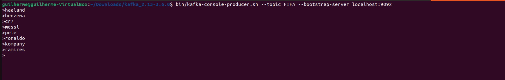

### 17- Pra saber a sua saida usa o comando:
```
bin/kfka-console-consumer.sh --topic FIFA --bootstrap-server localhost:9092 --from-beginning
```
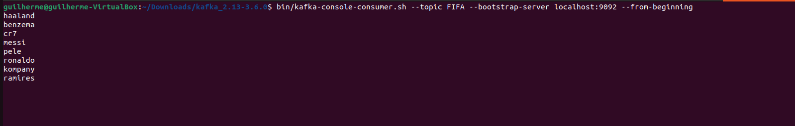

### 18- Agora usando a porta 9093, colocando mais algumas mensagem:
```
bin/kafka-console-producer.sh --topic FIFA --bootstrap-server localhost:9093
```
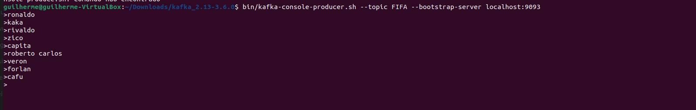


### 19- A sua saida é:
```
bin/kfka-console-consumer.sh --topic FIFA --bootstrap-server localhost:9093 --from-beginning
```
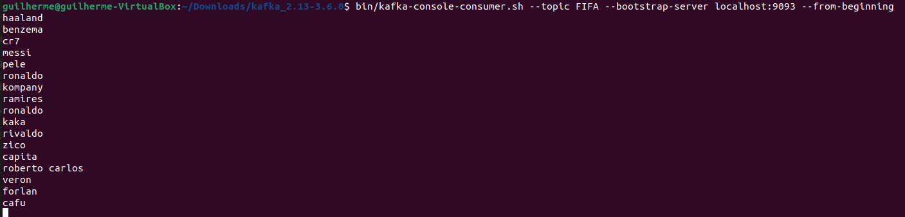

### 20- Criando a producer na porta 9094 com o comando:
```
bin/kafka-console-producer.sh --topic FIFA --bootstrap-server localhost:9094
```
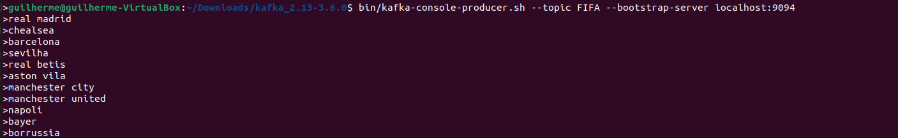

### 21- Seu resultado foi:
```
bin/kfka-console-consumer.sh --topic FIFA --bootstrap-server localhost:9094 --from-beginning
```
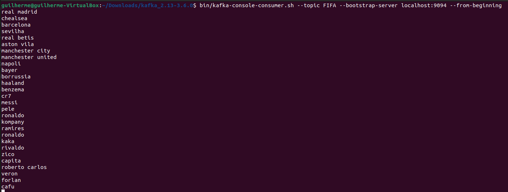

### NOVIDADE

### Para a novidade, usei um comando para acrecentar automaticamente valores com o comando abaixo:
```
seq 10 | bin/kafka-console-producer.sh --topic FIFA --bootstrap-server localhost:9094
```

```
Ele vai colocar numeros de 0 a 10, de forma automatica 
```
### Tento como saida:

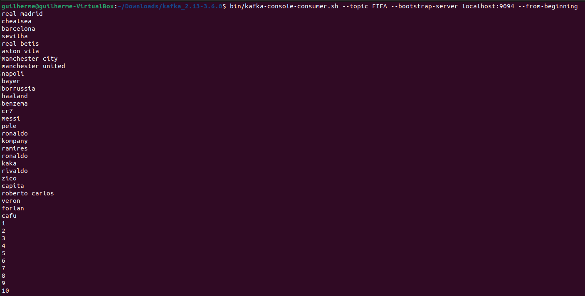

### GIT E PUSH

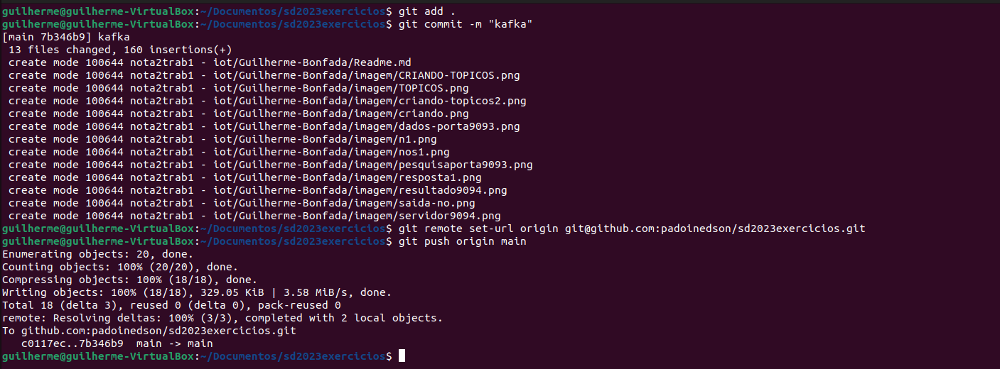


