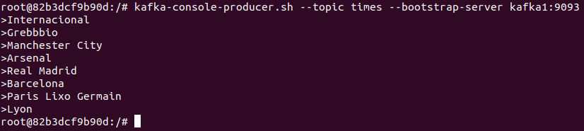

### Aluno: Guilherme Eckhardt

### Passos para instalação - Para Virtual Box (Ubuntu)
### 1. Baixar Virtual Box.
```
https://www.virtualbox.org/
```
### 2. Baixar ISO Ubuntu.
```
https://ubuntu.com/download/desktop
```
### 3. Fazer a instalação do Ubuntu no Virtual Box.

### Passos para realização das etapas
### 1. Abra o terminal e instale o docker e o docker compose
```
sudo apt install docker
sudo apt install docker-compose
```
### 2. Vamos baixar o Kafka:
```
wget https://archive.apache.org/dist/kafka/3.3.1/kafka_2.13-3.3.1.tgz
```
### 3. Descompacte o arquivo:
```
wget https://archive.apache.org/dist/kafka/3.3.1/kafka_2.13-3.3.1.tgz
```
### Criação do ambiente
### 1. Agora você pode criar uma pasta dentro da pasta documentos com o nome que desejar:
```
cd Documents/
mkdir nome_pasta
cd nome_pasta
```
### 2. Criar um arquivo com o nome "docker-compose.yml" dentro da pasta criada e adicionar os dados:
```
services:
  zookeeper:
    image: wurstmeister/zookeeper:latest
    ports:
     - "2181:2181"

  kafka1:
    image: wurstmeister/kafka:latest
    ports:
     - "9292:9292"
    expose:
     - "9292"
    environment:
      KAFKA_ADVERTISED_LISTENERS: INSIDE://kafka1:9093,OUTSIDE://localhost:9092
      KAFKA_LISTENER_SECURITY_PROTOCOL_MAP: INSIDE:PLAINTEXT,OUTSIDE:PLAINTEXT
      KAFKA_LISTENERS: INSIDE://0.0.0.0:9093,OUTSIDE://0.0.0.0:9092
      KAFKA_INTER_BROKER_LISTENER_NAME: INSIDE
      KAFKA_ZOOKEEPER_CONNECT: "zookeeper:2181"
      KAFKA_BROKER_ID: 1
      KAFKA_NUM_PARTITIONS: 3
      KAFKA_REPLICATION_FACTOR: 3

  kafka2:
    image: wurstmeister/kafka:latest
    ports:
     - "9494:9494"
    expose:
     - "9494"
    environment:
      KAFKA_ADVERTISED_LISTENERS: INSIDE://kafka2:9095,OUTSIDE://localhost:9094
      KAFKA_LISTENER_SECURITY_PROTOCOL_MAP: INSIDE:PLAINTEXT,OUTSIDE:PLAINTEXT
      KAFKA_LISTENERS: INSIDE://0.0.0.0:9095,OUTSIDE://0.0.0.0:9094
      KAFKA_INTER_BROKER_LISTENER_NAME: INSIDE
      KAFKA_ZOOKEEPER_CONNECT: "zookeeper:2181"
      KAFKA_BROKER_ID: 2
      KAFKA_NUM_PARTITIONS: 3
      KAFKA_REPLICATION_FACTOR: 3

  kafka3:
    image: wurstmeister/kafka:latest
    ports:
     - "9696:9696"
    expose:
     - "9696"
    environment:
      KAFKA_ADVERTISED_LISTENERS: INSIDE://kafka3:9097,OUTSIDE://localhost:9096
      KAFKA_LISTENER_SECURITY_PROTOCOL_MAP: INSIDE:PLAINTEXT,OUTSIDE:PLAINTEXT
      KAFKA_LISTENERS: INSIDE://0.0.0.0:9097,OUTSIDE://0.0.0.0:9096
      KAFKA_INTER_BROKER_LISTENER_NAME: INSIDE
      KAFKA_ZOOKEEPER_CONNECT: "zookeeper:2181"
      KAFKA_BROKER_ID: 3
      KAFKA_NUM_PARTITIONS: 3
      KAFKA_REPLICATION_FACTOR: 3
```
### Produtor e Consumidor normal (Todos os nodos ON)
### 1. Vamos iniciar os serviços definidos no seu "arquivo docker-compose.yml" em segundo plano:
```
sudo docker-compose up -d
```

### 2. Verifique se os serviços estão em execução:
```
sudo docker-compose ps
```

### 3. Vamos acessar o container:
```
sudo docker exec -it nome_pasta_kafka2_1 bash
```
### 4. Agora crie um tópico:
```
kafka-topics.sh --create \
--topic nome_topico \
--partitions 3 \
--replication-factor 3 \
--bootstrap-server kafka1:9093
```

### 5. Você pode visualizar os tópicos criados:
```
kafka-topics.sh --list --bootstrap-server kafka1:9093
```

### 6. Vamos enviar dados para o Kafka a partir de um prompt:
```
kafka-console-producer.sh --topic nome_topico --bootstrap-server kafka1:9093
```

### 7. Vamos abrir outro terminal, pois iremos verificar se as mensagens foram enviadas.
```
sudo docker exec -it nome_pasta_kafka2_1 bash
```
### 8. Vamos usar o comando para consumir as mensagens enviadas:
```
kafka-console-consumer.sh --topic nome_topico --from-beginning --bootstrap-server kafka1:9093
```

### Produtor e Consumidor com um dos Nodos OFF
### 1. Vamos derrumar um nó
```
sudo docker stop nome_pasta_kafka2_1
```
### 2. Pode verificar os containers em execução
```
sudo docker ps
```
### 3. Após a verificação, fui ver se as mensagens não estavam perdidas. Em seguida, reiniciei o container.
```
sudo docker start nome_pasta_kafka2_1
```


### 4. Agora vamos abrir 3 terminais, onde teremos um Produtor e dois Consumidores. Pois iremos verificar se estamos recebendo os dados em tempo real:


### Consumidor com leitura em grupo
```
kafka-console-consumer.sh --topic nome_topico --bootstrap-server kafka1:9093 --from-beginning --group meu-grupo
```

### Novidades
Como novidade trouxe alguns comandos que você pode usar que irão trazer mais informações sobre o consumo dos dados:
- Consumir mensagens a partir do último offset lido:
```
kafka-console-consumer.sh --topic nome_topico --bootstrap-server kafka1:9093
```

- Consumir mensagens e exibir somente as chaves ou valores:
```
kafka-console-consumer.sh --topic times --bootstrap-server kafka1:9093 --property print.key=true
```

- Consumir mensagens e exibir informações detalhadas, como chave, valor, timestamp:
```
kafka-console-consumer.sh --topic nome_topico --bootstrap-server kafka1:9093 --from-beginning --property print.key=true --property print.value=true --property print.timestamp=true
```


### GIT
- Imagens demonstrando que foi realizado o commit e push

