Guilherme Izidro Leal

## Passos para instalação

Primeiro é necessário entrar no link
https://github.com/confluentinc/cp-docker-images/tree/5.3.3-post/examples/kafka-cluster
e copiar o conteúdo do arquivo .yml para um arquivo de mesmo nome local

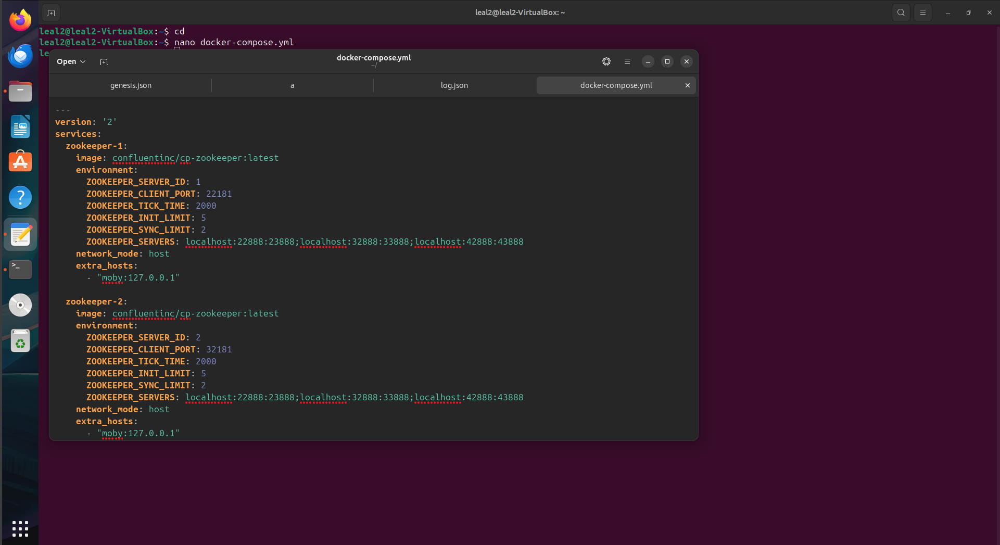

Após isso é necessatio ter instalado docker e docker compose

`sudo apt install docker.io`

`sudo apt install docker-compose`

## Passos para realização das etapas

Para a criação do ambiente deve-se usar o seguinte comando

`sudo docker-compose up`

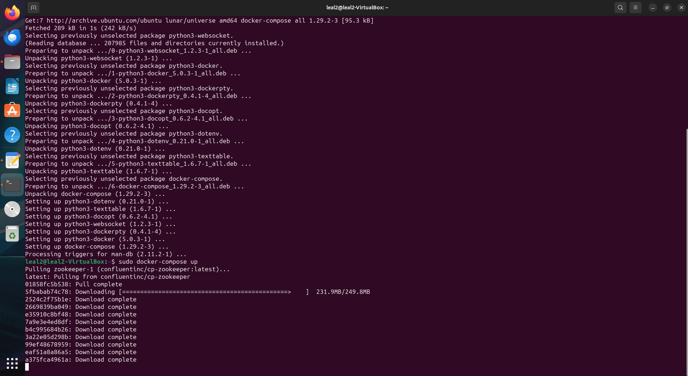

Pode-se utilizar o seguinte comando para ver os status do docker

`sudo docker-compose ps`

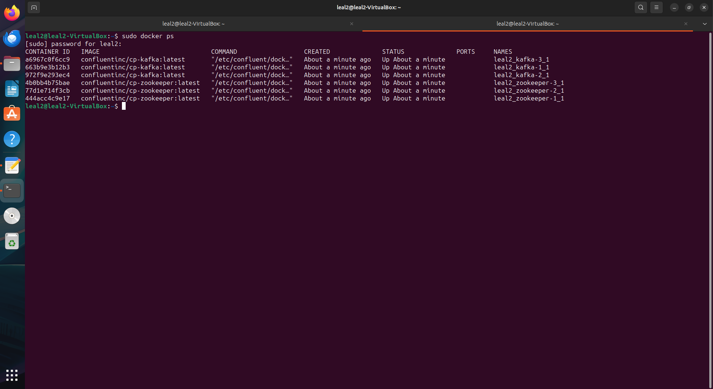

## Criação de produtores e consumidores

Primeiro, deve-se acessar um conteiner em um terminal

`sudo docker exec -it <nome do user>_kafka-1_1 bash`

e criar um tópico (nesse exemplo vai ser feito uma database de yu-gi-oh chamada "card-database")

`kafka-topics --create --bootstrap-server localhost:29092 --replication-factor 3 --partitions 3 --topic card-database`

Nesse ponto foram escolhidos os valores de fator de replicação e partição

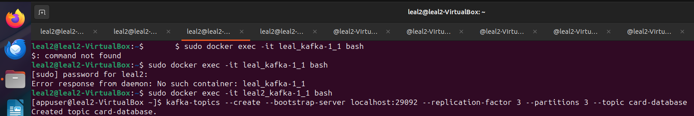

Em outro terminal agora podemos acessar novamente o container com o comando 

`sudo docker exec -it <nome do user>_kafka-1_1 bash`

Dentro dele podemos criar o nosso primeiro produtor

`kafka-console-producer --broker-list localhost:29092 --topic card-database`

Em seguida podemos digitar algum conteúdo, em nosso caso números de série de cartas

```
DABL-EN012
PHHY-EN006
DABL-EN013
OP21-EN008
```

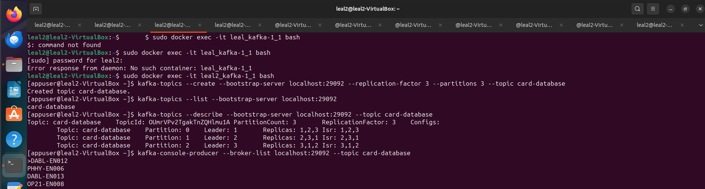

Enquanto isso em outro terminal podemos criar um consumer

`sudo docker exec -it <nome do user>_kafka-1_1 bash`

`kafka-console-consumer --bootstrap-server localhost:29092 --topic card-database --from-beginning`

Esse terminal deve mostrar o conteúdo inserido no producer

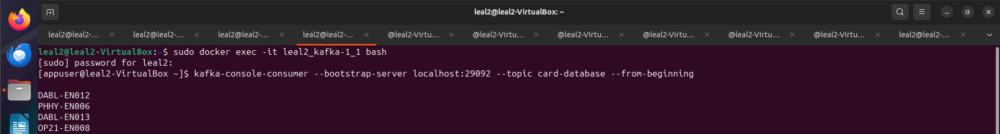

Isso pode ser testado adicionando mais conteúdo no producer e observando no consumer

Agora para testar com um nodo off
Podemos derrubar um nodo com o comando

`sudo docker stop <nome do user>_kafka-1_1`

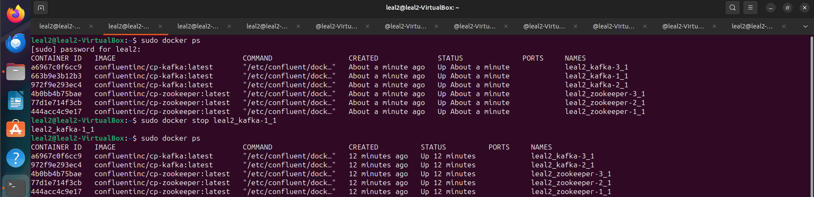

Depois podemos entrar em outro nodo com o comando

`sudo docker exec -it <nome do user>_kafka-1_1 bash`

e podemos testar com o mesmo comando

`kafka-console-consumer --bootstrap-server localhost:29092 --topic card-database --from-beginning`

O output deve ser o mesmo

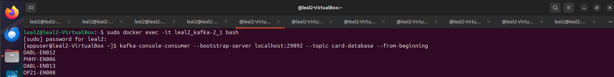

Agora para testar com um novo nodo, podemos subir o nodo que derrubamos anteriormente

`sudo docker start <nome do user>_kafka-1_1`

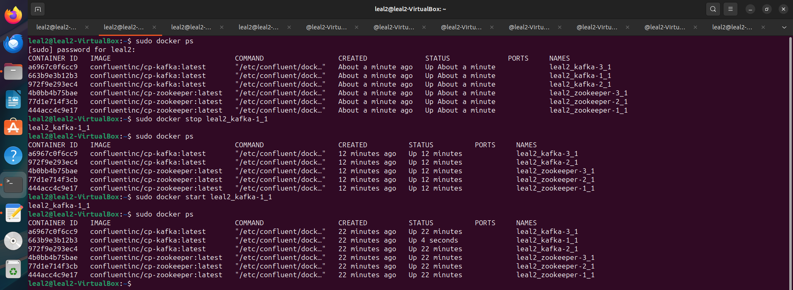

`sudo docker exec -it <nome do user>_kafka-1_1 bash`

Acessando esse nodo é possível realizar qualquer comando utilizado anteriormente para testa-lo

Além disso, também é possível fazer a leitura de por meio de grupos utilizando o comando 

`kafka-console-consumer --bootstrap-server localhost:29092 --topic card-database --from-beginning --group tcg`

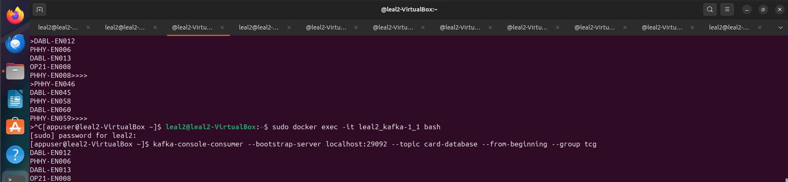

## Minha novidade

Para minha novidade eu trouxe uma forma de formatar os inputs e outputs dos produtores e consumidores
Nesse exemplo eu formatei eles para acompanharem uma "Chave" seguida de um "Valor" no formato:

Chave:Valor

Minha ideia com isso é facilitar o uso desses dados em um arquivo .json posteriormente

Para fazer isso, é necessário colocar novas configurações ao iniciar um produtor e um consumidor

O produtor pode ser inicializado com o comando

`kafka-console-producer --broker-list localhost:29092 --topic card-database --property "parse.key=true" --property "key.separator=:"`

Isso faz com que ele separe qualquer input em uma chave e valor antes e depois do ":"

Já o consumidor, pode ser inicializado assim

`kafka-console-consumer --bootstrap-server localhost:29092 --topic card-database --from-beginning --property "print.key=true" --property "key.separator=:"`

Isso faz com que ele aceite valores valor chave

Ao fazer isso qualquer valor adicionado pelo produtor deve ser colocado com : para separar o conteúdo

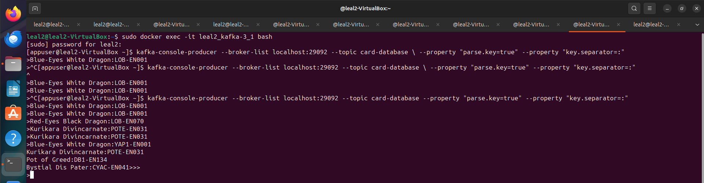

enquanto o consumidor receberá os valores da mesma forma, porém se perceber, valores não informados com uma chave vem nulos

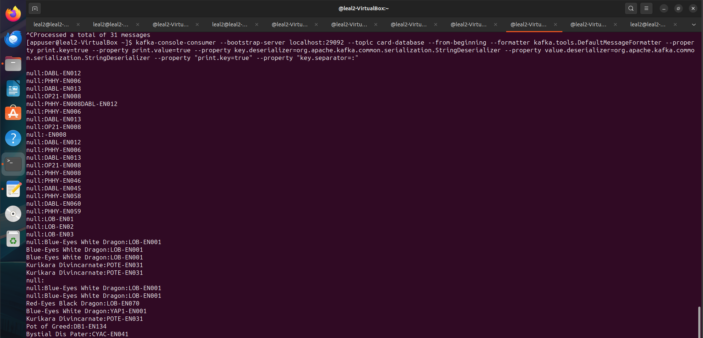

Além disso, também é possível guardar esses valres em um arquivo .txt ou .json separado para motivos de arquivamento ou para manipulação futura por meio do comando 

`kafka-console-consumer --bootstrap-server localhost:29092 --topic card-database --from-beginning --property "print.key=true" --property "key.separator=:" > /save.txt`

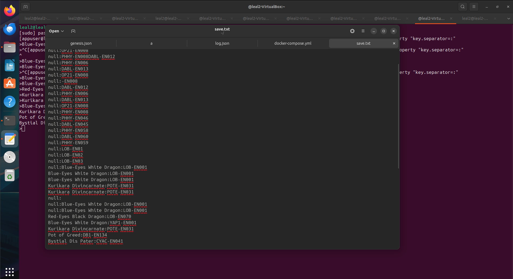

