*Guilherme Peukert Michel*

# Kafka com descrição timestamp pro consumidor

### PASSOS PARA INSTALAÇÃO

- VM = Donwload virtual box, imagem linux, executar virtual box, criar máquina virtual
- Download do e descompactação do kafka https://downloads.apache.org/kafka/3.6.0/kafka_2.13-3.6.0.tgz
- Entrar na pasta onde foi descompactado o kafka, clicar com o botão direito do mouse e ir em abrir terminal

### PASSOS PARA REALIZAÇÃO DAS ETAPAS

-  1-Com o terminal aberto na pasta do kafka é necessário colocar rodar o Zookeeper que vem junto no download do kafka que vai auxiliar a lidar com os 3 brokers:

	`$ sh bin/zookeeper-server-start.sh config/zookeeper.properties`

- 2-Próximo passo seria destinado para executar o Kafka em si, e para isso precisa ser aberto outra aba do terminal e executar :

	`$ sh bin/kafka-server-start.sh config/server.properties`

- 3-Agora para criação dos 3 brokers como solicitado precisamos dar cd na pasta config dentro do kafka, e dentro criar 3 arquivos properties onde iremos configura-los depois:
	
	`$ cd config`
	
	`$ cp server.properties michel1.properties`
	
	`$ cp server.properties michel2.properties`
	
	`$ cp server.properties michel3.properties`

- 4-Após criados você deve navegar até as pastas properties criadas e edite, mudando o campo "broker.id" onde vai ser um ID único daquele broker e o campo "listeners=PLAINTEXT://:9095" na qual precisa designar uma porta para cada broker, no meu caso usei a 9095, 9096 e 9097.

- 5-Após a configuração volte para o terminal e execute um "cd .." para que saia da pasta config e volte para a do kafka inicial.

- 6-Abra 2 terminais adicionais onde cada um sera designado para iniciar um broker. Executar nos terminais de cada broker apenas mudando o nome dele no comando(michel1, michel2, michel3):

	`$ bin/kafka-server-start.sh config/michel1.properties`

- 7-Agora partimos para criação de um tópico com as configurações que foram solicitadas (3 partições e fator de replicação 3) na qual vai servir futuramente para Produtor e Consumidor usar: 

	`$./bin/kafka-topics.sh --create --bootstrap-server localhost:9092 --replication-factor 3 --partitions 3 --topic INTER`

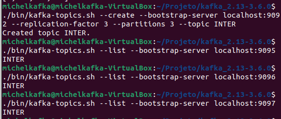
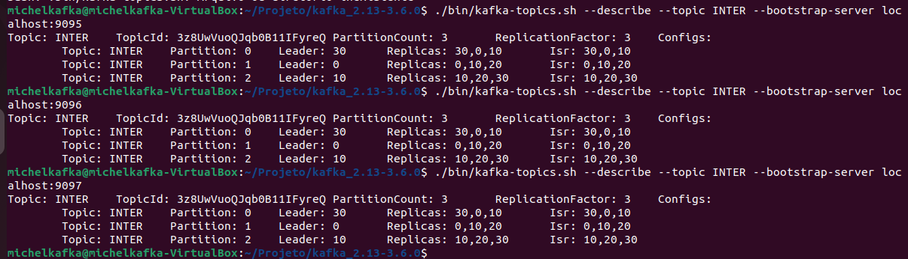

- 8-Com todos nodos ON conforme foi solicitado executar comandos: 

	`$bin/kafka-console-producer.sh --topic INTER --bootstrap-server localhost:9095`
>Produtor
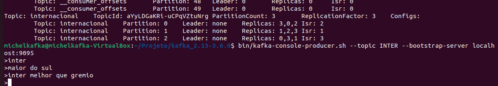

	`$bin/kafka-console-consumer.sh --topic INTER --bootstrap-server localhost:9096 --from-beginning`
>Consumidor
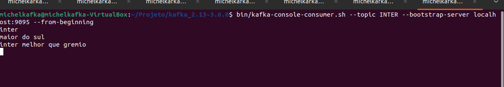

- 9-Com um nodo OFF conforme foi solicitado executar :
 

	`$lsof -t -i:9095 | xargs kill -9`
>Esse comando fará que eu encerre tudo que tem referente ao que esta configurado na porta 9095

	`$bin/kafka-console-consumer.sh --topic INTER --bootstrap-server localhost:9095 --from-beginning`
>Esse comando vai tentar executar o que encerramos para ser um Consumidor, porém ele vai acusar que a conexão não é estabelecida

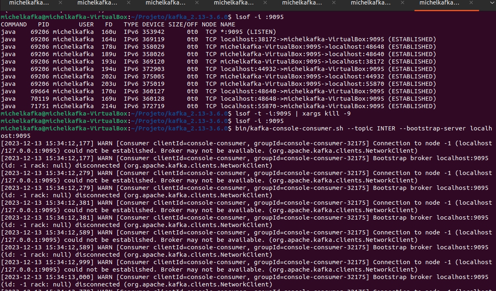

- 10-Com um nodo a mais, no caso adicionar um como foi solicitado:
>Iniciar novamente o nodo que foi colocado como OFF antes com o comando do passo 6

	`$ cd config`
	
	`$ cp server.properties michelnovo.properties' 
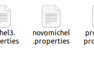 
>Esse Comando vai criar um novo properties que será necessário editar igual outros feitos anteriormente, designando um ID e uma porta
>Inicar ele como é feito no passo 6
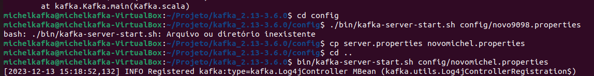
	

- 11-Com o novo criado e rodando podemos realizar testes:

	`$ bin/kafka-console-producer.sh --topic INTER --bootstrap-server localhost:9098'
>Colocando o "novomichel" com porta 9098 para Produtor para fins de testes

	`$bin/kafka-console-consumer.sh --topic INTER --bootstrap-server localhost:9095 --from-beginning`
>Colocando o "michel1" de porta 9095 como consumidor, da pra notar também que esse era o que haviamos parado antes, e ele mesmo parado e iniciado novamente ainda possui as mensagens antigas e também do novo "michelnovo"

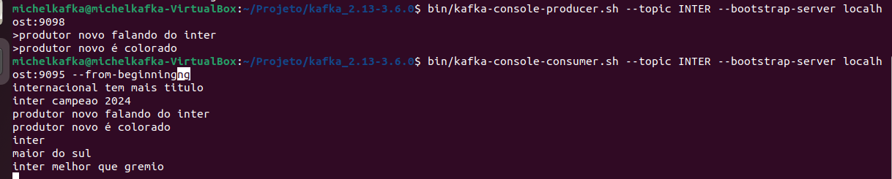

- 12-Partimos para leitura em grupo do Consumidor:
 
	`$ bin/kafka-console-producer.sh --topic INTER --bootstrap-server localhost:9095`
>Iniciamos um Produtor para fazer testes usando comando designando um grupo
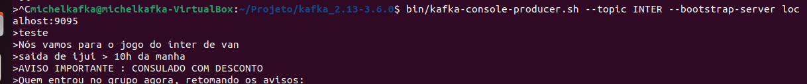

	`$bin/kafka-console-consumer.sh --topic INTER --bootstrap-server localhost:9092 --group VanParaJogo`
>Esse comando vai vazer que o seja designado um grupo, que no caso se chama "VanParaJogo" onde Consumidores presentes nele vao conseguir ler o que é colocado.
>Detalhe que o Produtor não precisa estar inserido no grupo, qualquer produtor pode escrever em qualquer tópico 
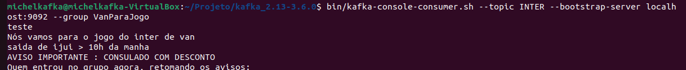
	
- 13- Novidade seria referente a que podemos alterar o código do Produtor para que quando o Consumidor ler ele saber data e hora daquela mensagem específica

	`$echo "{\"origem\": \"Produtor Novo\", \"mensagem\": \"Falando do Inter\", \"timestamp\": \"$(date -u +"%Y-%m-%dT%H:%M:%SZ")\"}" | bin/kafka-console-producer.sh --topic INTER --bootstrap-server localhost:9098`
>Vale ressaltar que a "origem" e a "mensagem" são inseridas manualmente a fim só de melhorar a descrição para o Consumidor, mas a parte do código "timestamp" pegaria automático do sistema a data e horário que foi produzida a mensagem

#### Na imagem mostra o envio de uma mensagem com o código da novidade através de um Produtor e um Consumidor lendo ela
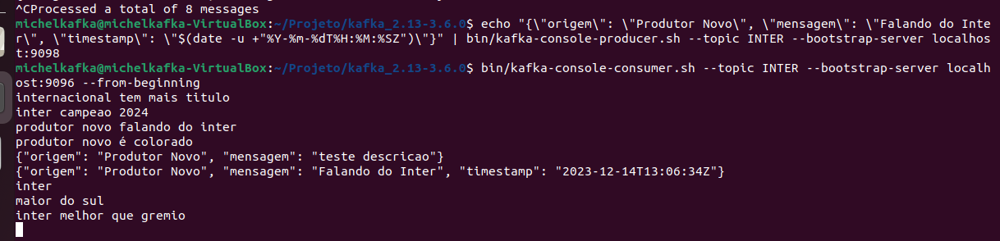
>Importante também dizer que por mais que na imagem é notório, essa novidade faz com que você consiga mandar uma mensagem por vez apenas, porém trazendo dados de data e hora que foram Produzidas

- Print referente ao :
 - git add .
 - git commit -m "sendtrabblockchain"
 - git push origin main
 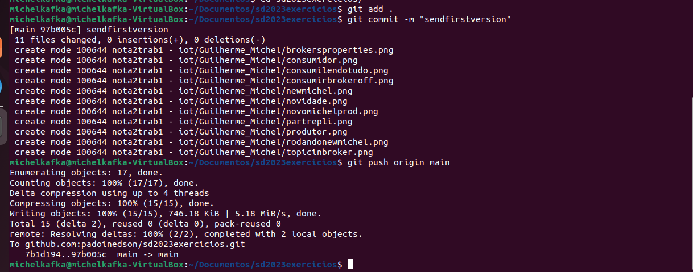
 

