#### Aplicação de Kafka
#### João Gabriel Foletto Schefer

##### 1 Instalar o kafka
##### Comando para fazer o download do kafka
	wget https://archive.apache.org/dist/kafka/3.3.1/kafka_2.13-3.3.1.tgz
	
##### Descompactar o arquivo
	tar -xzf kafka_2.13-3.3.1.tgz
	
##### Acessar o diretório
	cd kafka_2.13-3.3.1/

##### 2 Vamos utilizar o docker compose e precisamos instalar (nessa máquina já tenho instalado)

##### 3 Criação do ambiente (nodos, partição, fator de replicação)
##### Temos que criar um arquivo chamado "docker-compose.yml" com o seguinte conteudo

version: '2'
services:
  zookeeper:
    image: wurstmeister/zookeeper:latest
    ports:
     - "2181:2181"

  kafka1:
    image: wurstmeister/kafka:latest
    ports:
     - "9292:9292"
    expose:
     - "9292"
    environment:
      KAFKA_ADVERTISED_LISTENERS: INSIDE://kafka1:9093,OUTSIDE://localhost:9092
      KAFKA_LISTENER_SECURITY_PROTOCOL_MAP: INSIDE:PLAINTEXT,OUTSIDE:PLAINTEXT
      KAFKA_LISTENERS: INSIDE://0.0.0.0:9093,OUTSIDE://0.0.0.0:9092
      KAFKA_INTER_BROKER_LISTENER_NAME: INSIDE
      KAFKA_ZOOKEEPER_CONNECT: "zookeeper:2181"
      KAFKA_BROKER_ID: 1
      KAFKA_NUM_PARTITIONS: 3
      KAFKA_REPLICATION_FACTOR: 3

  kafka2:
    image: wurstmeister/kafka:latest
    ports:
     - "9494:9494"
    expose:
     - "9494"
    environment:
      KAFKA_ADVERTISED_LISTENERS: INSIDE://kafka2:9095,OUTSIDE://localhost:9094
      KAFKA_LISTENER_SECURITY_PROTOCOL_MAP: INSIDE:PLAINTEXT,OUTSIDE:PLAINTEXT
      KAFKA_LISTENERS: INSIDE://0.0.0.0:9095,OUTSIDE://0.0.0.0:9094
      KAFKA_INTER_BROKER_LISTENER_NAME: INSIDE
      KAFKA_ZOOKEEPER_CONNECT: "zookeeper:2181"
      KAFKA_BROKER_ID: 2
      KAFKA_NUM_PARTITIONS: 3
      KAFKA_REPLICATION_FACTOR: 3

  kafka3:
    image: wurstmeister/kafka:latest
    ports:
     - "9696:9696"
    expose:
     - "9696"
    environment:
      KAFKA_ADVERTISED_LISTENERS: INSIDE://kafka3:9097,OUTSIDE://localhost:9096
      KAFKA_LISTENER_SECURITY_PROTOCOL_MAP: INSIDE:PLAINTEXT,OUTSIDE:PLAINTEXT
      KAFKA_LISTENERS: INSIDE://0.0.0.0:9097,OUTSIDE://0.0.0.0:9096
      KAFKA_INTER_BROKER_LISTENER_NAME: INSIDE
      KAFKA_ZOOKEEPER_CONNECT: "zookeeper:2181"
      KAFKA_BROKER_ID: 3
      KAFKA_NUM_PARTITIONS: 3
      KAFKA_REPLICATION_FACTOR: 3

##### 4 Abra um terminal e va para o diretorio onde esta esse arquivo e de o seguinte comando
	docker-compose up -d
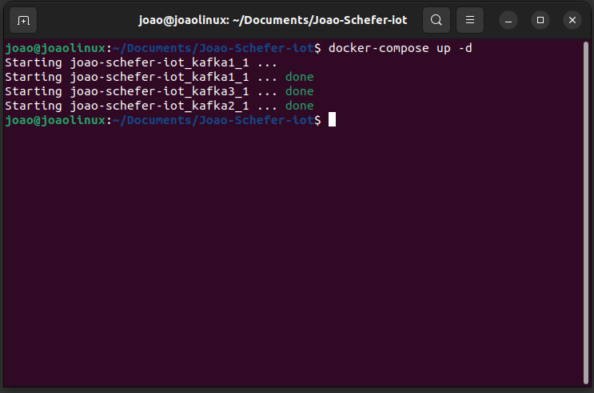

##### 5 Verfique se os containers estão em execução com o comando
	docker-compose ps
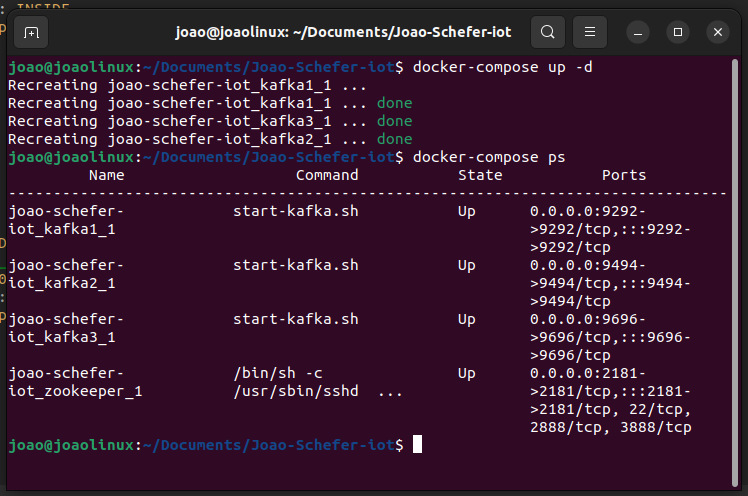

##### Pra criar um topico, voce precisa acessar o container com o seguinte comando
	docker exec -it joao-schefer-iot_kafka2_1 bash
	
##### Dentro do container, voce deve dar o comando a seguir, que ira criar um topico
	kafka-topics.sh --create \
  	--topic times \
  	--partitions 3 \
  	--replication-factor 3 \
  	--bootstrap-server kafka1:9093
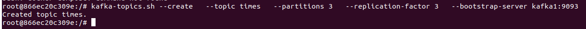
 
##### Foi criado um topico chamado times

##### Com o proximo comando, podemos listar os topicos existentes
	kafka-topics.sh --list --bootstrap-server kafka1:9093
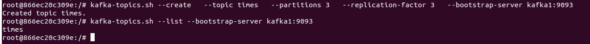

##### Agora vamos enviar dados para o kafka usando o seguinte comando
	kafka-console-producer.sh --topic times --bootstrap-server kafka1:9093
##### Esse comando vai abrir um prompt onde voce ira escrever a mensagem e teclar enter. Voce pode fazer isso quantas vezes quiser
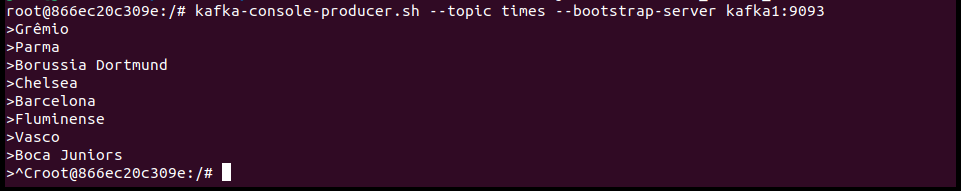

##### Agora vamos verificar se as mensagens foram enviadas. Precisamos abrir outro terminal e dar o seguinte comando
	docker exec -it joao-schefer-iot_kafka2_1 bash

##### AGora execute o seguinte comando para consumir as mensagens
	kafka-console-consumer.sh --topic times --from-beginning --bootstrap-server kafka1:9093
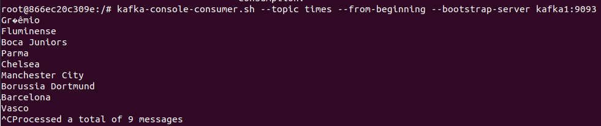

#### Produtor e Consumidor normal (todos os nodos on)
##### Esta etapa foi feita acima

#### Produtor e Consumidor com um dos nodos off (derrubar um nodo)
##### Para fazer isso, precisamos derrubar um nó com o seguinte comando
	sudo docker stop joao-schefer-iot_kafka2_1
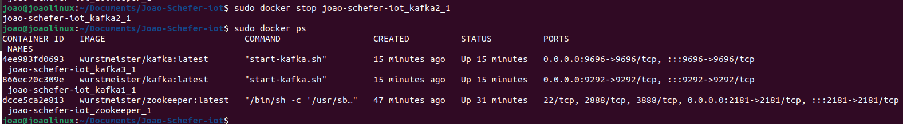
	
##### Vamos ver os conatiners em execução
	sudo docker ps
	
##### Vamos acessar outro container em outro terminal
	sudo docker exec -it joao-schefer-iot_kafka3_1 bash

##### Podemos perceber que se dermos o seguinte comando, vamos perceber que as mensagens não foram perdidas
	kafka-console-consumer.sh --topic times --from-beginning --bootstrap-server kafka1:9093
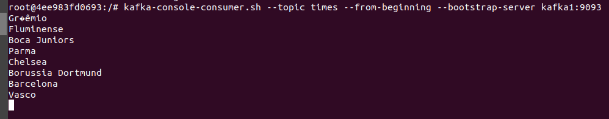
	
##### Agora vamos reerguer o container
	sudo docker start joao-schefer-iot_kafka2_1
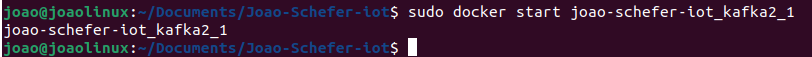
	
##### Podemos ver os containers em execução
	sudo docker ps
	
##### No terminal 2 podemos dar o seguinte comando e perceber que nenhum dado foi perdido
	kafka-console-consumer.sh --topic times --bootstrap-server kafka1:9093 --from-beginning
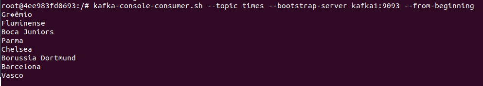

##### Agora em um terminal, vamos deixaar ele como produtor
##### Outro terminal como consumidor
##### E mais como consumidor
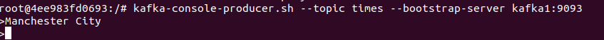
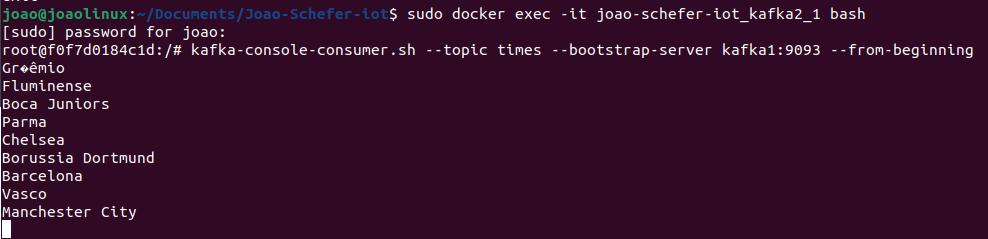
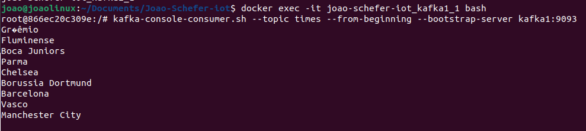		
##### Podemos visualizar que estamos produzindo mensagens e consumindo elas em tempo real nos terminais 1 e 2

#### Consumidor com leitura em grupo
##### Com o seguinte comando, vamos conseguir ler as mensagens em grupo
	kafka-console-consumer.sh --topic times --bootstrap-server kafka1:9093 --from-beginning --group meu-grupo
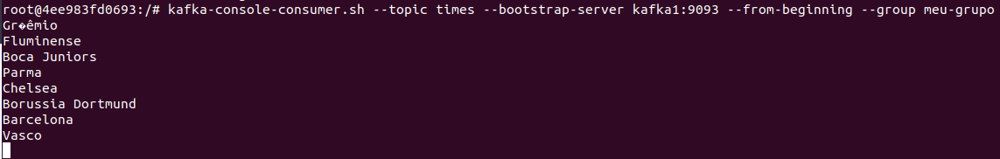

#### Novidades em relação ao exemplo de aula
##### Na parte de novidades, vamos consumir mensagens por partição e offset
##### -> Partição: um tópico pode ser dividido em várias partições. Cada partição é uma sequência ordenada e imutável de registros que são continuamente anexados.
##### -> Offset: cada mensagem em uma partição é identificada por um número único chamado de offset.

##### Se dermos o seguinte comando, vamos consumir todos os times ou mensagens
	kafka-console-consumer.sh --topic times --from-beginning --bootstrap-server kafka1:9093

##### Porem se dermos o seguinte comando, vamos consumir apenas as partições que quisermos
	kafka-console-consumer.sh --topic times --bootstrap-server kafka1:9093 --from-beginning --partition 0
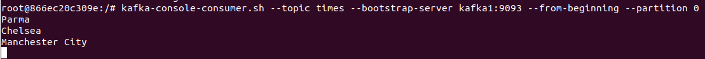
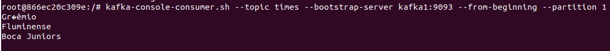
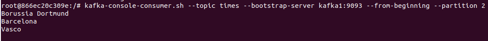

##### Podemos tambem consumir as mensagens a partir de um offset especifico	
	kafka-console-consumer.sh --topic times --bootstrap-server kafka1:9093 --partition 0 --offset 1
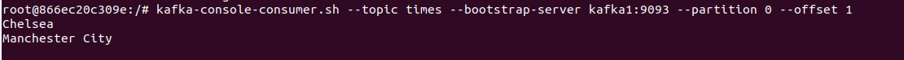

#### Prints de tela com:

##### git add do diretorio
##### git commit
##### git push

