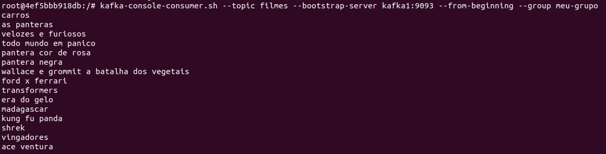

## Passo a Passo

##### Faça o download do Virtual Box (https://www.virtualbox.org/)

##### Baixe a imagem do Ubuntu (https://ubuntu.com/download/desktop)

##### Crie e configure (placa em modo Bridge) a máquina virtual com a imagem do Ubuntu

##### Acesse o terminal e comece

1. Atualize o sistema e instale o docker:
    ```bash
    sudo apt update
    sudo apt upgrade
    sudo apt install docker
    sudo apt install docker.io
    sudo apt install docker-compose
    ```

2. Baixe e extraia o arquivo contendo o kafka:
    ```bash
    wget https://downloads.apache.org/kafka/3.6.0/kafka_2.13-3.6.0.tgz
    tar -xzf kafka_2.13-3.6.0.tgz
    ```

5. Entre na pasta do kafka:
    ```bash
    cd kafka_2.13-3.6.0/
    ```

6. Crie um arquivo docke-compose.yml e cole o seguinte conteúdo:

    ```yaml
    version: '2'
    services:
      zookeeper:
        image: wurstmeister/zookeeper:latest
        ports:
         - "2181:2181"

      kafka1:
        image: wurstmeister/kafka:latest
        ports:
         - "9292:9292"
        expose:
         - "9292"
        environment:
          KAFKA_ADVERTISED_LISTENERS: INSIDE://kafka1:9093,OUTSIDE://localhost:9092
          KAFKA_LISTENER_SECURITY_PROTOCOL_MAP: INSIDE:PLAINTEXT,OUTSIDE:PLAINTEXT
          KAFKA_LISTENERS: INSIDE://0.0.0.0:9093,OUTSIDE://0.0.0.0:9092
          KAFKA_INTER_BROKER_LISTENER_NAME: INSIDE
          KAFKA_ZOOKEEPER_CONNECT: "zookeeper:2181"
          KAFKA_BROKER_ID: 1
          KAFKA_NUM_PARTITIONS: 3
          KAFKA_REPLICATION_FACTOR: 3

      kafka2:
        image: wurstmeister/kafka:latest
        ports:
         - "9494:9494"
        expose:
         - "9494"
        environment:
          KAFKA_ADVERTISED_LISTENERS: INSIDE://kafka2:9095,OUTSIDE://localhost:9094
          KAFKA_LISTENER_SECURITY_PROTOCOL_MAP: INSIDE:PLAINTEXT,OUTSIDE:PLAINTEXT
          KAFKA_LISTENERS: INSIDE://0.0.0.0:9095,OUTSIDE://0.0.0.0:9094
          KAFKA_INTER_BROKER_LISTENER_NAME: INSIDE
          KAFKA_ZOOKEEPER_CONNECT: "zookeeper:2181"
          KAFKA_BROKER_ID: 2
          KAFKA_NUM_PARTITIONS: 3
          KAFKA_REPLICATION_FACTOR: 3

      kafka3:
        image: wurstmeister/kafka:latest
        ports:
         - "9696:9696"
        expose:
         - "9696"
        environment:
          KAFKA_ADVERTISED_LISTENERS: INSIDE://kafka3:9097,OUTSIDE://localhost:9096
          KAFKA_LISTENER_SECURITY_PROTOCOL_MAP: INSIDE:PLAINTEXT,OUTSIDE:PLAINTEXT
          KAFKA_LISTENERS: INSIDE://0.0.0.0:9097,OUTSIDE://0.0.0.0:9096
          KAFKA_INTER_BROKER_LISTENER_NAME: INSIDE
          KAFKA_ZOOKEEPER_CONNECT: "zookeeper:2181"
          KAFKA_BROKER_ID: 3
          KAFKA_NUM_PARTITIONS: 3
          KAFKA_REPLICATION_FACTOR: 3
    ```

7. Suba o docker-compose:
    
    ```bash
    sudo docker-compose up -d
    ```
    
    
    ```bash
    sudo docker ps
    ```
    

#### Todos os nodos on

8. Criação do tópico e listagem:
    
    ```bash
    sudo docker exec -it kafka_213-360_kafka1_1 bash
    kafka-topics.sh --create --topic filmes --partitions 3 --replication-factor 3 --bootstrap-server kafka1:9093
    kafka-topics.sh --list --bootstrap-server kafka1:9093
    ```
    
    
9. Colocar conteudo pra dentro do tópico usando o produtor:

   ```bash
   kafka-console-producer.sh --topic times --bootstrap-server kafka1:9093
   ```
   
   
10. Agora você irá abrir um novo terminal e usar ele como consumidor dos dados através desse comando:
   
   ```bash
   sudo docker exec -it kafka_213-360_kafka2_1 bash
   kafka-console-consumer.sh --topic filmes --from-beginning --bootstrap-server kafka1:9093
   ```
   
   
   
#### Derrubando um nodo

11. Para derrubar um nodo use esse comando:
   
   ```bash
   sudo docker stop kafka_213-360_kafka2_1
   sudo docker ps
   ```
   
   
   
12. Abra outro terminal pra acessar o outro nodo e ver se ainda consegue consumir os dados:

   ```bash
   sudo docker exec -it kafka_213-360_kafka3_1 bash
   kafka-console-consumer.sh --topic filmes --from-beginning --bootstrap-server kafka1:9093
   ```
   
   
#### Colocando 2 consumidores e 1 produtor

13. Reerguendo o container e o colocando pra consumir os dados do produtor:
   
   ```bash
   sudo docker start kafka_213-360_kafka2_1
   sudo docker exec -it kafka_213-360_kafka2_1 bash   
   kafka-console-consumer.sh --topic filmes --from-beginning --bootstrap-server kafka1:9093
   ```
   
   

14. Agora o produtor está soltando mais conteudo e ambos estão recebendo:

   
   
   
   
#### Leitura em grupo

15. Use esse comando em algum dos terminais:

   ```bash
   kafka-console-consumer.sh --topic filmes --bootstrap-server kafka1:9093 --from-beginning --group meu-grupo
   ```
      
   
## Novidade

- Utilizacao de python pra colocar generos aleatorios no tópico.

    ```bash
    apt update
    apt install -y python3
    python3 -c 'import random; print(random.choice(["Ação", "Comédia", "Drama"]))' | kafka-console-producer.sh --topic filmes --bootstrap-server kafka1:9093
    ```

    
    
    
## GitHub


