Nome do aluno: Mateus E. Chitolina
# Intalação
Antes de mais nada é essencial realizar a intação do docker-compose atraves do comando:

`sudo apt install docker-compose`

Apos realizar a instação do docker-compose é realizado a criação do arquivo docker-compose.yml. Dentro desse arquivo é informado as seguintes configurações:

    ---
    version: '2'
    services:
      zookeeper-1:
    	image: confluentinc/cp-zookeeper:latest
    	environment:
      	ZOOKEEPER_SERVER_ID: 1
      	ZOOKEEPER_CLIENT_PORT: 22181
      	ZOOKEEPER_TICK_TIME: 2000
      	ZOOKEEPER_INIT_LIMIT: 5
      	ZOOKEEPER_SYNC_LIMIT: 2
      	ZOOKEEPER_SERVERS: localhost:22888:23888;localhost:32888:33888;localhost:42888:43888
    	network_mode: host
    	extra_hosts:
      	- "moby:127.0.0.1"
  
    zookeeper-2:
  	image: confluentinc/cp-zookeeper:latest
  	environment:
    	ZOOKEEPER_SERVER_ID: 2
    	ZOOKEEPER_CLIENT_PORT: 32181
    	ZOOKEEPER_TICK_TIME: 2000
    	ZOOKEEPER_INIT_LIMIT: 5
    	ZOOKEEPER_SYNC_LIMIT: 2
    	ZOOKEEPER_SERVERS: localhost:22888:23888;localhost:32888:33888;localhost:42888:43888
  	network_mode: host
  	extra_hosts:
    	- "moby:127.0.0.1"
  
    zookeeper-3:
  	image: confluentinc/cp-zookeeper:latest
  	environment:
    	ZOOKEEPER_SERVER_ID: 3
    	ZOOKEEPER_CLIENT_PORT: 42181
    	ZOOKEEPER_TICK_TIME: 2000
    	ZOOKEEPER_INIT_LIMIT: 5
    	ZOOKEEPER_SYNC_LIMIT: 2
    	ZOOKEEPER_SERVERS: localhost:22888:23888;localhost:32888:33888;localhost:42888:43888
  	network_mode: host
  	extra_hosts:
    	- "moby:127.0.0.1"
  
    kafka-1:
  	image: confluentinc/cp-kafka:latest
  	network_mode: host
  	depends_on:
    	- zookeeper-1
    	- zookeeper-2
    	- zookeeper-3
  	environment:
    	KAFKA_BROKER_ID: 1
    	KAFKA_ZOOKEEPER_CONNECT: localhost:22181,localhost:32181,localhost:42181
    	KAFKA_ADVERTISED_LISTENERS: PLAINTEXT://localhost:19092
    	KAFKA_CREATE_TOPICS: "linguagens:1:1"
  	extra_hosts:
    	- "moby:127.0.0.1"
  
    kafka-2:
  	image: confluentinc/cp-kafka:latest
  	network_mode: host
  	depends_on:
    	- zookeeper-1
    	- zookeeper-2
    	- zookeeper-3
  	environment:
    	KAFKA_BROKER_ID: 2
    	KAFKA_ZOOKEEPER_CONNECT: localhost:22181,localhost:32181,localhost:42181
    	KAFKA_ADVERTISED_LISTENERS: PLAINTEXT://localhost:29092
  	extra_hosts:
    	- "moby:127.0.0.1"
  
    kafka-3:
  	image: confluentinc/cp-kafka:latest
  	network_mode: host
  	depends_on:
    	- zookeeper-1
    	- zookeeper-2
    	- zookeeper-3
  	environment:
    	KAFKA_BROKER_ID: 3
    	KAFKA_ZOOKEEPER_CONNECT: localhost:22181,localhost:32181,localhost:42181
    	KAFKA_ADVERTISED_LISTENERS: PLAINTEXT://localhost:39092
  	extra_hosts:
    	- "moby:127.0.0.1"

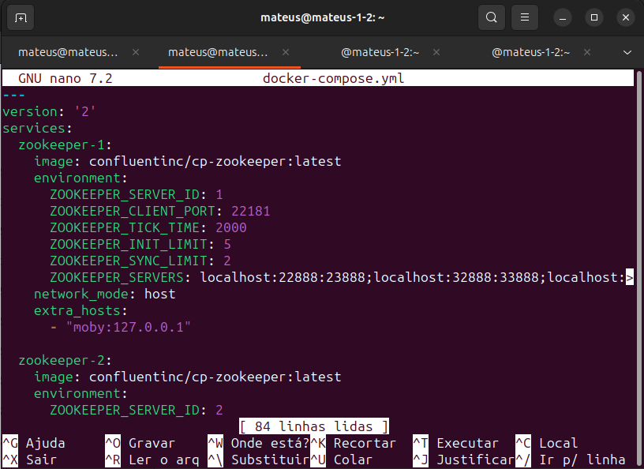

Apos a criação do arquivo é necessário apenas executar o docker-compose com o comando:

`sudo docker-compose up`

Para verificar se todos os container já foram devidamente iniciado basta abrir outro terminar e digitar o comando:

`sudo docker-compose ps`

# Consumidor e Produtos com todos nós on

Para entrar dentro do container que está rodando o seu Kafka é necessário abrir outra aba do terminal e digitar `sudo docker exec -it [SEU USUARIO]_kafka-1_1 bash`, no meu caso fica assim:

`sudo docker exec -it mateus_kafka-1_1 bash`

Para exibir o console do produtor basta utiliza o comando

`kafka-console-producer --broker-list localhost:29092 --topic linguagens`

Em uma outra aba do terminal para abrir o console do consumidor é necessário utilizar o comando:

`kafka-console-consumer --bootstrap-server localhost:29092 --topic linguagens`

Prints dos testes:

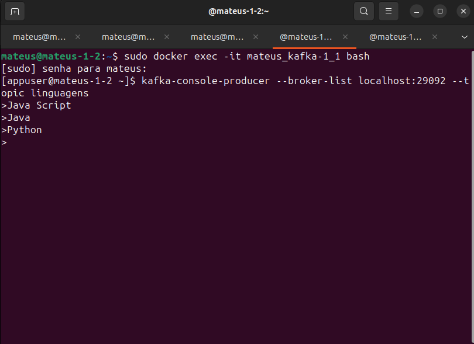
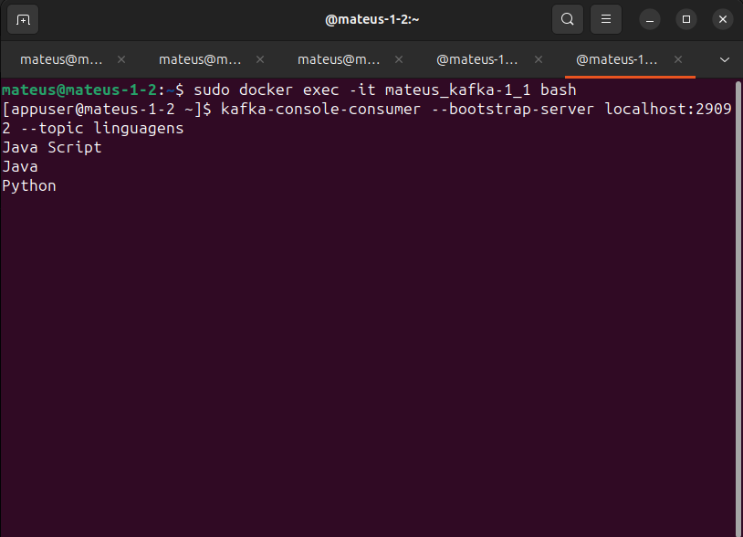

# Produtor e Consumidor com um dos nodos off

Para relizar esse teste é necessário derrubarmos um dos nós com o comando:

`sudo docker stop mateus_kafka-1_1`

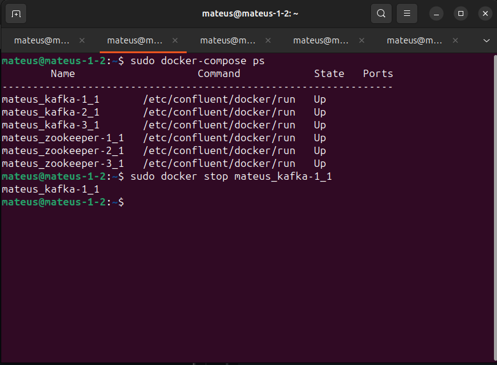

Assim entramos em outro container para validar as informações inseridas no container que foi derrubado, utilizando o comando:

`sudo docker exec -it mateus_kafka-2_1 bash`

E então utilizado o comando:

`kafka-console-consumer --bootstrap-server localhost:29092 --topic linguagens --from-beginning`

Visualizamos as informações que foram inseridas no container que foi derrubado:

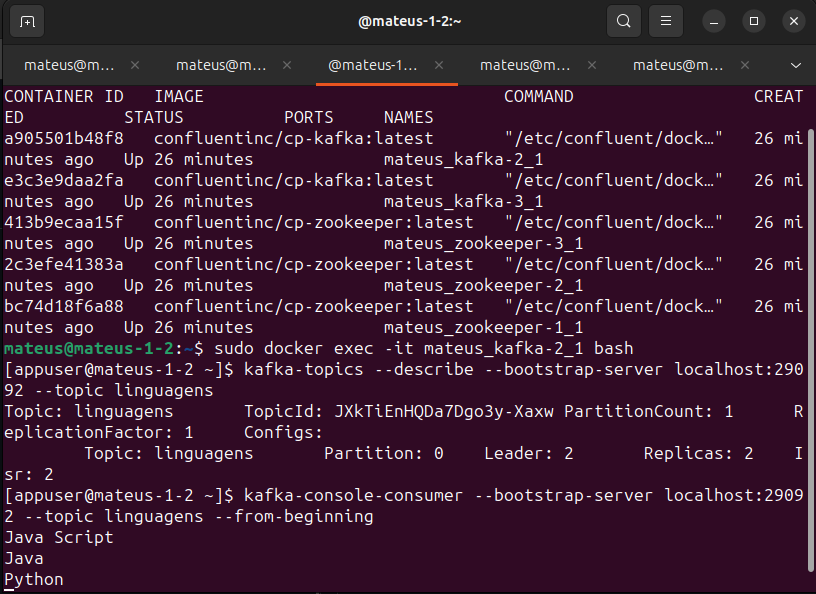

# Produtor e Consumidor com um nodo novo (adicionar um nodo)

Para subir o container novamente basta utilizar o comando:

`sudo docker start mateus_kafka-1_1`

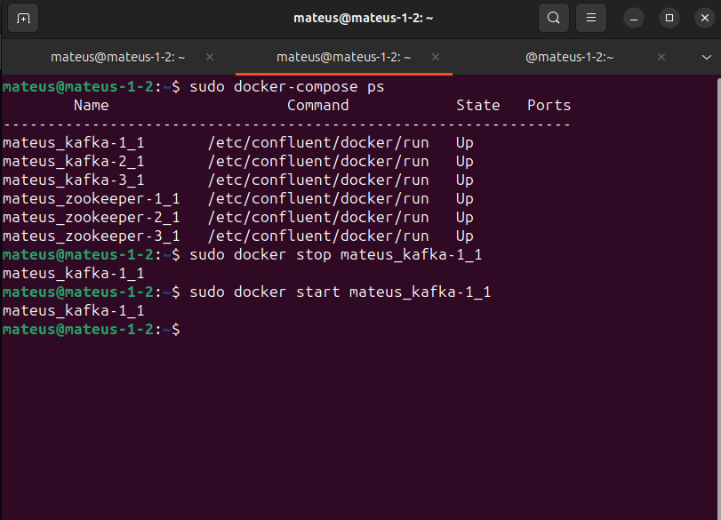

Apos isso é necessario entrar no container utilizando o comando:

`sudo docker exec -it mateus_kafka-1_1 bash`

E para visualizar as mensagens utilizasse o comnado:

`kafka-console-consumer --bootstrap-server localhost:29092 --topic linguagens --from-beginning`

Provando que não houve perda de mensagem quando derrubado o container:

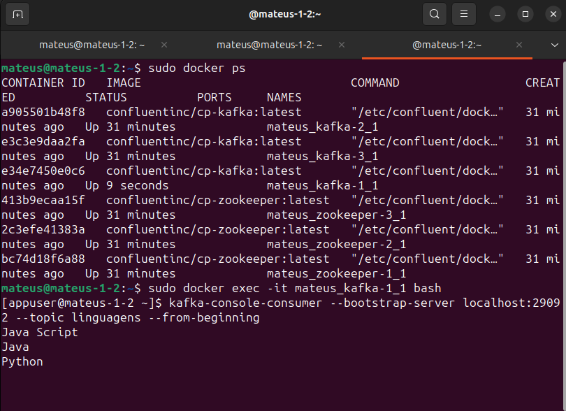

# Consumidor com leitura em grupo

Para visualizar as mensagens em leitura em grupo basta utilizar o comando apos entrar no conteiner:

`kafka-console-consumer --bootstrap-server localhost:29092 --topic linguagens --from-beginning --group programar`

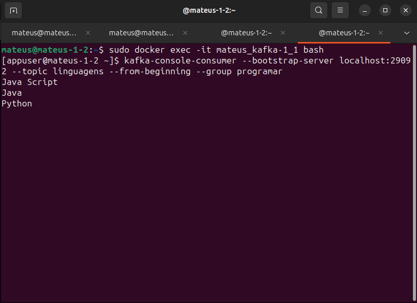

# Novidade

No processo não foi necessário criar um tópico dentro do kafka por conta da nova parâmetrização nova inserida no docker compose chamada:

`KAFKA_CREATE_TOPICS`

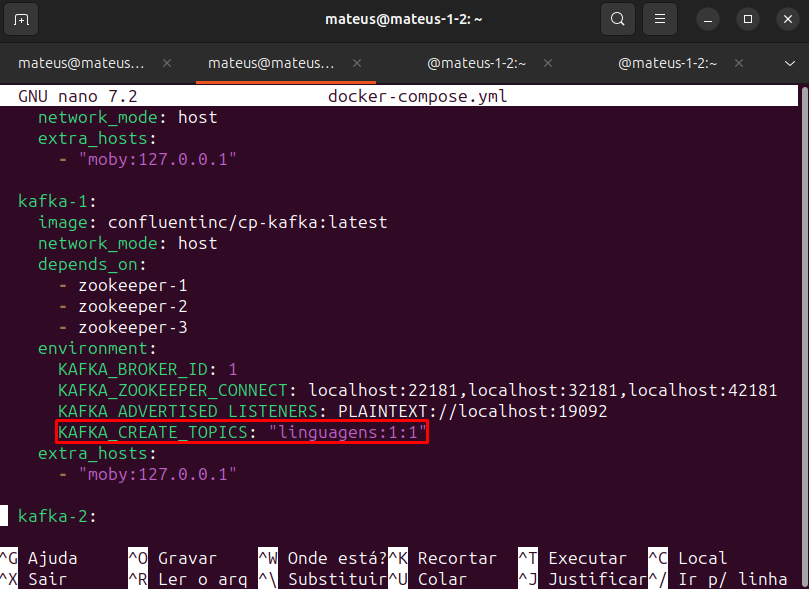

A nova configuração já insere o tópico ao executar o kafka não sendo necessário inserir manualmente.

## Imagens do envio para o git:

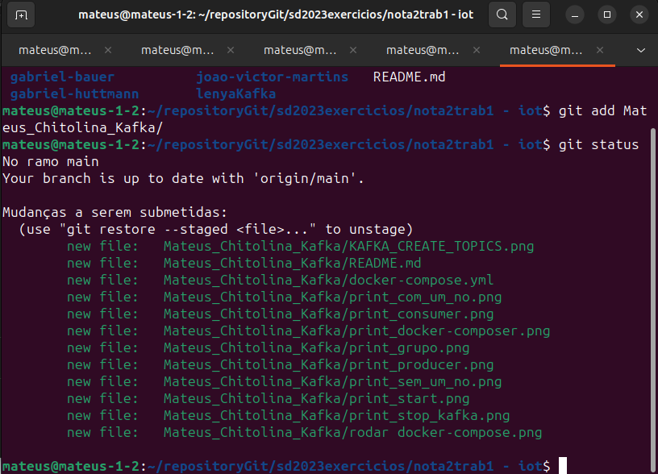

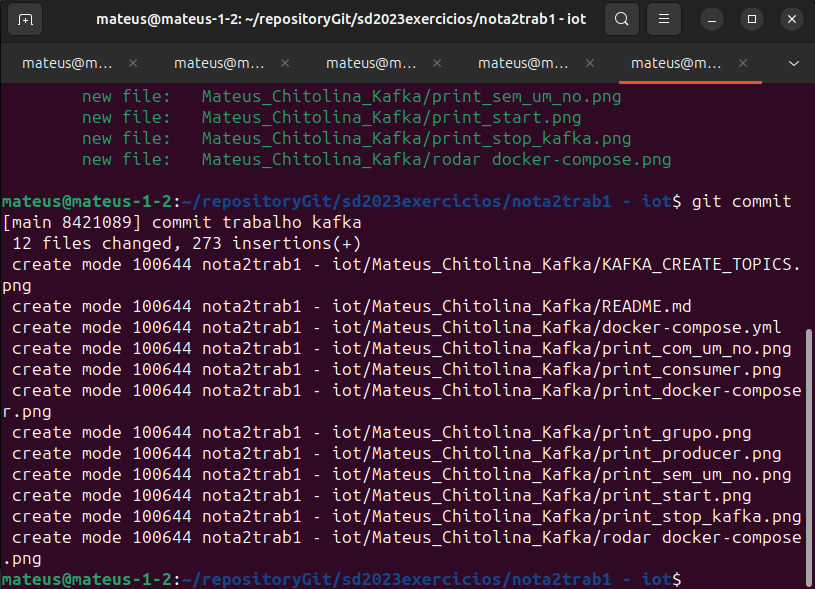

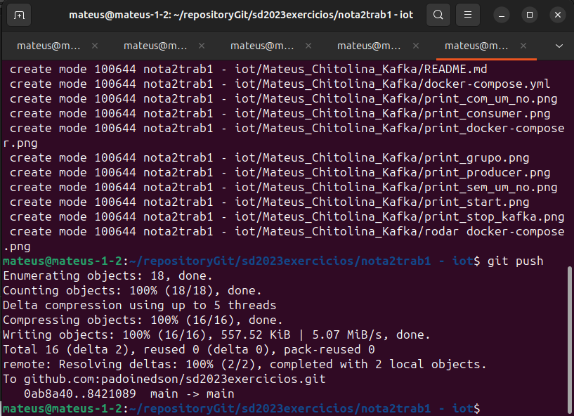
