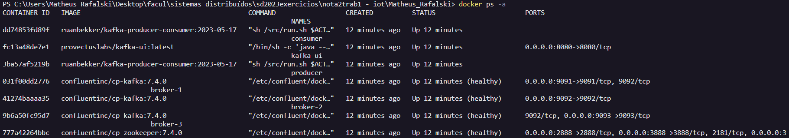
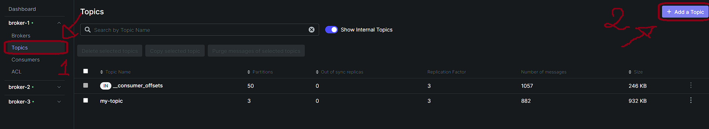
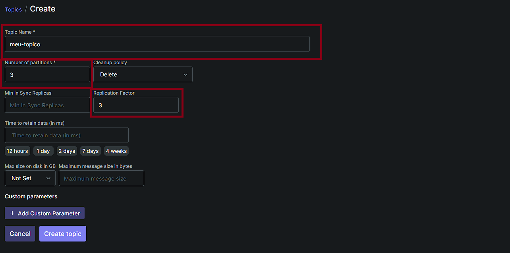
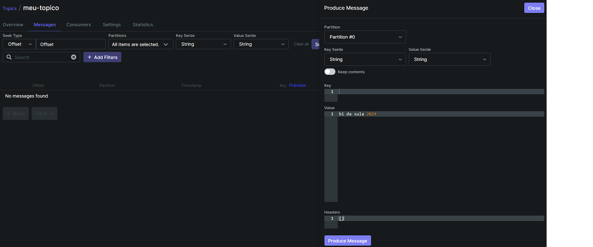
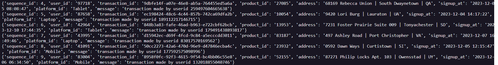
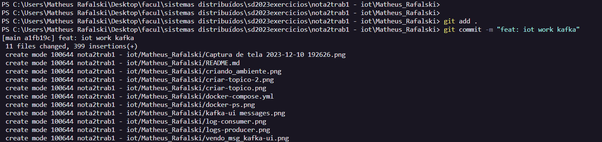
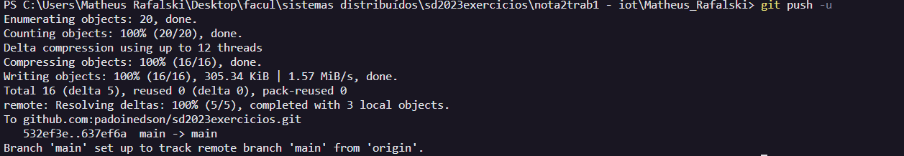

# Instalação do Apache Kafka, Zookeeper e Kafka UI com Docker Compose

## Nome do autor: Matheus Rafalski

### Pré-requisitos
Docker

### Configuração do Docker Compose
1. **Crie um arquivo `docker-compose.yml`** com o seguinte conteúdo  no seu diretório de trabalho:

```yaml
version: "3.9"

services:
  zookeeper:
    platform: linux/amd64
    image: confluentinc/cp-zookeeper:${CONFLUENT_PLATFORM_VERSION:-7.4.0}
    container_name: zookeeper
    restart: unless-stopped
    ports:
      - '32181:32181'
      - '2888:2888'
      - '3888:3888'
    environment:
      ZOOKEEPER_SERVER_ID: 1
      ZOOKEEPER_CLIENT_PORT: 32181
      ZOOKEEPER_TICK_TIME: 2000
      ZOOKEEPER_INIT_LIMIT: 5
      ZOOKEEPER_SYNC_LIMIT: 2
      ZOOKEEPER_SERVERS: zookeeper:2888:3888
    healthcheck:
      test: echo stat | nc localhost 32181
      interval: 10s
      timeout: 10s
      retries: 3
    networks:
      - kafka

  kafka-ui:
    container_name: kafka-ui
    image: provectuslabs/kafka-ui:latest
    ports:
      - 8080:8080
    depends_on:
      - broker-1
      - broker-2
      - broker-3
    environment:
      KAFKA_CLUSTERS_0_NAME: broker-1
      KAFKA_CLUSTERS_0_BOOTSTRAPSERVERS: broker-1:29091
      KAFKA_CLUSTERS_0_METRICS_PORT: 19101
      KAFKA_CLUSTERS_1_NAME: broker-2
      KAFKA_CLUSTERS_1_BOOTSTRAPSERVERS: broker-2:29092
      KAFKA_CLUSTERS_1_METRICS_PORT: 19102
      KAFKA_CLUSTERS_2_NAME: broker-3
      KAFKA_CLUSTERS_2_BOOTSTRAPSERVERS: broker-3:29093
      KAFKA_CLUSTERS_2_METRICS_PORT: 19103
      DYNAMIC_CONFIG_ENABLED: 'true'
    networks:
      - kafka

  broker-1:
    platform: linux/amd64
    image: confluentinc/cp-kafka:${CONFLUENT_PLATFORM_VERSION:-7.4.0}
    container_name: broker-1
    restart: unless-stopped
    ports:
      - '9091:9091'
    depends_on:
      - zookeeper
    environment:
      KAFKA_BROKER_ID: 1
      KAFKA_ZOOKEEPER_CONNECT: zookeeper:32181
      KAFKA_LISTENER_SECURITY_PROTOCOL_MAP: INTERNAL:PLAINTEXT,EXTERNAL:PLAINTEXT
      KAFKA_INTER_BROKER_LISTENER_NAME: INTERNAL
      KAFKA_ADVERTISED_LISTENERS: INTERNAL://broker-1:29091,EXTERNAL://localhost:9091
      KAFKA_DEFAULT_REPLICATION_FACTOR: 3
      KAFKA_NUM_PARTITIONS: 3
      KAFKA_JMX_PORT: 19101
      KAFKA_JMX_HOSTNAME: localhost
    healthcheck:
      test: nc -vz localhost 9091
      interval: 10s
      timeout: 10s
      retries: 3
    networks:
      - kafka

  broker-2:
    platform: linux/amd64
    image: confluentinc/cp-kafka:${CONFLUENT_PLATFORM_VERSION:-7.4.0}
    container_name: broker-2
    restart: unless-stopped
    ports:
      - '9092:9092'
    depends_on:
      - zookeeper
    environment:
      KAFKA_BROKER_ID: 2
      KAFKA_ZOOKEEPER_CONNECT: zookeeper:32181
      KAFKA_LISTENER_SECURITY_PROTOCOL_MAP: INTERNAL:PLAINTEXT,EXTERNAL:PLAINTEXT
      KAFKA_INTER_BROKER_LISTENER_NAME: INTERNAL
      KAFKA_ADVERTISED_LISTENERS: INTERNAL://broker-2:29092,EXTERNAL://localhost:9092
      KAFKA_DEFAULT_REPLICATION_FACTOR: 3
      KAFKA_NUM_PARTITIONS: 3
      KAFKA_JMX_PORT: 19102
      KAFKA_JMX_HOSTNAME: localhost
    healthcheck:
      test: nc -vz localhost 9092
      interval: 10s
      timeout: 10s
      retries: 3
    networks:
      - kafka

  broker-3:
    platform: linux/amd64
    image: confluentinc/cp-kafka:${CONFLUENT_PLATFORM_VERSION:-7.4.0}
    container_name: broker-3
    restart: unless-stopped
    ports:
      - '9093:9093'
    depends_on:
      - zookeeper
    environment:
      KAFKA_BROKER_ID: 3
      KAFKA_ZOOKEEPER_CONNECT: zookeeper:32181
      KAFKA_LISTENER_SECURITY_PROTOCOL_MAP: INTERNAL:PLAINTEXT,EXTERNAL:PLAINTEXT
      KAFKA_INTER_BROKER_LISTENER_NAME: INTERNAL
      KAFKA_ADVERTISED_LISTENERS: INTERNAL://broker-3:29093,EXTERNAL://localhost:9093
      KAFKA_DEFAULT_REPLICATION_FACTOR: 3
      KAFKA_NUM_PARTITIONS: 3
      KAFKA_JMX_PORT: 19103
      KAFKA_JMX_HOSTNAME: localhost
    healthcheck:
      test: nc -vz localhost 9093
      interval: 10s
      timeout: 10s
      retries: 3
    networks:
      - kafka
  producer:
    platform: linux/amd64
    container_name: producer
    image: ruanbekker/kafka-producer-consumer:2023-05-17
    # source: https://github.com/ruanbekker/quick-starts/tree/main/docker/kafka/python-client
    restart: always
    environment:
      - ACTION=producer
      - BOOTSTRAP_SERVERS=broker-1:29091,broker-2:29092,broker-3:29093
      - TOPIC=my-topic
      - PYTHONUNBUFFERED=1 # https://github.com/docker/compose/issues/4837#issuecomment-302765592
    networks:
      - kafka
    depends_on:
      - zookeeper
      - broker-1
      - broker-2
      - broker-3

  consumer:
    platform: linux/amd64
    container_name: consumer
    image: ruanbekker/kafka-producer-consumer:2023-05-17
    # source: https://github.com/ruanbekker/quick-starts/tree/main/docker/kafka/python-client
    restart: always
    environment:
      - ACTION=consumer
      - BOOTSTRAP_SERVERS=broker-1:29091,broker-2:29092,broker-3:29093
      - TOPIC=my-topic
      - CONSUMER_GROUP=cg-group-id
      - PYTHONUNBUFFERED=1 # https://github.com/docker/compose/issues/4837#issuecomment-302765592
    networks:
      - kafka
    depends_on:
      - zookeeper
      - broker-1
      - broker-2
      - broker-3
      - producer

networks:
  kafka:
    name: kafka
```


### 2. Execução
- Execute `docker compose up -d` para iniciar o serviço em segundo plano. 

- Em sequência verifique se os containers foram criados com sucesso executando o comando `docker ps -a`.



- Após os serviços executarem, você pode abrir o navegador para acessar o kafka-ui na url `http://localhost:8500`. Para adicionar um tópico, basta clicar no botão `Add a Topic` no canto superior direito


- Em seguida, defina o nome do tópico e a quantidade de partições. **APENAS esta duas informações são de preenchimento obrigatório.** , você também pode definir o fato de replicação




### 3. Produzir mensagens do kafka
- Clique no botão `Produce Message` dentro do tópico e escolha em qual partição deseja produzir a mensagem e defina os atributos `Key` e `Value` de cada mensagem.


### 4. Ler mensagens do kafka
- Após produzir a mensagem seguindo o passo acima, você consegue visualizar as mensagens produzidas na aba `Messages`



### 3. Produzire consumir mensagens do kafka
- Para produzir mensagens nós usamos o container que foi declarado no arquivo do docker-compose que constantemente publica mensagens.
fonte: `[](https://github.com/ruanbekker/quick-starts/blob/main/docker/kafka/python-client/produce.py)`
- Para ver as mensagens publicas basta executar o comando `docker logs -f producer`


- Da mesma forma temos um container que consome as mensagens para ver as mensagens chegando no container basta executar o comando `docker logs -f consumer`
fonte: `[](https://github.com/ruanbekker/quick-starts/blob/main/docker/kafka/python-client/consume.py)`



### 6. Git add, push e commit



