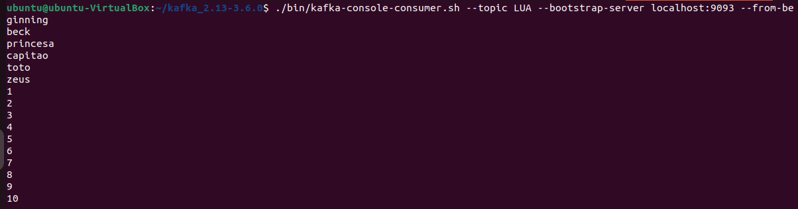

###Mayara Meotti

### 1- Instale o Kafta através do link: https://downloads.apache.org/kafka/3.6.0/kafka_2.13-3.6.0.tgz
### 2- Descompacte em um diretório. 

### 3- Se não possuir, baixe o Java JRE através dos dois seguintes comandos:
```
sudo apt update 
sudo apt install default-jre
```
### 4- Na pasta extraída, abra um terminal

### 5- O serviço Zookeeper deve ser inicializado via:
```
sh bin/zookeeper-server-start.sh config/zookeeper.properties
```
### 6- Um novo terminal na pasta extraída deve ser aberto para que o Kafta seja executado:
```
sh bin/kafka-server-start.sh config/server.properties
```
### 7- Um broker foi criado e pode ser visualizado por meio do comando:
```
./bin/zookeeper-shell.sh localhost:2181 <<<"ls /brokers/ids
```

###CRIAÇÃO DE VÁRIOS BROKERS

### 8- A pasta config deve ser acesada:
```
cd config
```
### 9- Execute, sequencialmete, os comandos:
```
cp server.properties mayara1.properties
cp server.properties mayara2.properties
cp server.properties mayara3.properties
```
Os 3 arquivos devem ser editados e as seguintes propriedades devem ser alteradas: 
```
broker.id=
listeners=PLAINTEXT://:PORT
log.dir=
```
O arquivo mayara1.properties foi modificado e passou a ter os seguintes valores: 
```
broker.id=1
listeners=PLAINTEXT://:9092
log.dir=/tmp/kafka-logs-1
```
Para cada valor nos demais arquivos de configuração, deve ser acrescentado 1.

### 10- Use, para sair da pasta atual, o comando:
```
cd ..
```
### 11- Um novo broker deve ser inicializado:
```
bin/kafka-server-start.sh config/server1.properties
```
### 12- Os 3 brokers estão rodando, a visualização deve ser feita por meio de:
```
./bin/zookeeper-shell.sh localhost:2181 <<<"ls /brokers/ids"
```


```
CRIAÇÃO DE TÓPICOS
```
### 13- Crie um tópico executando o comando:
```
./bin/kafka-topics.sh --create --bootstrap-server localhost:9092 --replication-factor 3 --partitions 3 --topic LUA
```


### 14- O mesmo tópico foi criado nos 3 brokens - é necessário alterar apenas o número da porta desejada - e a visualização se dá via:
```
./bin/kafka-topics.sh --list --botstrap-server localhost:PORT
```


VERIFICAR NÓS

### 15- As partições devem ser verificadas através de:
```
kafka-topics.sh --describe --topic LUA--bootstrap-server localhost:9092
```


### 17- Visualize a saída de um consumer no momento em que os 3 nós estavam rodando. A primeira imagem demonstra o conteúdo que foi produzido em um producer na porta 9092 e a segunda exibe a saída do consumer para a porta 9092


### 18- Na porta 9093 cria-se mais mensagens:


### 19- A imagem abaixo mostra o resultado do consumer na porta 9093 e, ainda, exibe as mensagens antigas produzidas na 9092.



### 20- Crie um novo producer na porta 9094 e inclua mensagem, como mostrado na imagem:


### 21- Com um novo consumer na porta 9092 criado pela flag --from-beginning  as mensagens incluídas anteriormente podem ser visualizadas:


NOVIDADE!

### 22- Para a parte de novidade, foi feito um arquivo txt, no qual ele possuia valores, fazando com que o comando abaixo, pegava o arquivo pelo seu caminho e pelo topico escolhido, acrecentava no programa:

```
bin/kafka-console-producer.sh --topic LUA --bootstrap-server localhost:9094 < /home/ubuntu/kafka/texto.txt
```


GIT 


