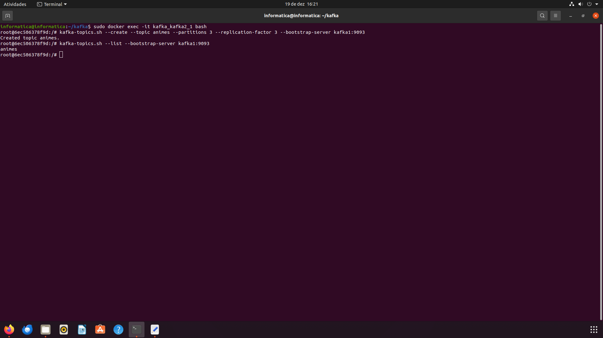
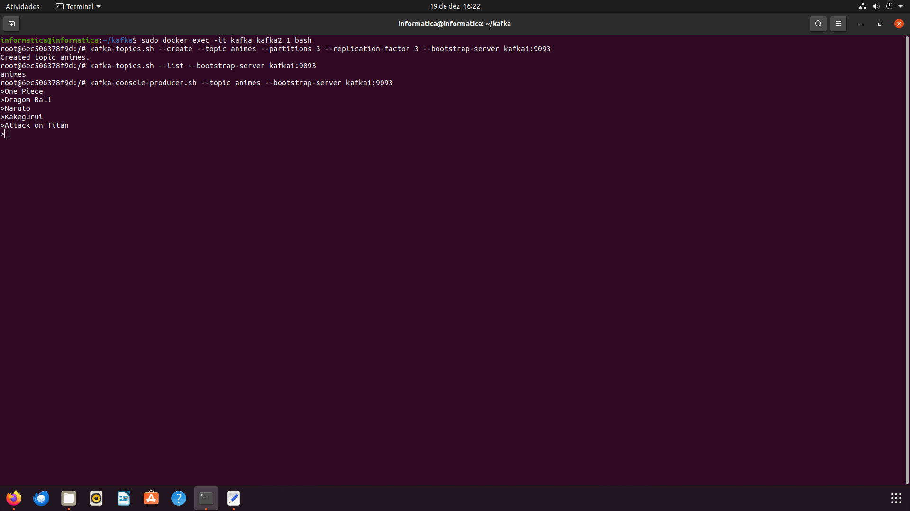
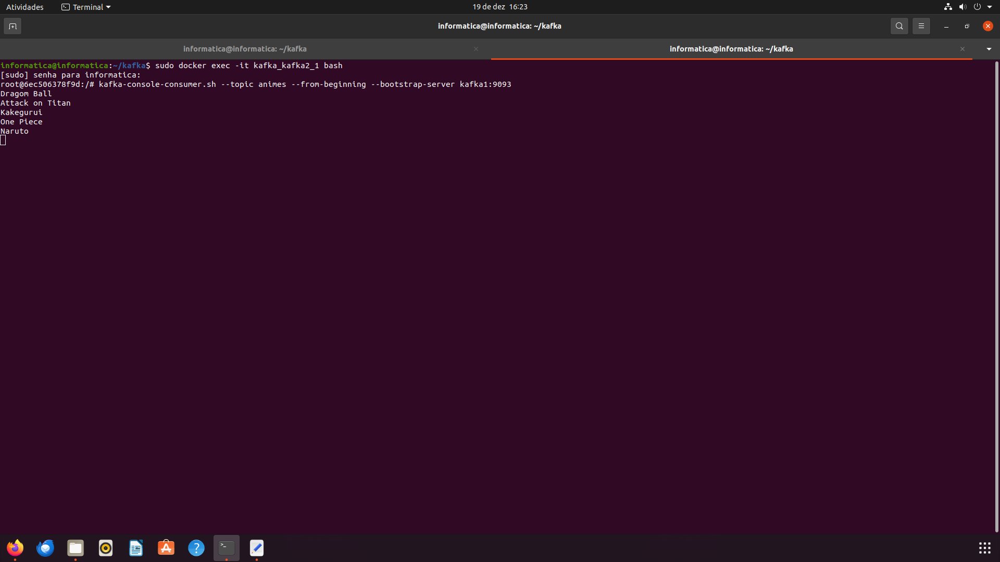
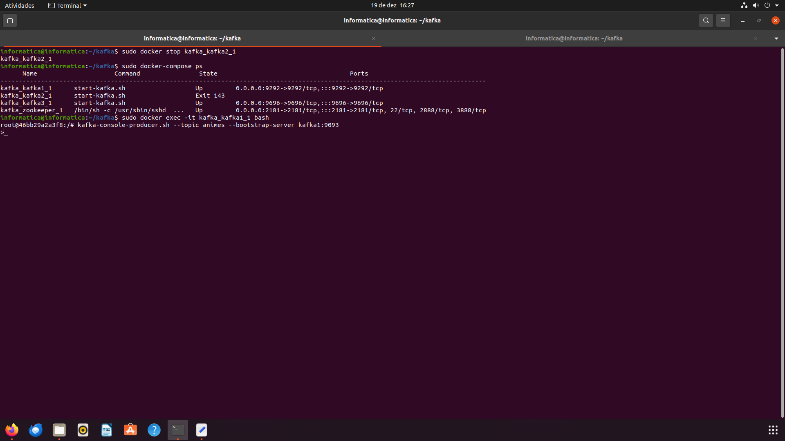
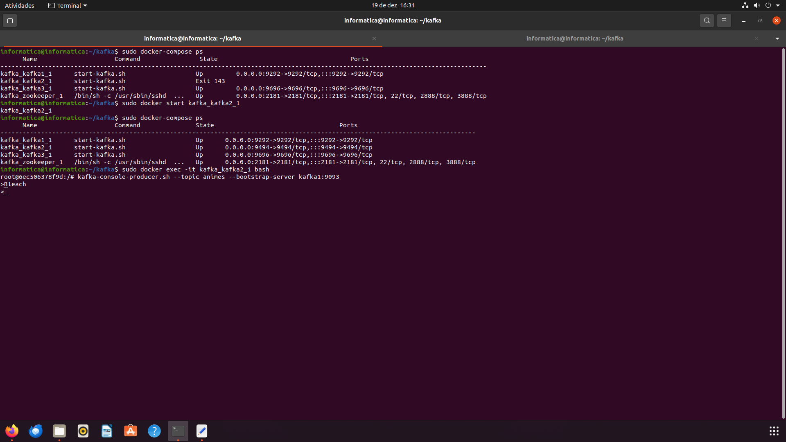
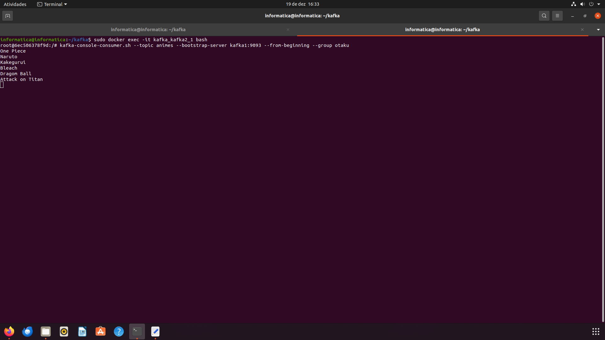

## Kafka

Nome: Renan L. Dambros

1. Abra o terminal e instale o docker e o docker compose
```
sudo apt install docker
```

```
sudo apt install docker-compose
```

2. Baixe o Kafka:
```
wget https://archive.apache.org/dist/kafka/3.3.1/kafka_2.13-3.3.1.tgz
```

3. Descompacte o arquivo:
```
tar -xzf kafka_2.13-3.3.1.tgz
```

4. Crie uma pasta:
```
mkdir Kafka
```

5. Enter na pasta:
```
cd  Kafka
```

6. Crie um arquivo "docker-compose.yml" e adicione:

```
nano docker-compose.yml
```

```
services:
  zookeeper:
    image: wurstmeister/zookeeper:latest
    ports:
     - "2181:2181"

  kafka1:
    image: wurstmeister/kafka:latest
    ports:
     - "9292:9292"
    expose:
     - "9292"
    environment:
      KAFKA_ADVERTISED_LISTENERS: INSIDE://kafka1:9093,OUTSIDE://localhost:9092
      KAFKA_LISTENER_SECURITY_PROTOCOL_MAP: INSIDE:PLAINTEXT,OUTSIDE:PLAINTEXT
      KAFKA_LISTENERS: INSIDE://0.0.0.0:9093,OUTSIDE://0.0.0.0:9092
      KAFKA_INTER_BROKER_LISTENER_NAME: INSIDE
      KAFKA_ZOOKEEPER_CONNECT: "zookeeper:2181"
      KAFKA_BROKER_ID: 1
      KAFKA_NUM_PARTITIONS: 3
      KAFKA_REPLICATION_FACTOR: 3

  kafka2:
    image: wurstmeister/kafka:latest
    ports:
     - "9494:9494"
    expose:
     - "9494"
    environment:
      KAFKA_ADVERTISED_LISTENERS: INSIDE://kafka2:9095,OUTSIDE://localhost:9094
      KAFKA_LISTENER_SECURITY_PROTOCOL_MAP: INSIDE:PLAINTEXT,OUTSIDE:PLAINTEXT
      KAFKA_LISTENERS: INSIDE://0.0.0.0:9095,OUTSIDE://0.0.0.0:9094
      KAFKA_INTER_BROKER_LISTENER_NAME: INSIDE
      KAFKA_ZOOKEEPER_CONNECT: "zookeeper:2181"
      KAFKA_BROKER_ID: 2
      KAFKA_NUM_PARTITIONS: 3
      KAFKA_REPLICATION_FACTOR: 3

  kafka3:
    image: wurstmeister/kafka:latest
    ports:
     - "9696:9696"
    expose:
     - "9696"
    environment:
      KAFKA_ADVERTISED_LISTENERS: INSIDE://kafka3:9097,OUTSIDE://localhost:9096
      KAFKA_LISTENER_SECURITY_PROTOCOL_MAP: INSIDE:PLAINTEXT,OUTSIDE:PLAINTEXT
      KAFKA_LISTENERS: INSIDE://0.0.0.0:9097,OUTSIDE://0.0.0.0:9096
      KAFKA_INTER_BROKER_LISTENER_NAME: INSIDE
      KAFKA_ZOOKEEPER_CONNECT: "zookeeper:2181"
      KAFKA_BROKER_ID: 3
      KAFKA_NUM_PARTITIONS: 3
      KAFKA_REPLICATION_FACTOR: 3
```

7. Inicie os serviços:
```
sudo docker-compose up -d
```

8. Verifique se os serviços estão em execução:
```
sudo docker-compose ps
```

9. Acesse o container:
```
sudo docker exec -it nome_pasta_kafka2_1 bash
```

10. Crie um tópico:
```
kafka-topics.sh --create --topic animes --partitions 3 --replication-factor 3 --bootstrap-server kafka1:9093
```



11. Visualize os tópicos criados:
```
kafka-topics.sh --list --bootstrap-server kafka1:9093
```

- Todos os nodos ON.

12. Envie dados para o kafka:
```
kafka-console-producer.sh --topic nome_topico --bootstrap-server kafka1:9093
```



13. Abra outro terminal:
```
sudo docker exec -it nome_pasta_kafka2_1 bash
```

14. Use o comando para consumir as mensagens enviadas:
```
kafka-console-consumer.sh --topic nome_topico --from-beginning --bootstrap-server kafka1:9093
```



- Produtor e Consumidor com um dos Nodos OFF.
1. Derrube um nó:
```
sudo docker stop nome_pasta_kafka2_1
```

2. Verifique os containers em execução
```
sudo docker-compose ps
```

3. Entre em outro container e veja se as mensagens continuam lá:
```
sudo docker start nome_pasta_kafka1_1
```

```
kafka-console-consumer.sh --topic nome_topico --from-beginning --bootstrap-server kafka1:9093
```




- Produtor e consumidor com um novo nodo.

1. Inicie o nó:
```
sudo docker start nome_pasta_kafka2_1
```

2. Verifique os containers em execução
```
sudo docker-compose ps
```

3. Entre em outro container e veja se as mensagens continuam lá:
```
sudo docker exec -it nome_pasta_kafka2_1 bash
```

```
kafka-console-consumer.sh --topic nome_topico --from-beginning --bootstrap-server kafka1:9093
```




- Consumidor com leitura em grupo
```
kafka-console-consumer.sh --topic nome_topico --bootstrap-server kafka1:9093 --from-beginning --group otaku
```


## Novidade

1. Delete um tópico:
```
kafka-topics.sh --bootstrap-server localhost:9093 --delete --topic animes
```

2. Delete um grupo: 
```
kafka-consumer-groups.sh --bootstrap-server localhost:9093 --delete --group otaku
```


