Victor Gabriel da Silva

## Passos para instalação

Baixar o arquivo [Docker-compose.yml](https://github.com/confluentinc/cp-docker-images/tree/5.3.3-post/examples/kafka-cluster)

Instalar o docker e docker compose

    sudo apt install docker
    sudo apt install docker.io
    sudo apt install docker-compose

## Criação do ambiente

Para iniciar, é necessário rodar o comando na pasta onde se encontra o docker-compose.yml:

`sudo docker-compose up`

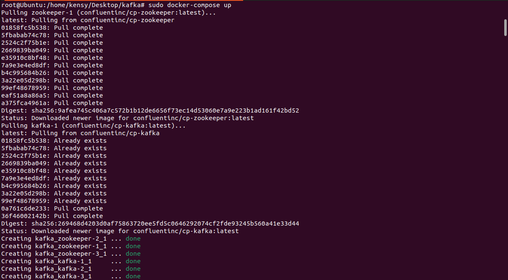

Para verificarmos o status do docker:

`sudo docker-compose ps`

## Produtores e Consumidores

Primeiramente, precisamos conectar a um container em um terminal

`sudo docker exec -it kafka_kafka-1_1 bash`

Precisamos criar um tópico. Por meio do comando abaixo, criei um tópico chamado "games".

`kafka-topics --create --bootstrap-server localhost:29092 --replication-factor 3 --partitions 3 --topic games`

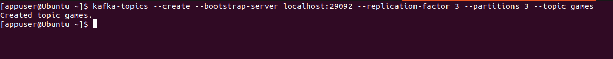

Acessando outro terminal, com o mesmo comando nos conectamos ao mesmo container 

`sudo docker exec -it kafka_kafka-1_1 bash`

Dentro do container, iremos criar o produtor.

`kafka-console-producer --broker-list localhost:29092 --topic games`

E adicionaremos o que queremos colocar de conteúdo dentro do tópico. Neste trabalho, usei alguns jogos (Overwatch, Fortnite, Minecraft e Paladins).

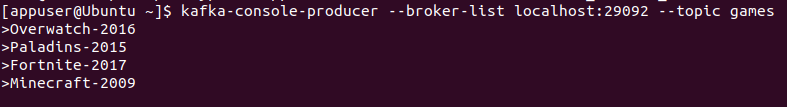

Abrimos outro terminal, e com o mesmo comando nos conectamos ao mesmo container, mas dessa vez criaremos um consumer

`sudo docker exec -it kafka_kafka-1_1 bash`

`kafka-console-consumer --bootstrap-server localhost:29092 --topic games --from-beginning`

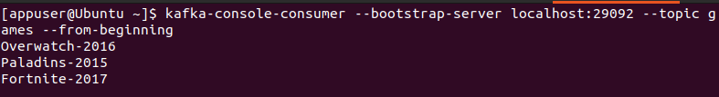

*note que o consumidor não tem a última opção que eu coloquei, pois esqueci de dar enter*

Esse terminal deve mostrar o conteúdo inserido no producer

## Com um nodo off

Paramos o contaider de um dos nodos com o comando

`sudo docker stop kafka_kafka-1_1`
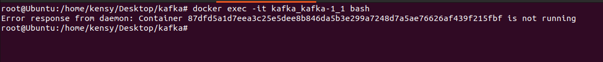
Em seguida utilizaremos outro nodo

`sudo docker exec -it kafka_kafka-2_1 bash`

`kafka-console-consumer --bootstrap-server localhost:29092 --topic games --from-beginning`

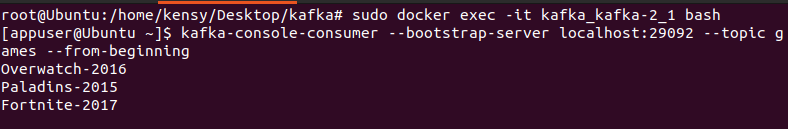

A saida deve ser a mesma

## Com um novo nodo  

Subimos o nodo que derrubamos anteriormente

`sudo docker start kafka_kafka-1_1`

`sudo docker exec -it <nome do user>_kafka-1_1 bash`

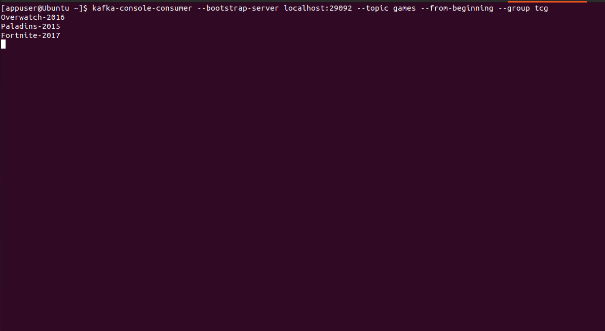

Acessando esse nodo é possível realizar qualquer comando utilizado anteriormente para testa-lo

Também é possível realizar a leitura por meio de grupos:

`kafka-console-consumer --bootstrap-server localhost:29092 --topic card-database --from-beginning --group tcg`

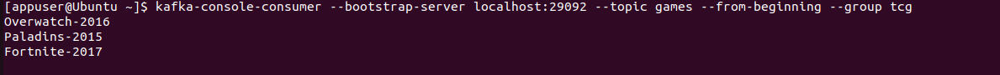

## Minha novidade

A minha ideia surgiu de pura curiosidade para saber como funciona o kafka e ter mais informações sobre.
Criei um novo tópico com o nome developers e adicionei algum conteúdo lá dentro.
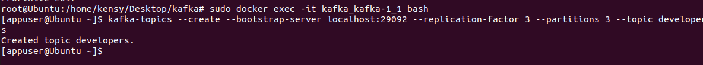

Utilizando o comando
 `kafka-topics --describe --bootstrap-server localhost:29092`
Temos informações sobre a quantidade de partições,  o fator de replicação e os lideres de cada partição.

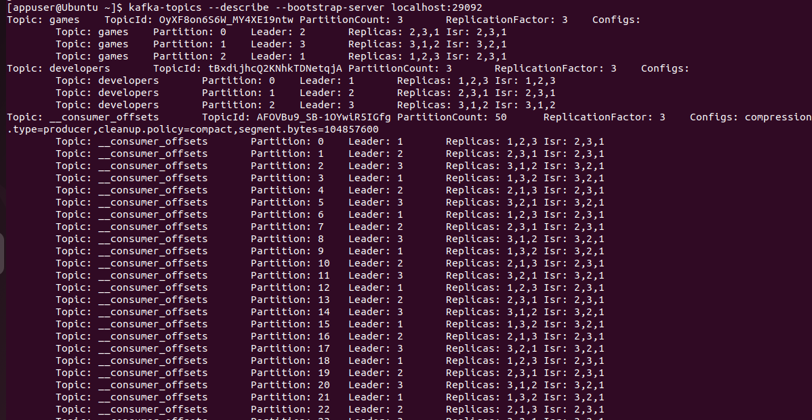

## Print do git
 
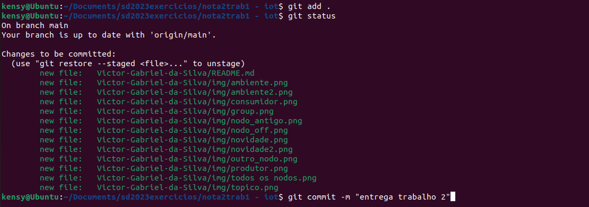

