# Apache Kafka + Firebase
Este documento tem como objetivo apresentar um passo a passo detalhando a instalação e a utilização básica do Apache Kafka em um sistema Linux, para fins de teste e aprendizado. Além disso, será demonstrada a integração de um broker criado no Apache Kafka com uma Realtime Database de um projeto do Firebase, através do uso do Kafka Connect, a fim de criar um gateway automático de dados entre os dois serviços.
> Autor: Bruno Moretto Monegat

## Pré-requisitos
* Sistema operacional baseado em Linux;
* Docker e Docker Compose;
* Projeto configurado no Firebase contendo uma Realtime Database.

## Criação da Imagem do Kafka Connect Firebase
Começe gerando uma nova chave privada contendo o token de autenticação para a sua conta de serviço do Firebase. Para isso, acesse o console do seu projeto no Firebase e navegue para **Configurações do projeto > Contas de Serviço**.

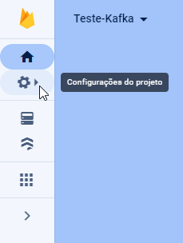

Pressione o botão **Gerar nova chave privada**. Será feito o download de um arquivo JSON contendo a chave privada da conta de serviço. Renemeie esse arquivo para **``serviceAccountKey.json``** e salve-o no diretório raíz do projeto, no mesmo lugar onde posteriormente ficarão os arquivos **``Dockerfile``** e **``docker-compose.yml``**:

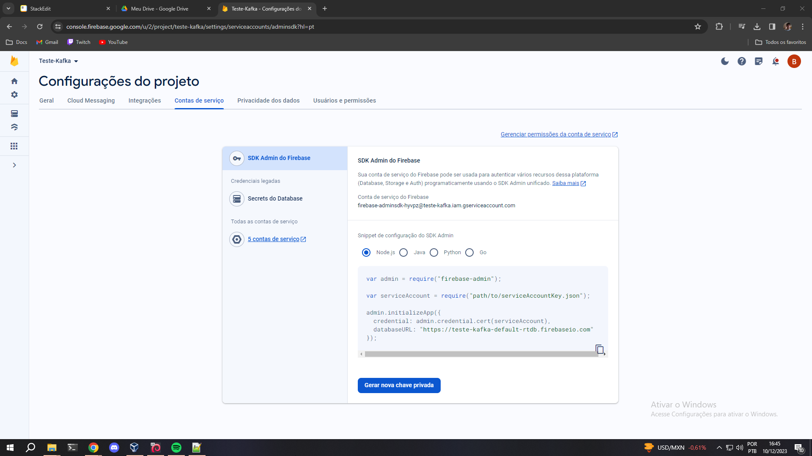

Crie um arquivo **`Dockerfile`** para o Kafka Connect com o seguinte conteúdo:
```docker
FROM confluentinc/cp-kafka-connect:latest
COPY serviceAccountKey.json /home/appuser/serviceAccountKey.json
RUN confluent-hub install --no-prompt confluentinc/kafka-connect-firebase:latest
```
> Essa etapa servirá para criar uma nova imagem do Kafka Connect com o **kafka-connect-firebase** já instalado e com as devidas credenciais.

Gere a nova imagem para o contêiner do Kafka Connect executando o seguinte comando:
```bash
$ sudo docker build -t kafka-connect-firebase-image .
```

## Criação do Ambiente Kafka
Crie um arquivo **`docker-compose.yml`** e adicione o seguinte conteúdo: 
```yml
version: "3"
services:
  zookeeper:
    image: confluentinc/cp-zookeeper:latest
    ports:
      - "2181:2181"
    environment:
      ZOOKEEPER_CLIENT_PORT: 2181

  kafka-broker-1:
    image: confluentinc/cp-kafka:latest
    ports:
      - "9092:9092"
      - "9093:9093"
    environment:
      KAFKA_BROKER_ID: 1
      KAFKA_ZOOKEEPER_CONNECT: "zookeeper:2181"
      KAFKA_LISTENER_SECURITY_PROTOCOL_MAP: "PLAINTEXT:PLAINTEXT,PLAINTEXT_HOST:PLAINTEXT"
      KAFKA_ADVERTISED_LISTENERS: "PLAINTEXT://kafka-broker-1:9092,PLAINTEXT_HOST://localhost:9093"
      KAFKA_OFFSETS_TOPIC_REPLICATION_FACTOR: 3
      KAFKA_DEFAULT_REPLICATION_FACTOR: 3
      KAFKA_NUM_PARTITIONS: 3
    depends_on:
      - zookeeper

  kafka-broker-2:
    image: confluentinc/cp-kafka:latest
    ports:
      - "9094:9094"
      - "9095:9095"
    environment:
      KAFKA_BROKER_ID: 2
      KAFKA_ZOOKEEPER_CONNECT: "zookeeper:2181"
      KAFKA_LISTENER_SECURITY_PROTOCOL_MAP: "PLAINTEXT:PLAINTEXT,PLAINTEXT_HOST:PLAINTEXT"
      KAFKA_ADVERTISED_LISTENERS: "PLAINTEXT://kafka-broker-2:9094,PLAINTEXT_HOST://localhost:9095"
      KAFKA_OFFSETS_TOPIC_REPLICATION_FACTOR: 3
      KAFKA_DEFAULT_REPLICATION_FACTOR: 3
      KAFKA_NUM_PARTITIONS: 3
    depends_on:
      - zookeeper

  kafka-broker-3:
    image: confluentinc/cp-kafka:latest
    ports:
      - "9096:9096"
      - "9097:9097"
    environment:
      KAFKA_BROKER_ID: 3
      KAFKA_ZOOKEEPER_CONNECT: "zookeeper:2181"
      KAFKA_LISTENER_SECURITY_PROTOCOL_MAP: "PLAINTEXT:PLAINTEXT,PLAINTEXT_HOST:PLAINTEXT"
      KAFKA_ADVERTISED_LISTENERS: "PLAINTEXT://kafka-broker-3:9096,PLAINTEXT_HOST://localhost:9097"
      KAFKA_OFFSETS_TOPIC_REPLICATION_FACTOR: 3
      KAFKA_DEFAULT_REPLICATION_FACTOR: 3
      KAFKA_NUM_PARTITIONS: 3
    depends_on:
      - zookeeper

  kafka-connect:
    image: kafka-connect-firebase-image
    ports:
      - "8083:8083"
    environment:
      CONNECT_ZOOKEEPER_CONNECT: "zookeeper:2181"
      CONNECT_BOOTSTRAP_SERVERS: "kafka-broker-1:9092,kafka-broker-2:9094,kafka-broker-3:9096"
      CONNECT_REST_ADVERTISED_HOST_NAME: "kafka-connect"
      CONNECT_REST_PORT: 8083
      CONNECT_GROUP_ID: "compose-connect-group"
      CONNECT_CONFIG_STORAGE_TOPIC: "docker-connect-configs"
      CONNECT_CONFIG_STORAGE_REPLICATION_FACTOR: 3
      CONNECT_OFFSET_STORAGE_TOPIC: "docker-connect-offsets"
      CONNECT_OFFSET_STORAGE_REPLICATION_FACTOR: 3
      CONNECT_STATUS_STORAGE_TOPIC: "docker-connect-status"
      CONNECT_STATUS_STORAGE_REPLICATION_FACTOR: 3
      CONNECT_KEY_CONVERTER: "org.apache.kafka.connect.storage.StringConverter"
      CONNECT_VALUE_CONVERTER: "org.apache.kafka.connect.json.JsonConverter"
      CONNECT_INTERNAL_KEY_CONVERTER: "org.apache.kafka.connect.json.JsonConverter"
      CONNECT_INTERNAL_VALUE_CONVERTER: "org.apache.kafka.connect.json.JsonConverter"
      CONNECT_PLUGIN_PATH: "/usr/share/java,/usr/share/confluent-hub-components"
    volumes:
      - "/dev/tmp/data:/var/share/kafka"
    depends_on:
      - kafka-broker-1
      - kafka-broker-2
      - kafka-broker-3
```
> Esse arquivo contém a configuração dos contêineres de 3 brokers Kafka, do Zookeeper, que é um serviço de gerenciamento de aplicações em nuvem e do Kafka Connect Firebase com a imagem customizada que acabamos de criar. 

Inicie o ambiente Kafka em background executando o seguinte comando:
```bash
$ sudo docker-compose up -d
```

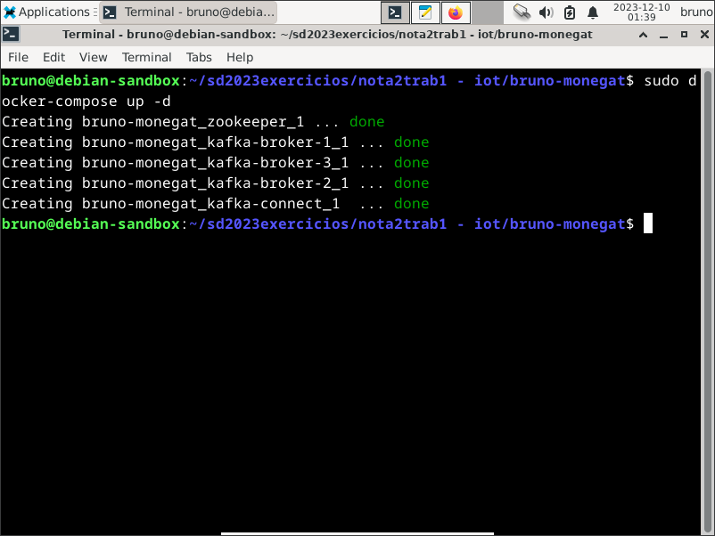

Execute o seguinte comando para checar se os contêineres foram iniciados corretamente:
```bash
$ sudo docker-compose ps
```
> Aguarde o contêiner do kafka-connect mudar o seu status de **(health: starting)** para **(healthy)** antes de continuar...

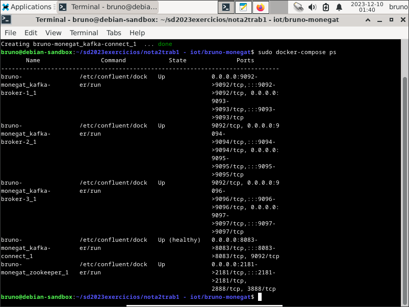

## Integração com o Firebase
Começe localizando e anotando a URL da Realtime Database do seu projeto no Firebase. Para isso, acesse o console do seu projeto e navegue para **Realtime Database**. A URL estará no topo da área em que estarão os dados da database:

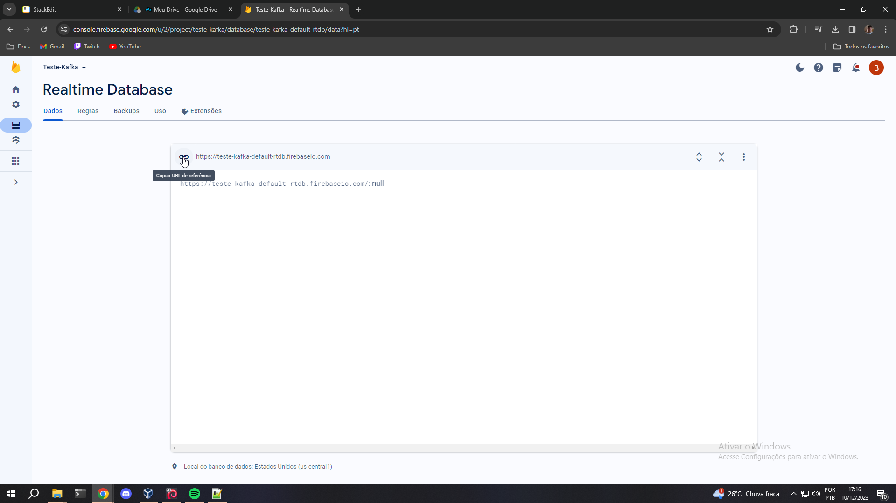

Crie um arquivo **``connect-firebase-config.json``** com o seguinte conteúdo, alterando __\<url-da-realtime-database>__ pela URL anotada:
```json
{
  "name": "FirebaseSourceConnector",
  "config": {
    "tasks.max": "1",
    "connector.class": "io.confluent.connect.firebase.FirebaseSourceConnector",
    
    "gcp.firebase.database.reference": "<url-da-realtime-database>/musicBlog",
    "gcp.firebase.credentials.path": "/home/appuser/serviceAccountKey.json",
    "gcp.firebase.snapshot": "true",
        
    "confluent.topic.bootstrap.servers": "kafka-broker-1:9092,kafka-broker-2:9094,kafka-broker-3:9096",
    "confluent.topic.replication.factor": "3"
  }
}
```
> Note que nesse exemplo de configuração  **/musicBlog** está sendo adicionado ao final da URL de referência. Isso indica para o Kafka Connect que entradas dentro do caminho **\<url-da-realtime-database>/musicBlog** são tópicos.  É possível alterá-lo para qualquer outro caminho desejado, ou até mesmo removê-lo. No entanto, nesse caso, a URL foi especificamente configurada desse jeito já antecipando a correta execução dos testes que serão feitos posteriormente...

Execute o seguinte comando para submeter o arquivo de configuração ao contêiner do Kafka Connect usando a sua REST API:
```bash
$ curl -X POST -H "Content-Type: application/json" --data @connect-firebase-config.json http://localhost:8083/connectors
```

## Testes
### Acessando o contêiner do 1° broker:
Execute o seguinte comando, localize o contêiner que está executando o broker de número 1 do Apache Kafka e tome nota do seu ID:
```bash
$ sudo docker-compose ps
```
> O ID do contêiner estará na coluna **Name**, e provavelmente será algo como **`*_kafka-broker-1_1`**. 

Para ter acesso ao contêiner através do terminal, execute o seguinte comando, substituindo **<id_do_conteiner_kafka>** pelo ID do passo anterior:
```bash
$ sudo docker exec -it <id_do_conteiner_kafka> /bin/bash
```
> Daqui em diante, todos os testes deverão ser executados **dentro** desse contêiner.

### Criando o tópico de testes:
No terminal **dentro** do contêiner, execute:
```bash
$ kafka-topics --create --topic teste --bootstrap-server kafka-broker-1:9092,kafka-broker-2:9094,kafka-broker-3:9096 --partitions 3 --replication-factor 3
```

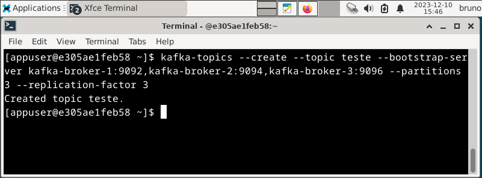

### Produtor e Consumidor normais:
Abra dois terminais, ambos **dentro** do contêiner. No primeiro, execute o Kafka Producer no tópico **teste** com o seguinte comando:
```bash
$ kafka-console-producer --topic teste --bootstrap-server kafka-broker-1:9092,kafka-broker-2:9094,kafka-broker-3:9096
```

No segundo terminal, execute o Kafka Consumer no tópico **teste** com o seguinte comando:
```bash
$ kafka-console-consumer --topic teste --bootstrap-server kafka-broker-1:9092,kafka-broker-2:9094,kafka-broker-3:9096
```

Envie algumas mensagens no terminal do Kafka Producer e veja elas sendo recebidas pelo terminal do Kafka Consumer:

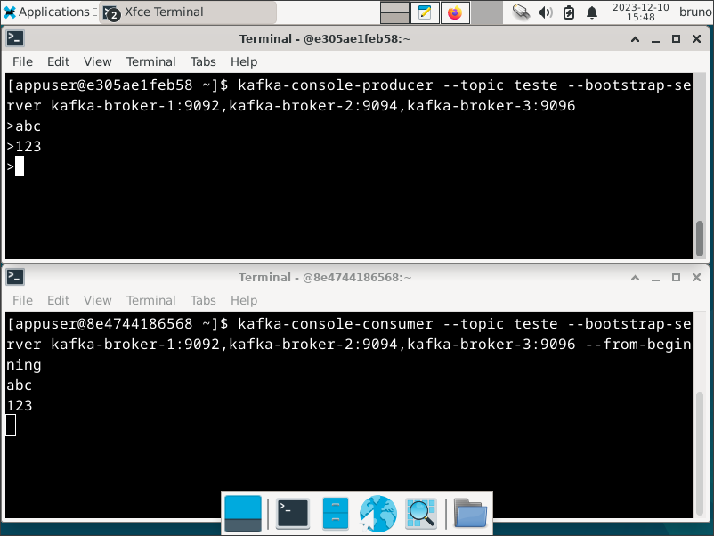

### Produtor e Consumidor com um dos nodos off:
Continuando a partir do teste anterior, abra um terceiro terminal, porém dessa vez **fora** do contêiner. Nesse terminal execute o seguinte comando para derrubar o 2° broker do Kafka:
```bash
$ sudo docker-compose stop kafka-broker-2
```

Envie algumas mensagens no terminal do Kafka Producer e veja que elas continuam sendo recebidas normalmente pelo terminal do Kafka Consumer, mesmo com a falha de um broker:

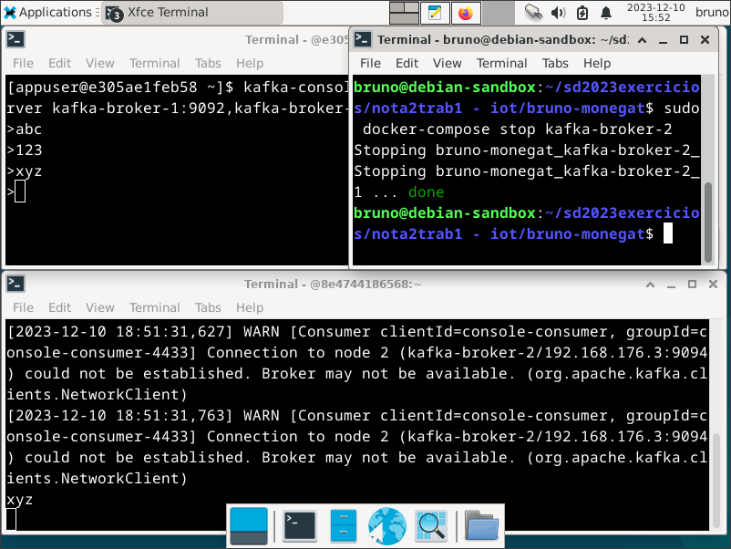

> Note que ocorreram alguns avisos no Kafka Consumer informando que a conexão com o nodo 2 foi perdida.

### Produtor e Consumidor com um nodo novo:
Continuando a partir do teste anterior, no terminal de **fora** do contêiner execute o seguinte comando para iniciar o 2° broker novamente:
```bash
$ sudo docker-compose start kafka-broker-2
```

Envie algumas mensagens no terminal do Kafka Producer e veja que elas continuam sendo recebidas normalmente pelo terminal do Kafka Consumer, como se nada tivesse acontecido:

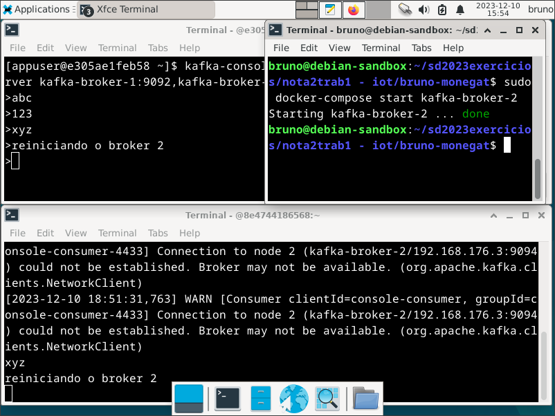

### Consumidor com leitura em grupo:
Descartando o ambiente de testes anterior, abra quatro novos terminais **dentro** do contêiner. Em dois deles execute Kafka Consumers, no tópico **teste** e no grupo **meu-grupo**, através desse comando:
```bash
$ kafka-console-consumer --topic teste --bootstrap-server kafka-broker-1:9092,kafka-broker-2:9094,kafka-broker-3:9096 --group meu-grupo
```

Nos outros dois terminais, execute Kafka Producers normalmente, através do seguinte comando:
```bash
$ kafka-console-producer --topic teste --bootstrap-server kafka-broker-1:9092,kafka-broker-2:9094,kafka-broker-3:9096
```

Envie algumas mensagens em ambos os terminais executando os Kafka Producers e veja que, apesar de estarem todos no mesmo tópico, cada um deles é redirecionado para um Kafka Consumer diferente:

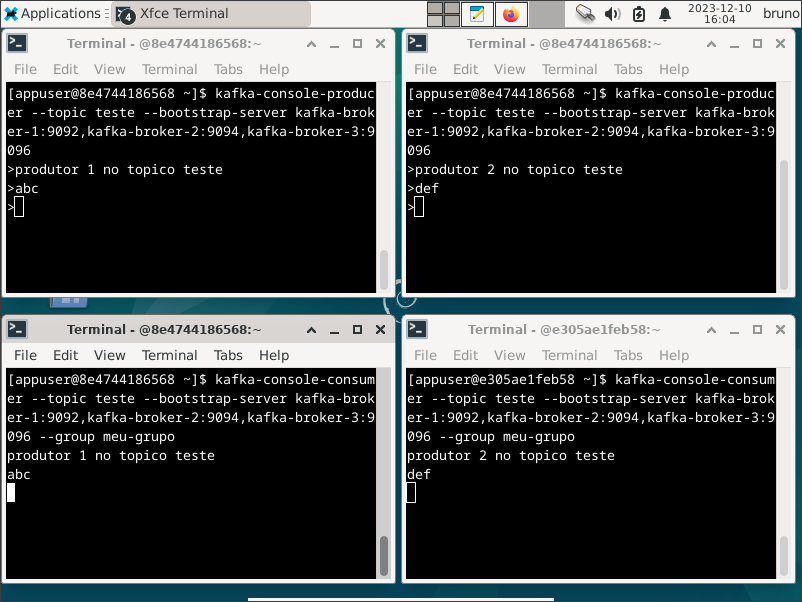

### Consumidor em um tópico do Firebase:
Para começar, importe o seguinte esquema de exemplo para a Realtime Database do seu projeto no Firebase: 
```json
{
   "musicBlog":{
      "artists":{
         "artistId1":{
            "name":"Michael Jackson",
            "genre":"Pop"
         },
         "artistId2":{
            "name":"Bob Dylan",
            "genre":"American folk"
         },
         "artistId3":{
            "name":"Freddie Mercury",
            "genre":"Rock"
         }
      },
      "songs":{
         "songId1":{
            "title":"billie jean",
            "artist":"Michael Jackson"
         },
         "songId2":{
            "title":"hurricane",
            "artist":"Bob Dylan"
         },
         "songId3":{
            "title":"bohemian rhapsody",
            "artist":"Freddie Mercury"
         }
      }
   }
}
```
> Esse esquema está incluso no exemplo de configuração básica do Kafka Firebase Connector para ser usado em testes: https://docs.confluent.io/kafka-connectors/firebase/current/source/overview.html

Para fazer essa importação, crie um arquivo JSON contendo o esquema, acesse o console do Firebase, navegue para **Realtime Database > Mais opções > Importar o JSON** e importe o arquivo criado:

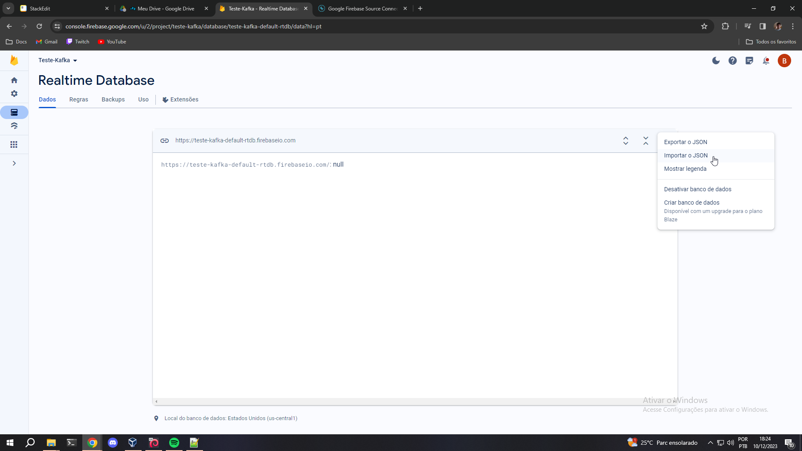

Após importado, acesse um novo terminal **dentro** do contêiner de algum broker Kafka. Execute então o seguinte comando para inicializar um Kafka Consumer no tópico **artists**:
```bash
$ kafka-console-consumer --topic artists --bootstrap-server kafka-broker-1:9092,kafka-broker-2:9094,kafka-broker-3:9096 --from-beginning
```
> Note que não foi necessário criar esse tópico, já que ele foi automaticamente criado pelo Kafka Connect assim que o esquema foi atualizado no Firebase. Como já mencionado durante a configuração do Kafka Connect, todas as entradas dentro de **musicBlog** serão consideradas tópicos, e todas as entradas dentro dos tópicos serão consideradas mensagens.

Cada mensagem dentro do tópico **artists** será impressa em formato JSON, incluindo algumas informações extras sobre a sua formatação:

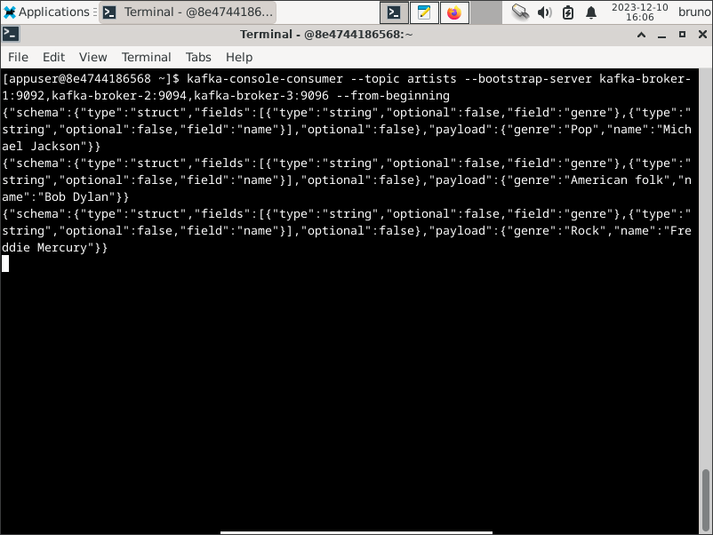

## Git
### Git add
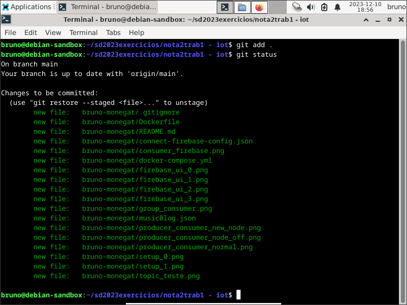

### Git commit
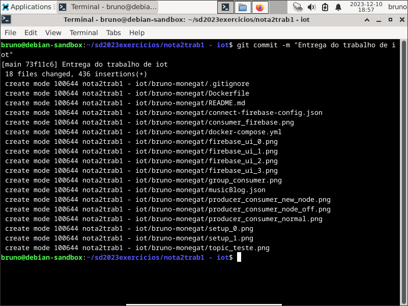

### Git push
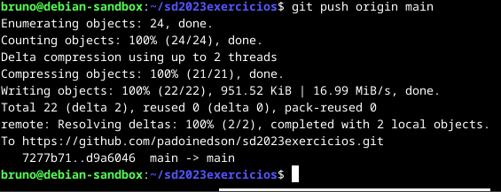
