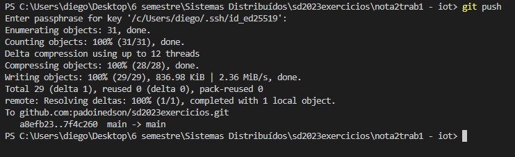

# Apache Kafka com aplicação Node.js

<b>Nome</b>: Diego Rafael Kalschne <br/> <br/>

# Instalação (Linux)
1. Realizar o download do Kafka a partir do link: https://downloads.apache.org/kafka/3.6.0/kafka_2.13-3.6.0.tgz
2. Descompactar no diretório da sua preferência
3. Caso não tenha, é necessário ter o Java JRE instalado no computador
    1. Executar `sudo apt update`
    2. Executar `sudo apt install default-jre` para instalar o Java
4. Abra um terminal na pasta extraída
5. Execute o comando `sh bin/zookeeper-server-start.sh config/zookeeper.properties`. Isso será responsável por iniciar o serviço do Zookeeper. O Zookeeper será responsável por gerenciar os vários brokers (instâncias) do Kafka.
6. Para executar o Kafka em paralelo, abra um novo terminal na pasta extraída e execute comando `sh bin/kafka-server-start.sh config/server.properties`
7. Isso criou um broker Kafka e pode ser visualizado executando o comando `./bin/zookeeper-shell.sh localhost:2181 <<<"ls /brokers/ids"`. Abra um novo terminal na pasta extraída, para isso.


# Criação de vários brokers
O arquivo `config/server.properties` é responsável por armazenar as configurações de cada broker do Kafka. Para criarmos várias instâncias do Kafka, vamos criar 3 arquivos de configuração diferentes.
1. Entre na pasta config com `cd config`
2. Execute os 3 comandos abaixo:
- `cp server.properties server1.properties`
- `cp server.properties server2.properties`
- `cp server.properties server3.properties`
3. Edite cada um dos novos 3 arquivos (utilizando nano, por exemplo) de modo que cada arquivos tenha um ID, uma porta e um diretório de logs diferentes. Observe as propriedades que devem serem alteradas:
```
broker.id=
listeners=PLAINTEXT://:PORT
log.dir=
```
O arquivo server1.properties foi modificado (as demais configurações já existentes no arquivo não são alteradas nem excluídas) para ter esses valores:
```
broker.id=1
listeners=PLAINTEXT://:9092
log.dir=/tmp/kafka-logs-1
```
Acrescente 1 (no ID, na porta e no caminho do log) para cada valor para os demais arquivos de configuração `server2` e `server3`.
A propriedade listeners é necessário criar dentro do arquivo (ou descomentar a já existente)

4. Execute `cd ..` para sair da pasta atual.
5. Inicie cada novo broker com o comando `bin/kafka-server-start.sh config/server1.properties`. Apenas altere o número do arquivo de configuração para cada broker. Faça isso em 1 terminal diferente para cada comando.
> Caso o broker criado no primeiro passo de instalação ainda esteja executando, finalize-o pressionando `CTRL + C` no terminal de execução. Isso é importante para evitar o conflito de portas
6. É possível visualizar que os 3 brokers estão rodandos executando novamente o comando `./bin/zookeeper-shell.sh localhost:2181 <<<"ls /brokers/ids"`


# Criação de tópicos
Para criar um tópico, a partir da versão 2.8.0 do Kafka, não poderemos utilizar mais o Zookeeper como parâmetro na criação dos tópicos. Em versões mais recentes, estaremos utilizando o "bootstrap-server".
1. Crie um tópico executando o comando `./bin/kafka-topics.sh --create --bootstrap-server localhost:9092 --replication-factor 3 --partitions 3 --topic NOME_TOPICO`. Nesse caso, criei um tópico chamado "usuarios", com 3 partições e fator de replicação também 3


Isso já automaticamente criou o mesmo tópico nos 3 brokers (instanciado em portas diferentes). Isso é possível visualizar executando o comando `./bin/kafka-topics.sh --list --botstrap-server localhost:PORT`. Apenas altere o número da porta desejada.


# Verificar nós
1. Executar o comando para verificar as partições `kafka-topics.sh --describe --topic TOPICO --bootstrap-server localhost:PORT`. Neste caso, para o tópico "usuarios", na porta 9092, o resultado foi:


# Com todos os nós on
Visualizaremos a saída de um consumer no momento em que as 3 instâncias (nós) do Kafka estavam rodando.
A imagem abaixo demonstra o conteúdo que foi produzido em um producer na porta 9092.


A imagem abaixo exibe agora a saída do consumer para a porta 9092:


# Remover uma partição
Vamos agora derrubar o broker instanciado na porta 9092. A imagem abaixo mostra que o broker estava indisponível ao tentar criar um consumer na porta em questão.


Agora com um producer na porta 9093, criamos mais algumas mensagens:


Na imagem abaixo, podemos ver o resultado do consumer na porta 9093. Exibindo as novas mensagens, bem como as antigas produzidas ainda na 9092.


# Adicionar nó
1. Iniciamos agora novamente o nó que havíamos derrubado anteriormente na porta 9092.
2. Criemos agora um novo producer na porta 9094 e incluímos algumas mensagens:


3. Ao criarmos um novo consumer na porta 9092, com a flag `--from-beginning`, conseguimos visualizar que todas as mensagens incluídas anteriormente, mesmo quando o broker estava OFF, permanecem preservadas.


# Novidades e leitura em grupo
Como novidade deste trabalho, destaco a criação de uma aplicação Node.js que é responsável por configurar um producer e dois consumers. A imagem abaixo demonstra o código criado (ele pode ser visualizado na íntegra no GitHub).


- O producer está dentro de um loop infinito, fazendo a publicação de várias mensagens periodicamente.
- Os consumers estão com o mesmo groupId, fazendo com que o recebimento das mensagens seja dividido entre os dois, podendo ser visualizado através do ID de cada consumer na imagem abaixo. Esse recurso de groupId é útil pois permite que as várias mensagens podem serem processadas em pararelo simultaneamente, com o Kafka gerenciando e garantindo que cada mensagem seja entregue a apenas um consumer dos vários presentes no grupo (evita 'duplicação' de processamento).


# Git
1. git add .


2. git commit


3. git push


