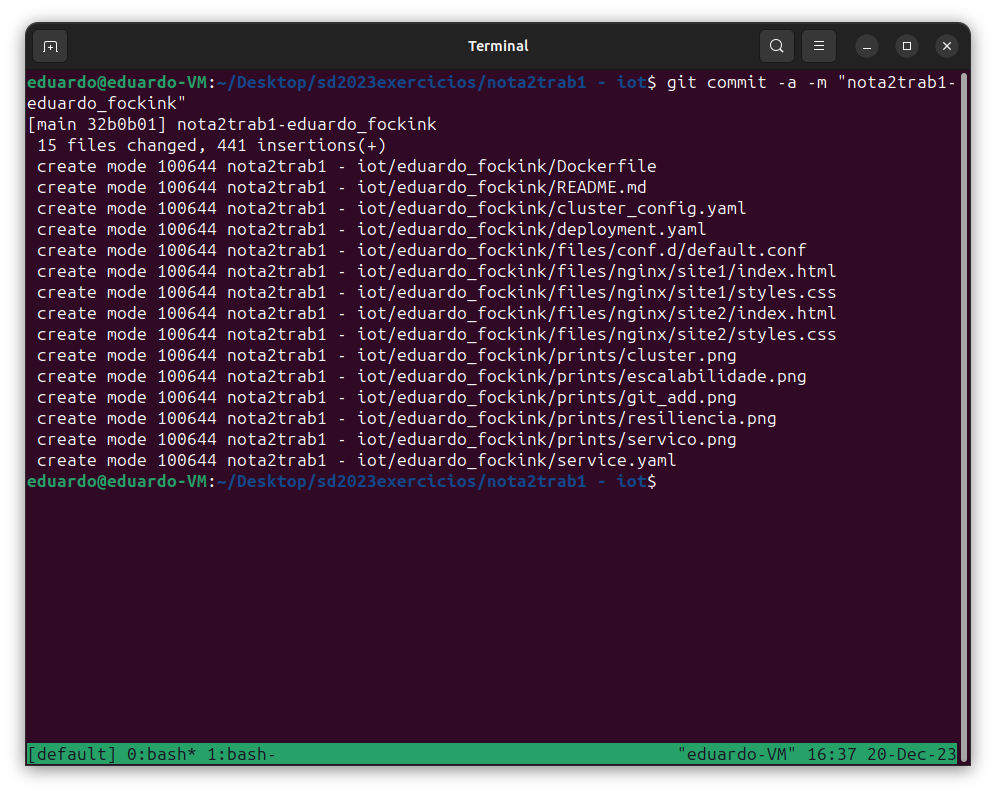
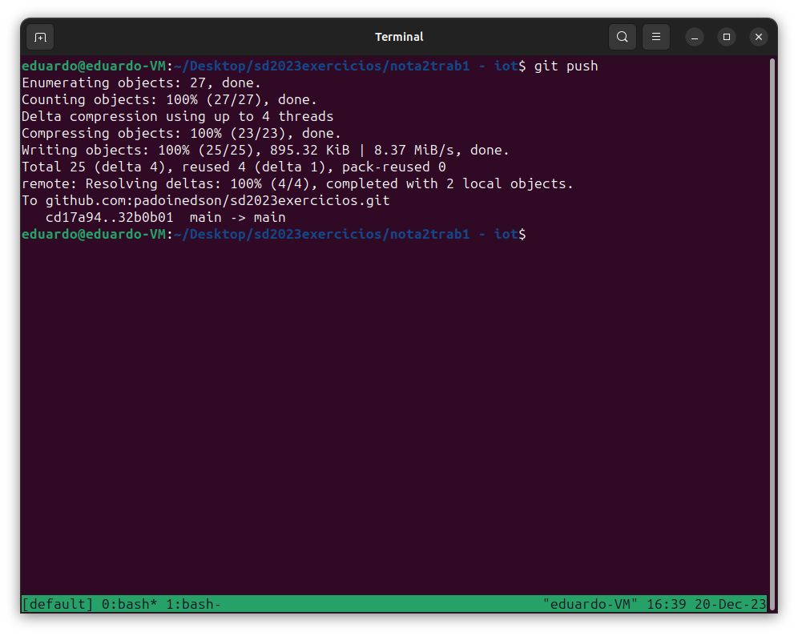

## **Eduardo Fockink Silva - Dezembro 2023**

### **Sumário**

1. [**Preparação do Ambiente**](#preparação-do-ambiente)
2. [**Criação e Configuração do Cluster Kubernetes**](#criação-e-configuração-do-cluster-kubernetes)
3. [**Deploy e Exposição do Servidor Nginx no Kubernetes**](#deploy-e-exposição-do-servidor-nginx-no-kubernetes)
4. [**Teste do Servidor Nginx**](#teste-do-servidor-nginx)
5. [**Adicionando ao Repositório Remoto**](#adicionando-ao-repositório-remoto)
6. [**Arquivos de Configuração Detalhados**](#arquivos-de-configuração-detalhados)

### Preparação do Ambiente

1. **Docker**:
    
    ```bash
    sudo curl -L https://get.docker.com/ | bash
    sudo usermod -aG docker $USER
    ```
    
2. **kubectl**:
    
    ```bash
    sudo curl -LO "https://dl.k8s.io/release/$(curl -L -s https://dl.k8s.io/release/stable.txt)/bin/linux/amd64/kubectl"
    sudo chmod +x kubectl
    sudo mv ./kubectl /usr/local/bin/kubectl
    ```
    
3. **kind**:
    
    ```bash
    sudo curl -Lo ./kind https://kind.sigs.k8s.io/dl/v0.11.1/kind-linux-amd64
    sudo chmod +x ./kind
    sudo mv ./kind /usr/local/bin
    ```
    

### Criação e Configuração do Cluster Kubernetes

1. **Construa a imagem Docker do Nginx personalizada:**
    
    ```bash
    cd eduardo_fockink/
    sudo docker build -t nginx-dual-site:1.0 .
    ```
    

2. **Criar Cluster com kind**:
    
    ```bash
    sudo kind create cluster --name cluster --config cluster_config.yaml
    ```
    
    **Print 1 da Criação do Cluster**
    
    
3. **Carregar imagem para o cluster:**

    ```bash
    sudo kind load docker-image nginx-dual-site:1.0 --name cluster
    ```

### Deploy e Exposição do Servidor Nginx no Kubernetes

1. **Aplicar o Deployment do Nginx:**
    
    ```bash
    sudo kubectl apply -f deployment.yaml
    ```
    
2. **Crie um Serviço do tipo LoadBalancer:**
    
    ```bash
    sudo kubectl apply -f service.yaml
    ```
    

### Teste do Servidor Nginx

1. **Verifique o status dos pods:**
    
    ```bash
    sudo kubectl get pods
    ```
    
2. **Após os pods estarem em execução, direcione as portas:**
    
    ```bash
    sudo kubectl port-forward service/nginx-service 8080:8080 &
    sudo kubectl port-forward service/nginx-service 9090:9090 &
    ```
    
    **Print 2 do Serviço Rodando**
    
    
3. **Acessar as paginas:**
    
    [Site 1](http://localhost:8080)
    
    [Site 2](http://localhost:9090)
    
4. **Teste de Resiliência:**

    ```bash
    sudo kubectl get pods
    ```

    ```bash
    sudo kubectl delete pod <nome-do-pod> # altere <nome-do-pod> por um nome válido
    ```

    ```bash
    sudo kubectl get pods
    ```

    **Print 3 do Teste de Resiliência**
    

5. **Teste de Escalabilidade:**

    ```bash
    sudo kubectl scale deployment/nginx-custom-deployment --replicas=6
    ```

    ```bash
    sudo kubectl get pods
    ```

    **Print 4 do Teste de Escalabilidade**
    

### Novidades em relaçãao ao exemplo de aula

1. **Uso de Dockerfile Customizado**: A personalização da imagem Docker do Nginx permite maior flexibilidade na configuração e na implementação de funcionalidades específicas.
2. **Implementação do LoadBalancer**: O uso do LoadBalancer facilita a exposição de serviços no Kubernetes, permitindo acesso externo e balanceamento de carga eficiente.

### **Adicionando ao repositório remoto**

**Print 5 git add**


**Print 6 git commit**


**Print 7 git push**


### Arquivos de Configuração Detalhados

### **`cluster_config.yaml`**

- Especifica a configuração do cluster Kubernetes.
    
    ```yaml
    kind: Cluster
    apiVersion: kind.x-k8s.io/v1alpha4
    nodes:
      - role: control-plane
      - role: worker
      - role: worker
      - role: worker
      - role: worker
    ```
    

### **`deployment.yaml`**

- Define o deployment do servidor Nginx no Kubernetes.
    
    ```yaml
    apiVersion: apps/v1
    kind: Deployment
    metadata:
      name: nginx-custom-deployment
    spec:
      replicas: 4
      selector:
        matchLabels:
          app: nginx-custom
      template:
        metadata:
          labels:
            app: nginx-custom
        spec:
          containers:
          - name: nginx
            image: nginx-dual-site:1.0
            ports:
            - containerPort: 8080
            - containerPort: 9090
    ```
    

### **`service.yaml`**

- Especifica o Serviço para expor o Nginx.
    
    ```yaml
    apiVersion: v1
    kind: Service
    metadata:
      name: nginx-service
    spec:
      type: LoadBalancer
      ports:
      - name: site1-port
        port: 8080
        targetPort: 8080
      - name: site2-port
        port: 9090
        targetPort: 9090
      selector:
        app: nginx-custom
    ```
    

### **`Dockerfile`**

- Define a configuração para a imagem Docker do Nginx.
    
    ```
    FROM nginx:latest
    
    LABEL maintainer="Eduardo Fockink Silva"
    LABEL description="Configuração do Nginx para TRABALHO 1 NOTA 2"
    
    COPY files/nginx/ /usr/share/nginx/
    COPY files/conf.d/
    ```