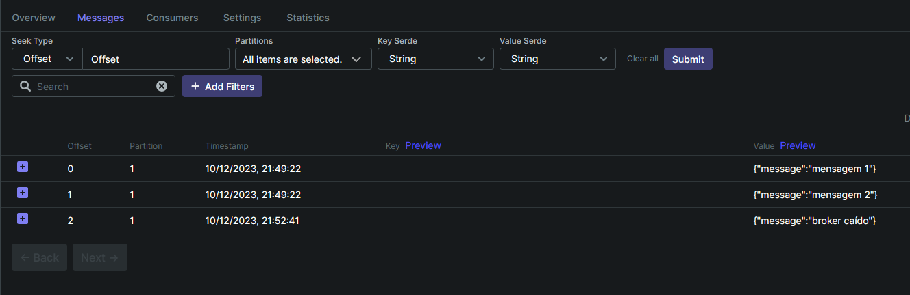

## Aluno: Gabriel Bauer Vieira

### Instalação

1. Execute o comando "docker-compose up" para iniciar os containers do kafka
  

### Uso

1. Abra o KafkaUI (localhost:8080) e configure um tópico da sua escolha
   

2. Nomeie o tópico, seleciona a quantidade de partições e o fator de replicação
   

3. Clique em "create topic"

### Enviando mensagens

Por conta do uso do Kafka REST, conseguimos enviar mensagens usando HTTP via JSON, para isso basta fazer um POST no endpoint respectivo ao tópico desejado.

A URL padrão é localhost:8082/topics/[nome do tópico]


1. Altere o Content-Type no header para "application/vnd.kafka.json.v2+json"

2. Crie o JSON no formato:
  ```json
  {
    "records": [
      {"value": "sua mensagem"},
    ]
  }
  ```

3. Faça o POST
  

  

### Extra
- Execução com um dos brokers fora do ar, neste caso o broker 1 está caído.


Veja que o sistema ainda funciona


### Novidades
1. Criação via docker-compose, o que agiliza e facilita a execução em diferentes máquinas
2. Conexão via HTTP com o kafka-rest
3. Gerenciamento dos tópicos via Kafka-ui

### Git

