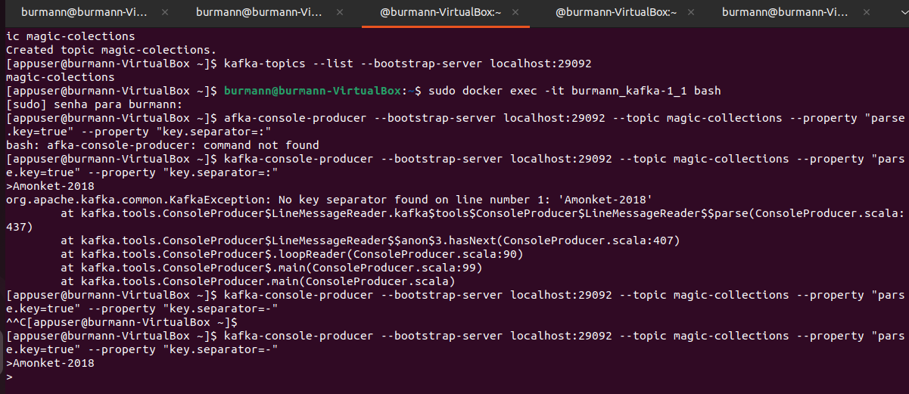
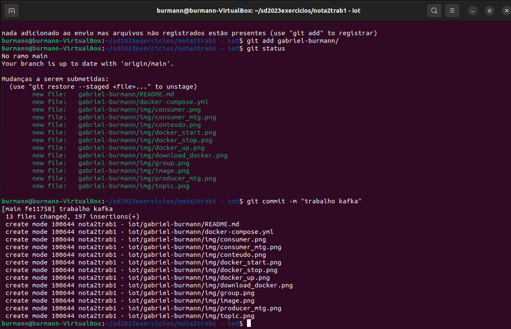

Gabriel Fischer Burmann

## Passos para instalação

Primeiro é necessário entrar no link
https://github.com/confluentinc/cp-docker-images/tree/5.3.3-post/examples/kafka-cluster
e copiar o conteúdo do arquivo .yml

Instalar o docker e docker compose

`sudo apt install docker.io`

`sudo apt install docker-compose`

## Criação do ambiente

Para "subir" o ambiente é necessário rodar o seguinte comando:

`sudo docker-compose up`

Para ver o status do docker podemos usar:

`sudo docker-compose ps`

## Produtores e Consumidores

Primeiramente, devemos acessar um container em um terminal

`sudo docker exec -it <nome do user>_kafka-1_1 bash`

E criar um tópico. Neste exemplo vamos utilzar coleções do jogo MTG, e suas respesctivas datas de lançamento

`kafka-topics --create --bootstrap-server localhost:29092 --replication-factor 3 --partitions 3 --topic "nome do tópico"`

Em outro terminal podemos acessar novamente o container com o comando 

`sudo docker exec -it <nome do user>_kafka-1_1 bash`

Dentro dele podemos criar o produtor

`kafka-console-producer --broker-list localhost:29092 --topic "nome do tópico"`

Em seguida podemos digitar o conteúdo

Enquanto isso em outro terminal criamos um consumer

`sudo docker exec -it <nome do user>_kafka-1_1 bash`

`kafka-console-consumer --bootstrap-server localhost:29092 --topic card-database --from-beginning`

Esse terminal deve mostrar o conteúdo inserido no producer

##Com um nodo off

Derrubamos um nodo com o comando

`sudo docker stop <nome do user>_kafka-1_1`

Em seguida usamos outro nodo

`sudo docker exec -it <nome do user>_kafka-1_1 bash`

`kafka-console-consumer --bootstrap-server localhost:29092 --topic card-database --from-beginning`

A saida deve ser a mesma

##Com um novo nodo  

Subimos o nodo que derrubamos anteriormente

`sudo docker start <nome do user>_kafka-1_1`

`sudo docker exec -it <nome do user>_kafka-1_1 bash`

Acessando esse nodo é possível realizar qualquer comando utilizado anteriormente para testa-lo

Também é possível realizar a leitura por meio de grupos:

`kafka-console-consumer --bootstrap-server localhost:29092 --topic card-database --from-beginning --group tcg`

## Minha novidade

A minha ideia surgiu de uma dificuldade de encontrar as coleções do MTG, então eu coloquei algumas dentro do producer utilizando o seguinte código:

`kafka-console-producer --bootstrap-server localhost:29092 --topic magic-collections --property "parse.key=true" --property "key.separator=-"`

Onde as mensagens têm chaves que são analisadas a partir do caractere "-" como separador entre a chave e o valor

Enquanto no consumidor: 

`kafka-console-consumer --bootstrap-server localhost:29092 --topic magic-collections --from-beginning --property "print.key=true" --property "key.separator=-" | grep "2023"`

Ele realiza um filtro no grep "2023", onde ele busca por ano em que a coleção foi lançada.

## Print do git
 

