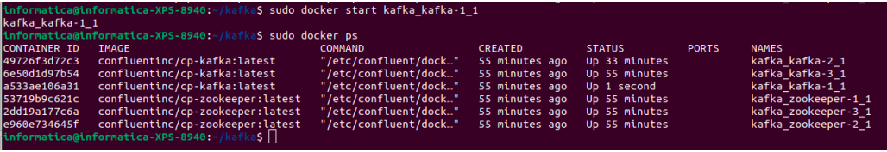

# Kafka

Na realização deste trabalho será utilizado o docker e docker compose, para instalar estes:
```
sudo apt install docker
sudo apt install docker.io
sudo apt install docker-compose
```
Criar uma pasta para conter o docker compose
```
mkdir kafka
```
Entrar na pasta criada
```
cd kafka
```
Criar o arquivo docker-compose.yml, que irá conter as configurações do contêiner
```
nano docker-compose.yml
```
Nele escrever:
```
---
version: '2'
services:
  zookeeper-1:
	image: confluentinc/cp-zookeeper:latest
	environment:
  	ZOOKEEPER_SERVER_ID: 1
  	ZOOKEEPER_CLIENT_PORT: 22181
  	ZOOKEEPER_TICK_TIME: 2000
  	ZOOKEEPER_INIT_LIMIT: 5
  	ZOOKEEPER_SYNC_LIMIT: 2
  	ZOOKEEPER_SERVERS: localhost:22888:23888;localhost:32888:33888;localhost:42888:43888
	network_mode: host
	extra_hosts:
  	- "moby:127.0.0.1"

  zookeeper-2:
	image: confluentinc/cp-zookeeper:latest
	environment:
  	ZOOKEEPER_SERVER_ID: 2
  	ZOOKEEPER_CLIENT_PORT: 32181
  	ZOOKEEPER_TICK_TIME: 2000
  	ZOOKEEPER_INIT_LIMIT: 5
  	ZOOKEEPER_SYNC_LIMIT: 2
  	ZOOKEEPER_SERVERS: localhost:22888:23888;localhost:32888:33888;localhost:42888:43888
	network_mode: host
	extra_hosts:
  	- "moby:127.0.0.1"

  zookeeper-3:
	image: confluentinc/cp-zookeeper:latest
	environment:
  	ZOOKEEPER_SERVER_ID: 3
  	ZOOKEEPER_CLIENT_PORT: 42181
  	ZOOKEEPER_TICK_TIME: 2000
  	ZOOKEEPER_INIT_LIMIT: 5
  	ZOOKEEPER_SYNC_LIMIT: 2
  	ZOOKEEPER_SERVERS: localhost:22888:23888;localhost:32888:33888;localhost:42888:43888
	network_mode: host
	extra_hosts:
  	- "moby:127.0.0.1"

  kafka-1:
	image: confluentinc/cp-kafka:latest
	network_mode: host
	depends_on:
  	- zookeeper-1
  	- zookeeper-2
  	- zookeeper-3
	environment:
  	KAFKA_BROKER_ID: 1
  	KAFKA_ZOOKEEPER_CONNECT: localhost:22181,localhost:32181,localhost:42181
  	KAFKA_ADVERTISED_LISTENERS: PLAINTEXT://localhost:19092
	extra_hosts:
  	- "moby:127.0.0.1"

  kafka-2:
	image: confluentinc/cp-kafka:latest
	network_mode: host
	depends_on:
  	- zookeeper-1
  	- zookeeper-2
  	- zookeeper-3
	environment:
  	KAFKA_BROKER_ID: 2
  	KAFKA_ZOOKEEPER_CONNECT: localhost:22181,localhost:32181,localhost:42181
  	KAFKA_ADVERTISED_LISTENERS: PLAINTEXT://localhost:29092
	extra_hosts:
  	- "moby:127.0.0.1"

  kafka-3:
	image: confluentinc/cp-kafka:latest
	network_mode: host
	depends_on:
  	- zookeeper-1
  	- zookeeper-2
  	- zookeeper-3
	environment:
  	KAFKA_BROKER_ID: 3
  	KAFKA_ZOOKEEPER_CONNECT: localhost:22181,localhost:32181,localhost:42181
  	KAFKA_ADVERTISED_LISTENERS: PLAINTEXT://localhost:39092
	extra_hosts:
  	- "moby:127.0.0.1`
```
Para executar o docker compose em background:
```
sudo docker-compose up -d
```


Para ver a situação dos contêineres (todos os nós de em execução):
`sudo docker-compose ps`


Para entrar no container:
```sudo docker exec -it kafka_kafka-1_1 bash```

Criando o tópico jogos com o fator de replicação 3 e 3 partições
```kafka-topics --create --bootstrap-server localhost:29092 --replication-factor 3 --partitions 3 --topic jogos```


Para postar no tópico:
```
kafka-console-producer --broker-list localhost:29092 --topic jogos
``` 
fazer postagens no tópico
```Rocket League
CS:GO
League of Legends
```
encerrar postagem `ctrl + c`

Abrir mais um terminal e acessar um contêiner:
```
sudo docker exec -it kafka_kafka-1_1 bash
```

Receber o que foi escrito no tópico desde sua criação e continuar recebendo o que está sendo escrito nele:
```
kafka-console-consumer --bootstrap-server localhost:29092 --topic jogos --from-beginning
```


Para testar se o terminal 2 está recebendo o que está sendo escrito no tópico em tempo real, vamos escrever mais mensagens no tópico pelo terminal 1, para isso:
```
kafka-console-producer --broker-list localhost:29092 --topic jogos
CS:GO 2
```
encerrar postagem `ctrl + c`

print do terminal 2:

Para parar de receber as mensagens do tópico: `ctrl + c`

### Vamos derrubar um nó e ver as mensagens do tópico sofreram alguma alteração:
No terminal 1, para sair do contêiner: `exit`
Derrubar um nó:
```
sudo docker stop kafka_kafka-1_1
```
Para ver os contêineres em execução:
```
sudo docker ps
```

No terminal 2, acessar outro contêiner:
```
sudo docker exec -it kafka_kafka-2_1 bash
```
Receber mensagens:
```
kafka-console-consumer --bootstrap-server localhost:29092 --topic jogos --from-beginning
```

`mensagens não foram ‘perdidas’ pois o tópico graças ao seu fator replicação (neste caso sendo 3)`

`ctrl + c` para parar de receber as mensagens

No terminal 1, executar novamente o nó que havia sido derrubado:
```
sudo docker start kafka_kafka-1_1
```

Para ver os contêineres em execução:
```
sudo docker ps
```


No terminal 2, receber mensagens para ver se houve alguma alteração:
```
kafka-console-consumer --bootstrap-server localhost:29092 --topic jogos --from-beginning
```


`não houve alteração nas mensagens pois elas estão replicadas`

`ctrl + c` para interromper execução

para sair do contêiner:
```exit```

### Teste utilizando um nó para envio de mensagens e outros dois para recebê-las em tempo real
No terminal 1, acessar um container e o deixar como consumidor:
```
sudo docker exec -it kafka_kafka-1_1 bash
```
```
kafka-console-consumer --bootstrap-server localhost:29092 --topic jogos --from-beginning
```

No terminal 2, acessar um container e o deixar como consumidor:
```
sudo docker exec -it kafka_kafka-2_1 bash
```
```
kafka-console-consumer --bootstrap-server localhost:29092 --topic jogos --from-beginning
```

No terminal 3, acessar um container e o deixar como produtor:
```
sudo docker exec -it kafka_kafka-3_1 bash
```
```
kafka-console-producer --broker-list localhost:29092 --topic jogos
```
Neste enviar mensagens e validar nos demais se estão recebendo:
```
GOW
Warzone
Age of Empires II
```


## novidades
### trazendo um número limitado de mensagens
é possível fazer isso passando o parâmetro `max-messages`:
```
kafka-console-consumer --bootstrap-server localhost:29092 --topic jogos --from-beginning --max-messages 3
```


### usando gerador de mensagens
para isso é necessário python, pip e virtualenv
```
sudo apt install python3.10
sudo apt install python3-pip
sudo apt install python3-virtualenv
```

fora do container, mas dentro da pasta `kafka`, criar uma pasta `extra` com virtualenv que irá conter o script em python para geração de mensagens:
```
virtualenv extra
```
ativar o ambiente:
```
source extra/bin/activate
```
nele criar o arquivo `producer.py`: 
```
nano extra/producer.py
``` 
nele escrever:
```
from kafka import KafkaProducer
import json
import random
from time import sleep
from datetime import datetime

# Create an instance of the Kafka producer
producer = KafkaProducer(bootstrap_servers='localhost:29092',
                            value_serializer=lambda v: str(v).encode('utf-8'))

# Call the producer.send method with a producer-record
print("Ctrl+c to Stop")
while True:
    producer.send('message-generator', random.randint(1,999))
```
abrir um segundo terminal, criar o tópico `message-generator` e passar a escutá-lo:
```
sudo docker exec -it kafka_kafka-2_1 bash
kafka-topics --create --bootstrap-server localhost:29092 --replication-factor 3 --partitions 3 --topic message-generator
kafka-console-consumer --bootstrap-server localhost:29092 --topic message-generator --from-beginning
```


no primeiro terminal, dentro da pasta kafka, ativar o virtualenv e executar script:
```
source extra/bin/activate
```
instalar o pacote kafka para python:
```
pip install kafka-python
```
rodar o script:
```
python extra/producer.py
```


para parar execução do script
`ctrl + c`


para desativar o virtualenv:
```
deactivate
```

derrubar contêiners:
````
sudo docker-compose down
``
## print git

