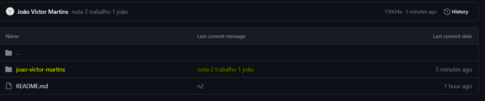

# README.md - Instalação do Apache Kafka, Zookeeper e Kafka UI com Docker Compose

## Nome do autor: João Victor Martins

### Introdução
Este documento fornece instruções para configurar e executar o Apache Kafka e Zookeeper usando Docker Compose. Isso simplifica a criação e gerenciamento de um ambiente Kafka para desenvolvimento e testes. O projeto abaixo foi desenvolvido para a empresa que trabalho (que é um GRUPO DE EMPRESAS), que recentemente foi adquirida para uma empresa maior. O intuito do projeto é processar e disparar eventos com a atualização de preço e modificações de produtos para todas as empresas / filiais dentro da rede, para que o mesmo produto vendido em diferentes redes tenha o preço mais atual.
Demonstrarei uma pequena parte do projeto onde configurei o docker-compose para processar as mensagens e demonstrarei o fluxo utilizando o kafka ui para facilitar a visualização. 

### Novidades em relação ao exemplo de aula
- Kafka ui e kafka connect file pulse

### Pré-requisitos
Docker e Docker Compose instalados

### Configuração do Docker Compose
1. **Crie um arquivo `docker-compose.yml`** com o seguinte conteúdo  no seu diretório de trabalho:

```yaml
version: '3'
services:
  zookeeper:
    image: confluentinc/cp-zookeeper:6.0.1
    hostname: zookeeper
    container_name: zookeeper
    ports:
      - "2181:2181"
    environment:
      ZOOKEEPER_CLIENT_PORT: 2181
      ZOOKEEPER_TICK_TIME: 2000

  kafka:
    image: confluentinc/cp-kafka:latest
    hostname: kafka
    container_name: kafka
    depends_on:
      - zookeeper
    ports:
      - "32000:32000"
      - "9092:9092"
    environment:
      KAFKA_BROKER_ID: 1
      KAFKA_ZOOKEEPER_CONNECT: 'zookeeper:2181'
      KAFKA_LISTENER_SECURITY_PROTOCOL_MAP: PLAINTEXT:PLAINTEXT,PLAINTEXT_HOST:PLAINTEXT
      KAFKA_ADVERTISED_LISTENERS: PLAINTEXT://kafka:9092,PLAINTEXT_HOST://localhost:32000
      KAFKA_OFFSETS_TOPIC_REPLICATION_FACTOR: 1
      KAFKA_GROUP_INITIAL_REBALANCE_DELAY_MS: 0
      CONFLUENT_METRICS_REPORTER_BOOTSTRAP_SERVERS: kafka:9092
      CONFLUENT_METRICS_REPORTER_ZOOKEEPER_CONNECT: zookeeper:2181
      CONFLUENT_METRICS_REPORTER_TOPIC_REPLICAS: 1
      CONFLUENT_METRICS_ENABLE: 'false'

  connect:
    image: streamthoughts/kafka-connect-file-pulse:2.3.0
    container_name: connect
    depends_on:
      - kafka
    ports:
      - "8083:8083"
    environment:
      CONNECT_BOOTSTRAP_SERVERS: 'kafka:9092'
      CONNECT_REST_ADVERTISED_HOST_NAME: connect
      CONNECT_REST_PORT: 8083
      CONNECT_GROUP_ID: compose-connect-group
      CONNECT_CONFIG_STORAGE_TOPIC: docker-connect-configs
      CONNECT_CONFIG_STORAGE_REPLICATION_FACTOR: 1
      CONNECT_OFFSET_FLUSH_INTERVAL_MS: 10000
      CONNECT_OFFSET_STORAGE_TOPIC: docker-connect-offsets
      CONNECT_OFFSET_STORAGE_REPLICATION_FACTOR: 1
      CONNECT_STATUS_STORAGE_TOPIC: docker-connect-status
      CONNECT_STATUS_STORAGE_REPLICATION_FACTOR: 1
      CONNECT_KEY_CONVERTER: org.apache.kafka.connect.storage.StringConverter
      CONNECT_VALUE_CONVERTER: org.apache.kafka.connect.json.JsonConverter
      CONNECT_INTERNAL_KEY_CONVERTER: "org.apache.kafka.connect.json.JsonConverter"
      CONNECT_INTERNAL_VALUE_CONVERTER: "org.apache.kafka.connect.json.JsonConverter"
      CONNECT_ZOOKEEPER_CONNECT: 'zookeeper:2181'
      CONNECT_PLUGIN_PATH: "/usr/share/java,/usr/share/confluent-hub-components/"
      CONNECT_LOG4J_ROOT_LOGLEVEL: "INFO"
    volumes:
      - /dev/tmp/data:/var/share/kafka
    
  
  kafka-ui:
    image: provectuslabs/kafka-ui:latest
    container_name: kafka-ui
    environment:
      KAFKA_CLUSTERS_0_NAME: local
      KAFKA_CLUSTERS_0_BOOTSTRAPSERVERS: kafka:9092
      KAFKA_CLUSTERS_0_ZOOKEEPER: zookeeper:2181
      KAFKA_CLUSTERS_0_KAFKACONNECT_0_NAME: connect
      KAFKA_CLUSTERS_0_KAFKACONNECT_0_ADDRESS: 'http://connect:8083'
    ports:
      - 8500:8080
```


### 2. Execução
- Execute `docker compose up -d` para iniciar o serviço em segundo plano (modo detached) 
- Em sequência verifique se os containers foram criados com sucesso executando o comando `docker ps -a`.


- Após os serviços executarem, você pode abrir o navegador para acessar o kafka-ui na url `http://localhost:8500`. Para adicionar um tópico, basta clicar no botão `Add a Topic` no canto superior direito


- Em seguida, defina o nome do tópico e a quantidade de partições. **APENAS esta duas informações são de preenchimento obrigatório.** 


- Para alterar tanto o número de partições quanto o fator de replicação, basta clicar nos "3 pontinhos" no canto superior direito e selecionar a opção `Edit settings`


### 3. Produzir mensagens do kafka
- Clique no botão `Produce Message` dentro do tópico e escolha em qual partição deseja produzir a mensagem e defina os atributos `Key` e `Value` de cada mensagem. Você também pode especificar o tipo da Key Serde e Value Serde, que são os tipos de `SERialização e DESerialização` de cada mensagem


### 4. Ler mensagens do kafka
- Após produzir a mensagem seguindo o passo acima, você consegue visualizar as mensagens produzidas na aba `Messages`


### 5. Consumir mensagens e Produzir mensagens com Quarkus
Você pode consumir as mensagens configurando e conectando os dados a um serviço que pode `streamar` os dados recebidos e despachar essas informações para um conector ou até mesmo para uma `Kafka Table` (tópico) que é uma tabela utilizada para representar o estado de uma sequência de eventos. No exemplo abaixo foi criado uma aplicação Java 17 utilizando framework `Quarkus`, onde irei demonstrar uma pequena aplicação.


- O método `.stream` é uma instância no streaming dos dados que estão vindo do tópico `nome-do-topico`
- O método `.filter` pode ser utilizado para filtrar tanto chaves quanto valores de mensagens. No exemplo acima, estou filtrando **APENAS CHAVES COM O VALOR 123**. Caso essa condição seja verdadeira, o processo seguinte irá despachar a informação para o tópico `tabela-temporaria-criada-com-quarkus`
- O método `.peek` funciona apenas como `logger` de mensagens filtradas no console

Após executar o programa, podemos visualizar que o tópico `tabela-temporaria-criada-com-quarkus` foi criado, e apenas as mensagens com a chave `123` estão sendo processadas para o tópico posterior


### 6. Git add, push e commit

- Add


- Push


- Commit


- Github 

