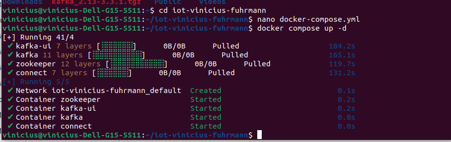
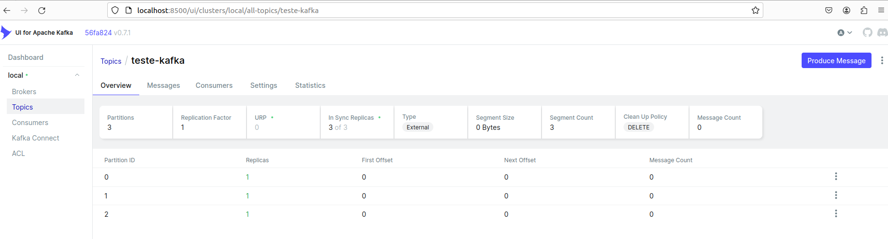
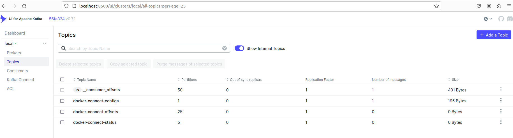
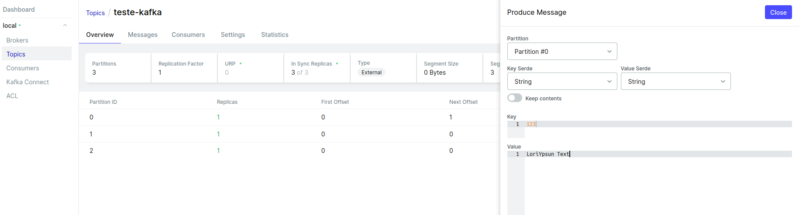
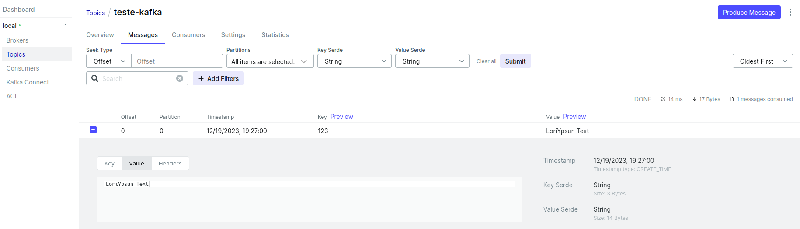
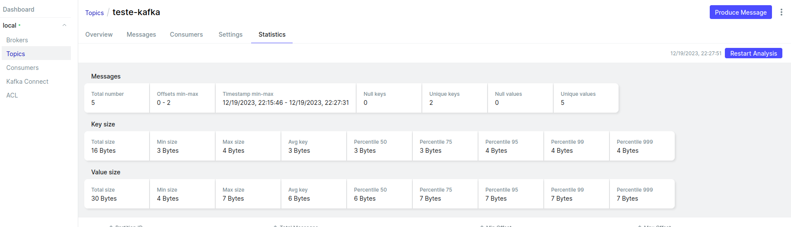
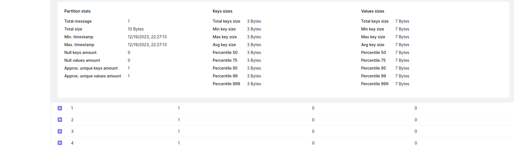
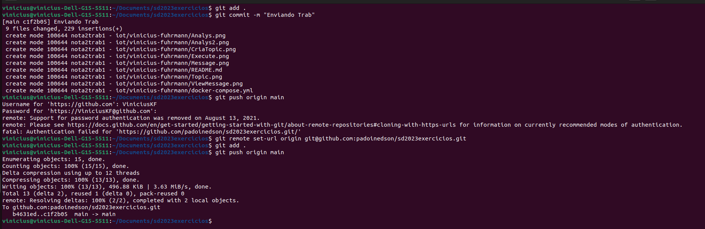

## Trabalho em IoT: Instalação do Apache Kafka, Zookeeper e Kafka UI

------------

Aluno: Vinicius Krupp Fuhrmann

------------

Neste trabalho, a implementação e desenvolvimento de soluções IoT demandam a utilização do Docker e Docker Compose para a instalação do Apache Kafka, Zookeeper e Kafka UI. Essas ferramentas são essenciais para a criação de um ambiente eficiente e escalável, facilitando o processamento de eventos em tempo real.

### 1. Instalações

 ->Fazer o download do kafka: wget https://archive.apache.org/dist/kafka/3.3.1/kafka_2.13-3.3.1.tgz
 
 ->Descompactar o arquivo: tar -xzf kafka_2.13-3.3.1.tgz

##### Criar arquivo chamado "docker-compose.yml" com o seguinte conteudo:

	version: '3'
	services:
	  zookeeper:
	    image: confluentinc/cp-zookeeper:6.0.1
	    hostname: zookeeper
	    container_name: zookeeper
	    ports:
	      - "2181:2181"
	    environment:
	      ZOOKEEPER_CLIENT_PORT: 2181
	      ZOOKEEPER_TICK_TIME: 2000

	  kafka:
	    image: confluentinc/cp-kafka:latest
	    hostname: kafka
	    container_name: kafka
	    depends_on:
	      - zookeeper
	    ports:
	      - "32000:32000"
	      - "9092:9092"
	    environment:
	      KAFKA_BROKER_ID: 1
	      KAFKA_ZOOKEEPER_CONNECT: 'zookeeper:2181'
	      KAFKA_LISTENER_SECURITY_PROTOCOL_MAP: PLAINTEXT:PLAINTEXT,PLAINTEXT_HOST:PLAINTEXT
	      KAFKA_ADVERTISED_LISTENERS: PLAINTEXT://kafka:9092,PLAINTEXT_HOST://localhost:32000
	      KAFKA_OFFSETS_TOPIC_REPLICATION_FACTOR: 1
	      KAFKA_GROUP_INITIAL_REBALANCE_DELAY_MS: 0
	      CONFLUENT_METRICS_REPORTER_BOOTSTRAP_SERVERS: kafka:9092
	      CONFLUENT_METRICS_REPORTER_ZOOKEEPER_CONNECT: zookeeper:2181
	      CONFLUENT_METRICS_REPORTER_TOPIC_REPLICAS: 1
	      CONFLUENT_METRICS_ENABLE: 'false'

	  connect:
	    image: streamthoughts/kafka-connect-file-pulse:2.3.0
	    container_name: connect
	    depends_on:
	      - kafka
	    ports:
	      - "8083:8083"
	    environment:
	      CONNECT_BOOTSTRAP_SERVERS: 'kafka:9092'
	      CONNECT_REST_ADVERTISED_HOST_NAME: connect
	      CONNECT_REST_PORT: 8083
	      CONNECT_GROUP_ID: compose-connect-group
	      CONNECT_CONFIG_STORAGE_TOPIC: docker-connect-configs
	      CONNECT_CONFIG_STORAGE_REPLICATION_FACTOR: 1
	      CONNECT_OFFSET_FLUSH_INTERVAL_MS: 10000
	      CONNECT_OFFSET_STORAGE_TOPIC: docker-connect-offsets
	      CONNECT_OFFSET_STORAGE_REPLICATION_FACTOR: 1
	      CONNECT_STATUS_STORAGE_TOPIC: docker-connect-status
	      CONNECT_STATUS_STORAGE_REPLICATION_FACTOR: 1
	      CONNECT_KEY_CONVERTER: org.apache.kafka.connect.storage.StringConverter
	      CONNECT_VALUE_CONVERTER: org.apache.kafka.connect.json.JsonConverter
	      CONNECT_INTERNAL_KEY_CONVERTER: "org.apache.kafka.connect.json.JsonConverter"
	      CONNECT_INTERNAL_VALUE_CONVERTER: "org.apache.kafka.connect.json.JsonConverter"
	      CONNECT_ZOOKEEPER_CONNECT: 'zookeeper:2181'
	      CONNECT_PLUGIN_PATH: "/usr/share/java,/usr/share/confluent-hub-components/"
	      CONNECT_LOG4J_ROOT_LOGLEVEL: "INFO"
	    volumes:
	      - /dev/tmp/data:/var/share/kafka
	    
	  
	  kafka-ui:
	    image: provectuslabs/kafka-ui:latest
	    container_name: kafka-ui
	    environment:
	      KAFKA_CLUSTERS_0_NAME: local
	      KAFKA_CLUSTERS_0_BOOTSTRAPSERVERS: kafka:9092
	      KAFKA_CLUSTERS_0_ZOOKEEPER: zookeeper:2181
	      KAFKA_CLUSTERS_0_KAFKACONNECT_0_NAME: connect
	      KAFKA_CLUSTERS_0_KAFKACONNECT_0_ADDRESS: 'http://connect:8083'
	    ports:
	      - 8500:8080
	      

------------

### 2. Execução

 ->Iniciar o serviço: docker compose up -d
 
 
 
 ->Acessar o kafka-ui na url http://localhost:8500
 
 ->Criar Topico ao clicar em Add a Topic no canto superior direito

 
 
 ->Definir o nome do tópico e a quantidade de partições
 
 
 
 ->Criar mensagem
 
 ->Clique no botão Produce Message
 
 ->Defina os atributos Key e Value
 
 
 
 ->Ler menssagem
 
 ->Na aba Messages teremos o que foi criado
 
 
 

------------

### 3. Novidade
 ->Utilização do Kafka UI
 ->Análise de informações dos tópicos
 
 
 
 

------------

### 4. Comandos Git

 
 
 
 
 
 
 
 
 
 
 
 
 
 
 
 
