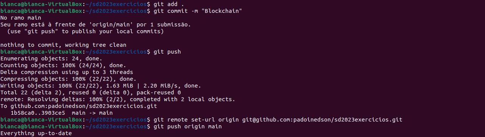

# Bianca Carolina Dahmer

## Criação para armazenar dados Blockchain
Esta pasta será compartilhada com o container. 
Para isso utilizei os comandos abaixo:

    $ cd ~
    $ mkdir ethereum

## Arquivo salvo com o nome **genesis.json** dentro da pasta **Etherum**

    {
        "config": {
        "chainId": 2023,
        "homesteadBlock": 0,
        "eip150Block": 0,
        "eip155Block": 0,
        "eip158Block": 0,
        "byzantiumBlock": 0,
        "constantinopleBlock": 0,
        "petersburgBlock": 0,
        "istanbulBlock": 0
        },
        "alloc": {
        "0x873fdF11A26934Cc21FaB49c1d9Aae5b7Ea5c94f": {
        "balance": "1000"
        },
        "0x3E7da3B7d0547761796A91F7bca917Db35e95A31": {
        "balance": "2000"
        },
        "0x012927e15d064d3867B92872843e347376E98014": {
        "balance": "3000"
        },
        "0xYourMinerAddress": {
        "balance": "150" 
        }
        },
        "coinbase": "0xYourMinerAddress",
        "difficulty": "0x20000",
        "extraData": "",
        "gasLimit": "0x2fefd8",
        "nonce": "0x0000000000000111",
        "mixhash": "0x0000000000000000000000000000000000000000000000000000000000000000",
        "parentHash": "0x0000000000000000000000000000000000000000000000000000000000000000",
        "timestamp": "0x00"
    }

O arquivo genesis.json foi configurado para a criação de dois usuários com os valores (1000, 2000, 3000) após a mineração ele será recompensado com um valor de 150 bitcoins. "NOVIDADE ACRESCENTADA AO ARQUIVO GENESIS"

## Download da Imagem
Neste trabalho foi utilizada a mesma imagem usada em aula. 
Link da imagem:  https://hub.docker.com/r/ethereum/client-go:release-1.10

    $ sudo docker pull ethereum/client-go:release-1.10

## Executar o container
No Terminal 1 - Gerenciar Docker

    $ sudo docker run -d --name ethereum-node -v $HOME/ethereum:/root -p 8545:8545 -p 8544:8544 -p 30301:30301 -p 30302:30302 -it --entrypoint=/bin/sh ethereum client-go:release-1.10

Para rodar o Container

    $ sudo docker start ethereum-node
    $ sudo docker ps

Caso você deseja excluir o Container

    $ sudo docker stop ethereum-node
    $ sudo docker rm ethereum-node  

Agora vamos acessar o container no **Terminal 2** e confirmar se o arquivo genesis.json está no local

    $ sudo docker exec -it ethereum-node sh
    $ cd /root
    $ ls
    $ cat genesis.json

Agora vamos acessar o container no **Terminal 3** e confirmar se o arquivo genesis.json está no local

    $ sudo docker exec -it ethereum-node sh
    $ cd /root
    $ ls
    $ cat genesis.json

Agora vamos acessar o container no **Terminal 4** e confirmar se o arquivo genesis.json está no local

    $ sudo docker exec -it ethereum-node sh
    $ cd /root
    $ ls
    $ cat genesis.json

# CRIAR CONTAS
Agora iremos realizar o cadastro das contas

No **Termina 2** execute o comando abaixo:                         
É importante ressaltar que você anote e guarde a sua **SENHA** e a **CHAVE PUBLICA** em um bloco de notas!

    $ geth account new --datadir ~/bia1

No **Termina 3** execute o comando abaixo:                         
É importante ressaltar que você anote e guarde a sua **SENHA** e a **CHAVE PUBLICA** em um bloco de notas!

    $ geth account new --datadir ~/bia2

No **Termina 4** execute o comando abaixo:                         
É importante ressaltar que você anote e guarde a sua **SENHA** e a **CHAVE PUBLICA** em um bloco de notas!

    $ geth account new --datadir ~/bia3

Para visualização das chaves privadas das contas, execute o comando abaixo

    $ cat /root/bia1/keystore/nome_do_arquivo_indicado_na_criacao

## Atualize as chaves públicas das contas criadas no arquivo genesis.json
No **Terminal 1** edite os campos alloc (atualizar as chaves públicas dos usuários criados: "chave publica": "valor inicial wei/eth")

    $ cd ~
    $ nano ethereum/genesis.json

    "alloc": {
    "0xEed8E55794C5680D0c631597e02F6ce2B75AF631": {
      "balance": "1000"
    },
    "0x95952D7A666Ad834EfcE2357f5a31F530329bA3F": {
      "balance": "2000"
    },
     "0xC3C4DfA771a630E821C9905F069C6a92C7Ae3019": {
      "balance": "3000"
    },
    "0x0000000000000000000000000000000000000000": {
      "balance": "150"} 
    }

## Conferir arquivo genesis.json
No **Terminal 2**

    $ cat /root/genesis.json

# NÓS
Para inicializar os nós na rede

No **TERMINAL 2**

    $ cd /root
    $ geth --datadir /root/bia1/ init genesis.json

No **TERMINAL 3**

    $ cd /root
    $ geth --datadir /root/bia2/ init genesis.json

No **TERMINAL 4**

    $ cd /root
    $ geth --datadir /root/bia3/ init genesis.json

## Colocar os nós da rede para rodar
No **TERMINAL 2**                
Anotar e guardar o seu enode!

    $ geth --datadir ~/bia1 --networkid 2023 --http --http.api 'txpool,eth,net,web3,personal,admin,miner' --http.corsdomain '*' --authrpc.port 8547 --allow-insecure-unlock console

No **TERMINAL 3**                          
Anotar e guardar o seu enode!

    $ geth --datadir ~/bia2 --networkid 2023 --http --http.api 'txpool,eth,net,web3,personal,admin,miner' --http.corsdomain '*' --authrpc.port 8547 --allow-insecure-unlock console

No **TERMINAL 4**                         
Anotar e guardar o seu enode!

    $ geth --datadir ~/bia3 --networkid 2023 --http --http.api 'txpool,eth,net,web3,personal,admin,miner' --http.corsdomain '*' --authrpc.port 8547 --allow-insecure-unlock console

Vamos definir a mesma networkid do arquivo **genesis.json** define uma porta diferente para cada nodo --port 30302 vamos usar "--allow-insecure-unlock" para habilitar "unlocking accounts" opção "console" chama o console do "geth"

# ADM
Para visualizar a quantidade de pares 

    $ net.peerCount

### Para adiciona um par

    $ admin.addPeer("atualizar com o enode do outro nó");

**Exemplo:**
    
    $ admin.addPeer("enode://dbf5fc5b10036895f3eee2dd81eed1ed29c52300e15e250ffbfb00b321f3a2fe7be9b9c00bc716d927d783c91c6a6a2c0aef2da1e397208a19020f52fe764409@127.0.0.1:30303");

Informando quando colocamos o nó para rodar

### Vamos verificar se adicionou os pares

    $ net.peerCount

### Vamos visualizar as informações sobre os pares

    $ admin.peers

### Visualizar as informações sobre os nós 
**genesis** e **head** ainda são os mesmos

    $ admin.nodeInfo

# CONTAS
**Para exibir as contas**

    $ eth.accounts

LEMBRANDO que em cada terminal temos uma conta

## Vamos verificar os saldos das contas

    $ eth.getBalance("atualizar com a chave publica")

Exemplo:

        $ eth.getBalance("0xd1a2DdAd9d9Da721ADa7eE7d67731C5cFFd37434")

Uma conta deve ter saldo 1000, 2000 e a outra 3000.

# MINERAR
### Iniciar a mineração

    $ miner.start(10)

10 indica a quantidade de threads. Verificar o saldo enquanto minera para poder efetivar uma transferência.

### Parar a mineração

    $ miner.stop()

### Para verificar o saldo - conferir os ganhos da mineração

    $ eth.getBalance("0xd1a2DdAd9d9Da721ADa7eE7d67731C5cFFd37434")

### Conferir - genesis e head se não são os mesmos

    $ admin.nodeInfo

# TRANSAÇÃO
### Vamos verificar o saldo das contas

    $ eth.getBalance("atualizar com a chave publica")

    $ eth.getBalance("0xEed8E55794C5680D0c631597e02F6ce2B75AF631")
    $ eth.getBalance("0x95952D7A666Ad834EfcE2357f5a31F530329bA3F")
    $ eth.getBalance("0xC3C4DfA771a630E821C9905F069C6a92C7Ae3019")

### CONTA 1

### CONTA 2 

### CONTA 3

### Vamos liberar a conta para uso

    $ personal.unlockAccount("0xEed8E55794C5680D0c631597e02F6ce2B75AF631")
    $ personal.unlockAccount("0x95952D7A666Ad834EfcE2357f5a31F530329bA3F")
    $ personal.unlockAccount("0xC3C4DfA771a630E821C9905F069C6a92C7Ae3019")

### Vamos enviar uma transação 

Transaçaõ da conta 1 para a conta 2

    $ eth.sendTransaction({from:"0xEed8E55794C5680D0c631597e02F6ce2B75AF631", to:"0x95952D7A666Ad834EfcE2357f5a31F530329bA3F", value:1111, gas:21000})
    
Transaçaõ da conta 2 para a conta 3

$ eth.sendTransaction({from:"0x95952D7A666Ad834EfcE2357f5a31F530329bA3F", to:"0xC3C4DfA771a630E821C9905F069C6a92C7Ae3019", value:1111, gas:21000})

Transaçaõ da conta 3 para a conta 1

$ eth.sendTransaction({from:"0xC3C4DfA771a630E821C9905F069C6a92C7Ae3019", to:"0xEed8E55794C5680D0c631597e02F6ce2B75AF631", value:1111, gas:21000})

### Vamos verificar o pool de transações

    $ txpool.status

verifique que a transação está pendente {pending: 1, queued: 0}

### Iniciar a mineração

    $ miner.start(10)

### Parar a mineração

    $ miner.stop()

### Vamos verificar o pool de transações

    $ txpool.status

verifique que a transação foi realizada {pending: 1, queued: 0}

### Vamor verificar o novo saldo das contas

    $ eth.getBalance("0xEed8E55794C5680D0c631597e02F6ce2B75AF631")
    $ eth.getBalance("0x95952D7A666Ad834EfcE2357f5a31F530329bA3F")
    $ eth.getBalance("0xC3C4DfA771a630E821C9905F069C6a92C7Ae3019")

### Sair do console

    $ exit

### Para criar contas dentro do NÓ

    $ personal.newAccount()

### Para exibir todas as contas

     $ eth.accounts

### Ver o saldo de cada conta

    $ eth.getBalance("0xEed8E55794C5680D0c631597e02F6ce2B75AF631")
    $ eth.getBalance("0x95952D7A666Ad834EfcE2357f5a31F530329bA3F")
    $ eth.getBalance("0xC3C4DfA771a630E821C9905F069C6a92C7Ae3019")

# CONTAINER 
### Parar os containers 

    $ sudo docker stop ethereum-node

### Excluir o container

    $ docker rm ethereum-node

### Excluir a pasta 

    $ cd ~ $ sudo rm -rf ethereum

# NOVIDADE

Vamos utilizar o comando:

    $ eth.blockNumber

Para obter o número de blocos mais recentes da Blockchain Ethereum

# COMANDOS GIT

## GIT ADD, GIT COMMIT E GIT PUSH

