## Nota2 Trabalho2 - BlockChain

## Autor
Nome: Bruno César Guisso de Souza

## Instalação
1. Primeiro Instalamos o Docker.
```bash
    sudo apt install docker
```
    
```bash
    sudo apt install docker.io
```
    
2. Baixamos a Imagem do 'ethereum/client-go':
```bash
    sudo docker pull ethereum/client-go:release-1.10
```

3. Criamos uma pasta 'ethereum':
```bash
    mkdir ethereum
```
    
4. Entramos na Pasta
```bash
    cd ethereum
```
    
5. Criamos o Arquivo `genesis.json`:
```bash
    nano genesis.json
```

6. . Colamos e salvamos o seguinte conteúdo:
```json
    {
        "config": {
            "chainId": 2023,
            "homesteadBlock": 0,
            "eip150Block": 0,
            "eip155Block": 0,
            "eip158Block": 0,
            "byzantiumBlock": 0,
            "constantinopleBlock": 0,
            "petersburgBlock": 0,
            "istanbulBlock": 0
        },
        "alloc": {
            "0x90bA23C7A92C7d524E5B5cc9D6dA30D65Ba30944": {
                "balance": "5000"
            },
            "0x90F8BE615B29B10B2E4B9BbF3ae17B970c86b955": {
                "balance": "6000"
            }
        },
        "coinbase": "0x0000000000000000000000000000000000000000",
        "difficulty": "0x20000",
        "extraData": "",
        "gasLimit": "0x2fefd8",
        "nonce": "0x0000000000000111",
        "mixhash": "0x0000000000000000000000000000000000000000000000000000000000000000",
        "parentHash": "0x0000000000000000000000000000000000000000000000000000000000000000",
        "timestamp": "0x00"
    }
```
    
7. Saia da pasta:
```bash
    cd
```

8. Execute o container:
```bash
    sudo docker run -d --name ethereum-node -v $HOME/ethereum:/root -p 8545:8545 -p 8544:8544 -p 30301:30301 -p 30310:30310 -p 30320:30320 -p 30330:30330 -it --entrypoint=/bin/sh ethereum/client-go:release-1.10
```

9. Acesse o container, entre em /root, verifique se o arquivo `genesis.json` está presente (Abra 2 terminais adicionais para as outras contas):
```bash
    sudo docker exec -it ethereum-node sh
```
    
```bash
    cd /root
```
    
```bash
    ls
```

9. Crie as contas usando (Cada uma em um terminal):
```bash
    geth account new --datadir ~/brunosouza1
```
   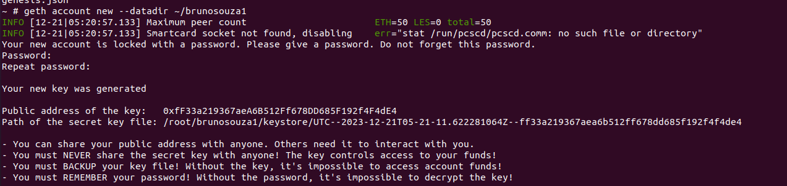 
```bash
    geth account new --datadir ~/brunosouza2
```
   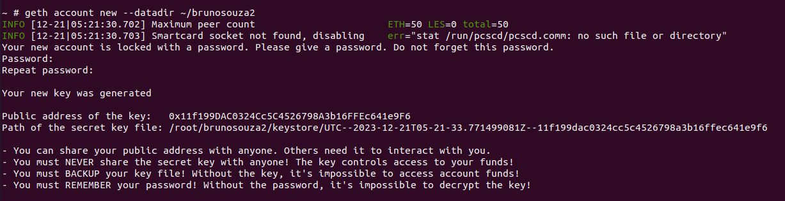
```bash
    geth account new --datadir ~/brunosouza3
```
   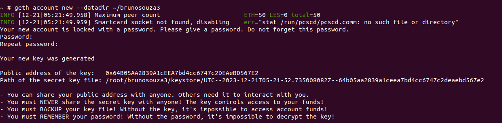
10. Copie a chave pública e atualize o arquivo `genesis.json`.

```json
    {
        "config": {
            "chainId": 2023,
            "homesteadBlock": 0,
            "eip150Block": 0,
            "eip155Block": 0,
            "eip158Block": 0,
            "byzantiumBlock": 0,
            "constantinopleBlock": 0,
            "petersburgBlock": 0,
            "istanbulBlock": 0
        },
        "alloc": {
            "0xfF33a219367aeA6B512Ff678DD685F192f4F4dE4": {
                "balance": "1000"
            },
            "0x11f199DAC0324Cc5C4526798A3b16FFEc641e9F6": {
                "balance": "2000"
            },
            "0x64B05AA2839A1cEEA7bd4cc6747c2DEAeBD567E2": {
                "balance": "3000"
            }
        },
        "coinbase": "0x0000000000000000000000000000000000000000",
        "difficulty": "0x20000",
        "extraData": "",
        "gasLimit": "0x2fefd8",
        "nonce": "0x0000000000000111",
        "mixhash": "0x0000000000000000000000000000000000000000000000000000000000000000",
        "parentHash": "0x0000000000000000000000000000000000000000000000000000000000000000",
        "timestamp": "0x00"
    }
```

11. Inicie os nós na rede:
```bash
    geth --datadir /root/brunosouza1/ init genesis.json
```
    
```bash
    geth --datadir /root/brunosouza2/ init genesis.json
```
    
```bash
    geth --datadir /root/brunosouza3/ init genesis.json
```

12. Rode os nós na rede:
```bash
    geth --datadir ~/brunosouza1 --networkid 2023 --http --http.api 'txpool,eth,net,web3,personal,admin,miner' --http.corsdomain '*' --authrpc.port 8547 --allow-insecure-unlock console
```

```bash
    geth --datadir ~/brunosouza2 --networkid 2023 --http --http.api 'txpool,eth,net,web3,personal,admin,miner' --http.corsdomain '*' --authrpc.port 8546 --port 30302 --http.port 8544 --allow-insecure-unlock console
```

```bash
    geth --datadir ~/brunosouza3 --networkid 2023 --http --http.api 'txpool,eth,net,web3,personal,admin,miner' --http.corsdomain '*' --authrpc.port 8548 --port 30500 --http.port 30501 --allow-insecure-unlock console
```

13. Verifique o Saldo inicial de cada conta em seu terminal especifico com:
```bash
    eth.getBalance("0xfF33a219367aeA6B512Ff678DD685F192f4F4dE4")
```
   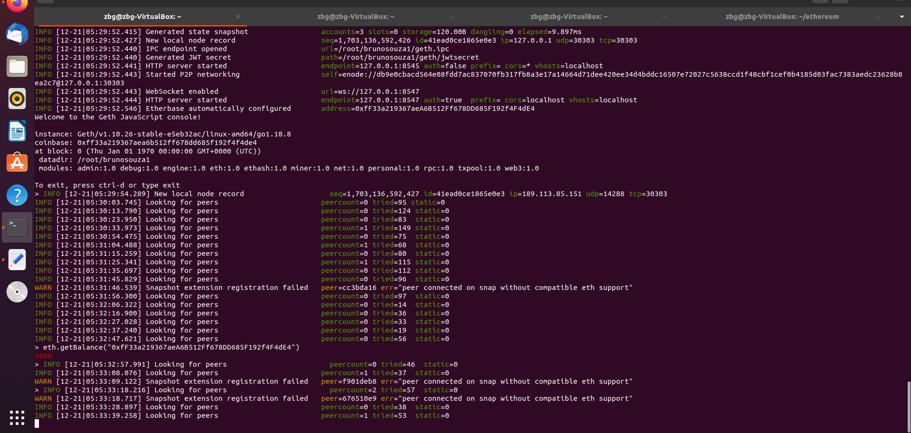 
```bash
    eth.getBalance("0x11f199DAC0324Cc5C4526798A3b16FFEc641e9F6")
```
   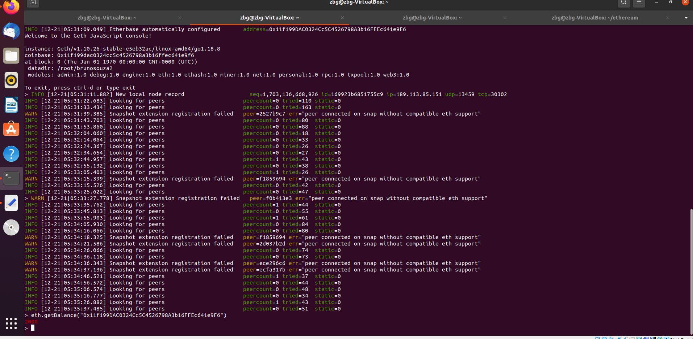  
```bash
    eth.getBalance("0x64B05AA2839A1cEEA7bd4cc6747c2DEAeBD567E2")
```
   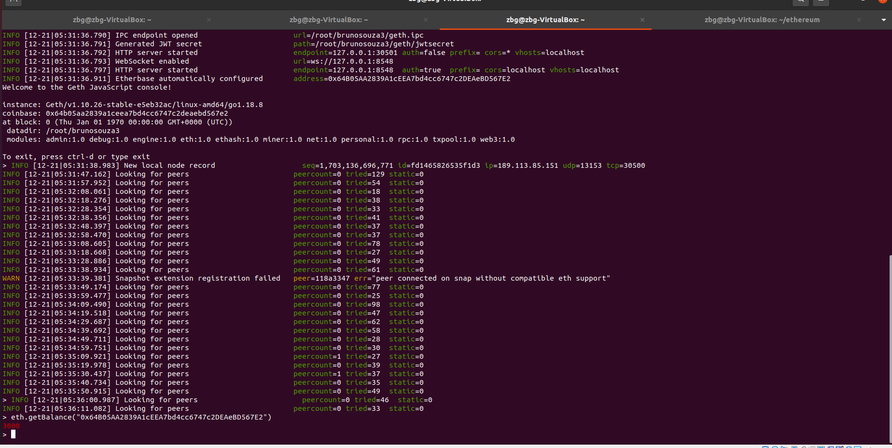 
 
14. Iniciando a mineração, verifique o saldo para começar a minerar:
```bash
    miner.start(10)
```
   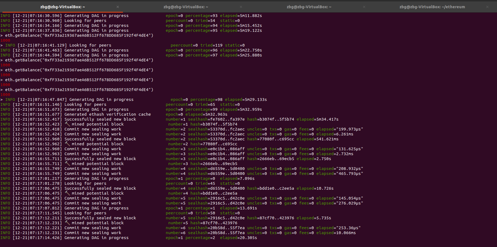
   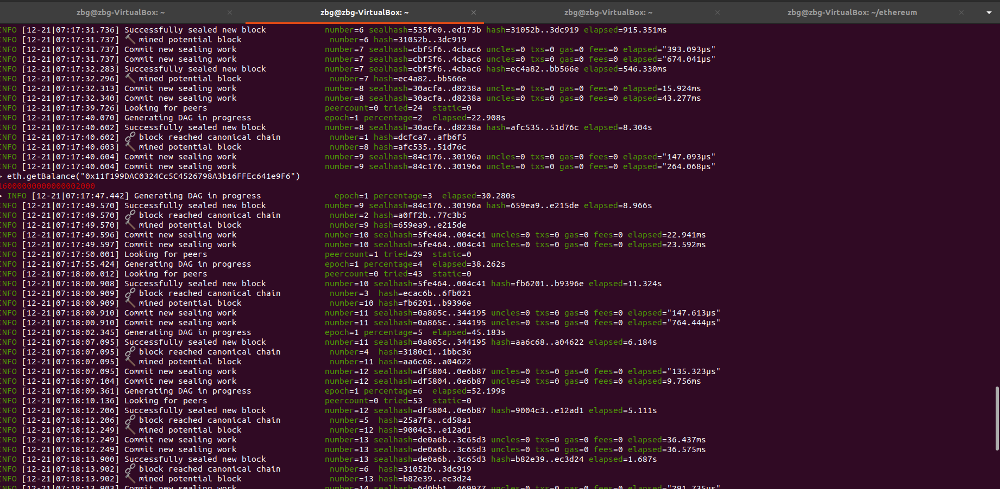
   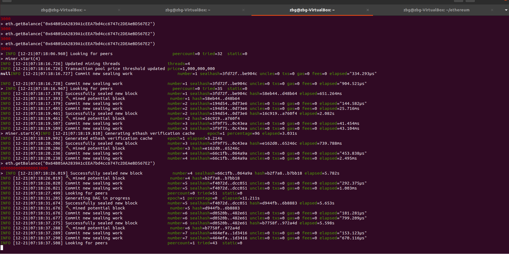

15. Parando a mineração:
```bash
    miner.stop()
```

16. Desbloqueie as contas para transações colando o comando abaixo e digitando a senha escolhida pra conta:
```bash
    personal.unlockAccount("0xfF33a219367aeA6B512Ff678DD685F192f4F4dE4")
```
    
```bash
    personal.unlockAccount("0x11f199DAC0324Cc5C4526798A3b16FFEc641e9F6")
```
    
```bash
    personal.unlockAccount("0x64B05AA2839A1cEEA7bd4cc6747c2DEAeBD567E2")
```

17. Transferência entre contas: Primeira conta para a segunda:
```bash
    eth.sendTransaction({from:"0xfF33a219367aeA6B512Ff678DD685F192f4F4dE4", to:"0x11f199DAC0324Cc5C4526798A3b16FFEc641e9F6", value:111, gas:21000})
```
   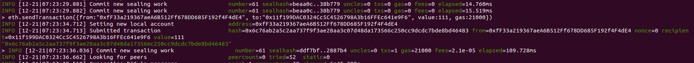

18. Transferência entre contas: Segunda conta para a terceira:
```bash
    eth.sendTransaction({from:"0x11f199DAC0324Cc5C4526798A3b16FFEc641e9F6", to:"0x64B05AA2839A1cEEA7bd4cc6747c2DEAeBD567E2", value:222, gas:21000})
   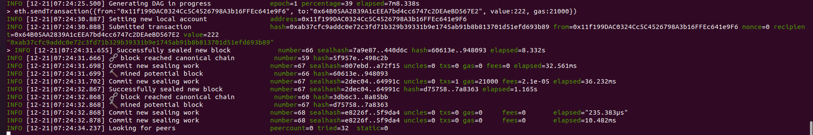
```

19. Verifique o pool de transações:
```bash
    txpool.status
```

20. Inicie a mineração para confirmar transações:
```bash
    miner.start(10)
```

21. Pare a mineração para efetuar as transações:
```bash
    miner.stop()
```

22. Verificando o saldo final das contas:
```bash
    eth.getBalance("0xfF33a219367aeA6B512Ff678DD685F192f4F4dE4")
```
    
```bash
    eth.getBalance("0x11f199DAC0324Cc5C4526798A3b16FFEc641e9F6")
```
   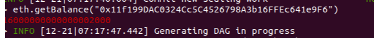
```bash
    eth.getBalance("0x64B05AA2839A1cEEA7bd4cc6747c2DEAeBD567E2")
   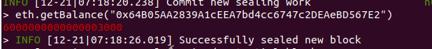
```
