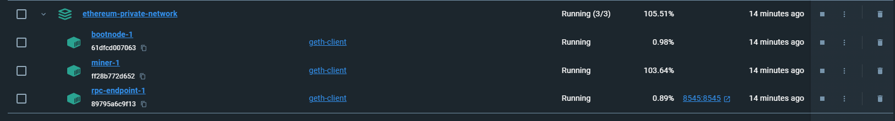
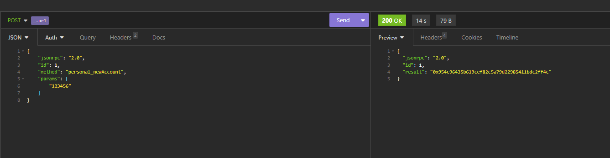
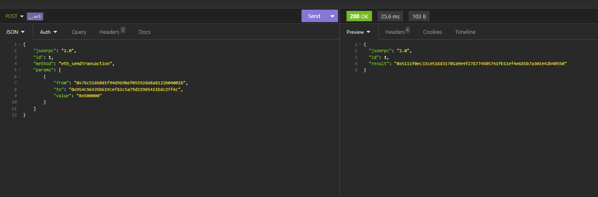
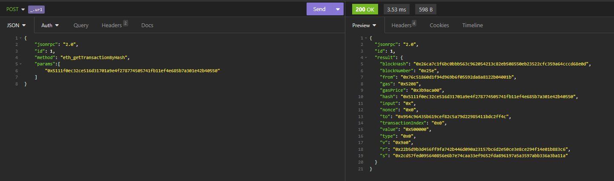
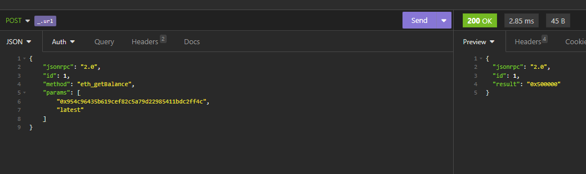

Carlos Eduardo

Requisitos:
- Ferramenta para fazer requisições HTTP

Primeiro execute o comando para criar os containers através do arquivo docker-compose

      docker-compose up -d

Novidades
- Endpoints HTTP para conexão externa
- Algoritmo de mineração Proof Of Work

Todos os comandos da documentação do GETH podem ser executados seguindo o padrão das requisições nos prints

Prints
1. Containers
   

2. Criação de nova conta
   

3. Envio de transação entre duas contas
   

4. Dados da transação
   

5. Saldo da conta que recebeu a transação
   