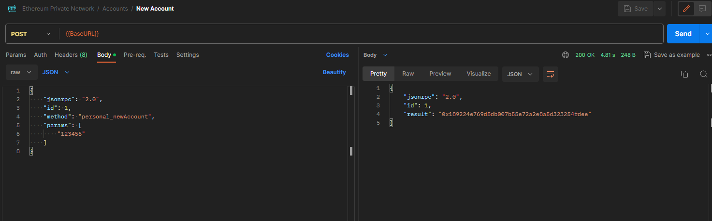
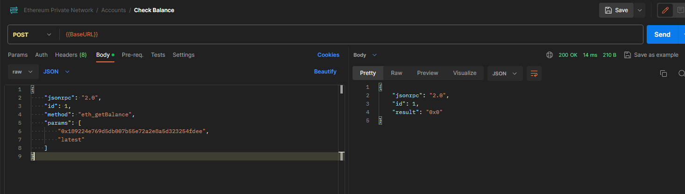

#### Aluno: Gabriel Bauer Vieira

### Requisitos
- Docker
- Ferramenta para fazer requisições HTTP (postman de preferência)

### Passos para execução
#### 1. Executar o comando para criar os containers
  ``` sh
      docker-compose up -d
  ```

#### 2. Após a criação do container, aguarde uns minutos (ou horas, dependendo do hardware) para que a DAG seja criada.


#### 3. Verificar se a conexão RPC está ativa


#### 4. Testar os diferentes Endpoints ([arquivo de rotas](Ethereum-Private-Network.postman_collection.json))

### Novidades
- Segurança nas contas (não liberamos o acesso full para todas as contas)
- Conexão via RPC (possibilita executar métodos via requisição ou sistemas web externos)
- Mineração com antigo algoritmo de consenso POW


### Prints
1. Containers
   

2. Criação de nova conta
   

3. Verificação de saldo da conta nova
   

4. Saldo conta de mineração
   

5. Envio de transação entre duas contas
   

6. Execução do minerador
   

7. Dados da transação
   

8. Saldo da conta que recebeu a transação
   