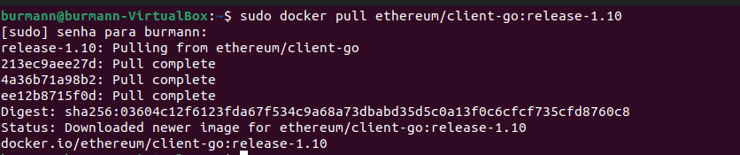
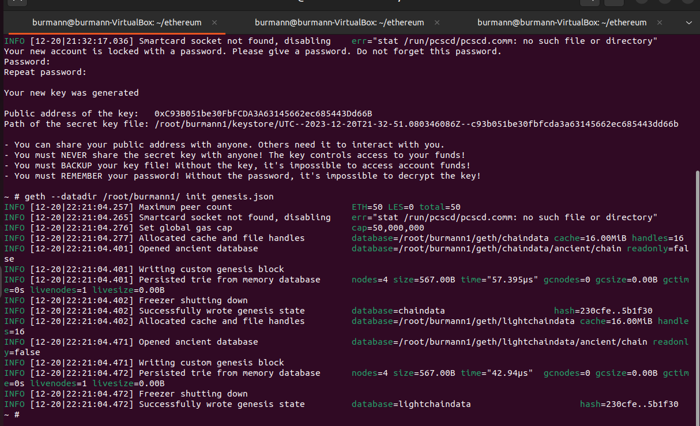
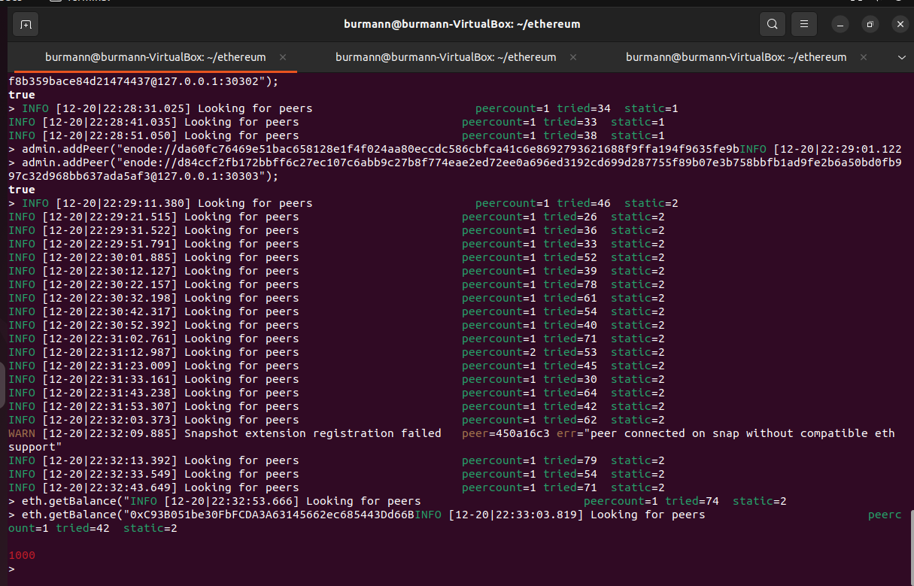
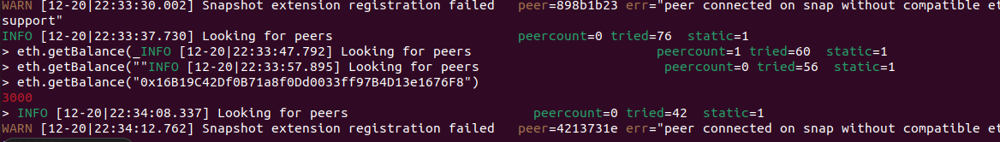
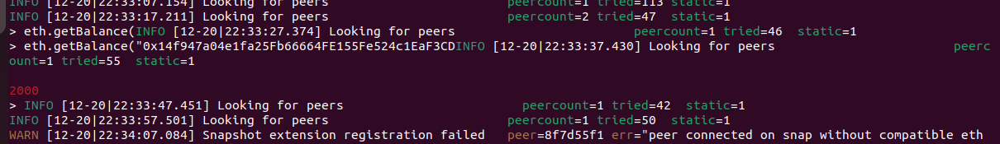
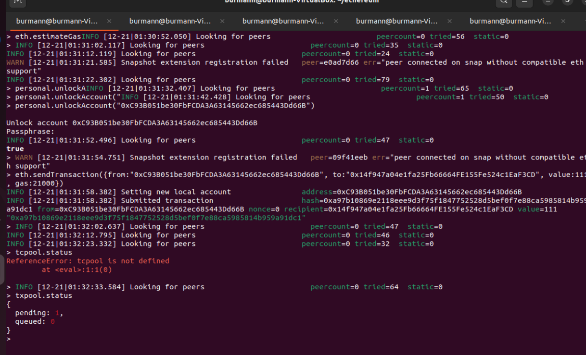
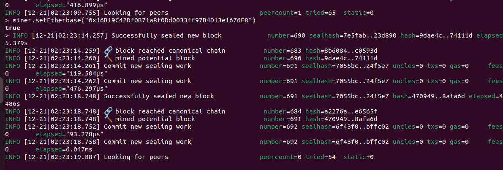
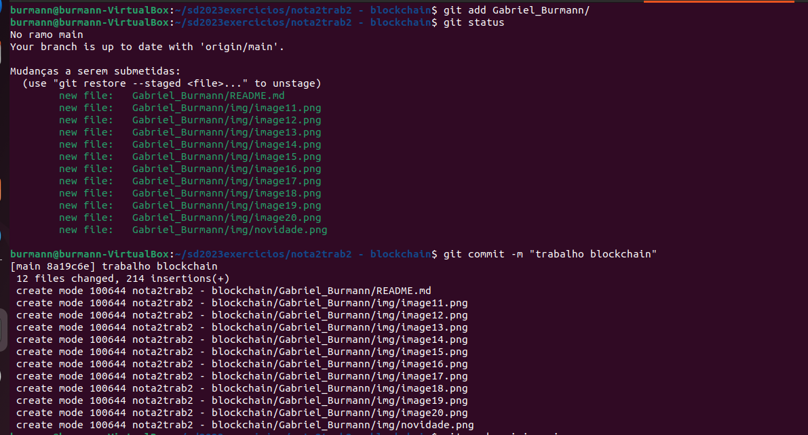
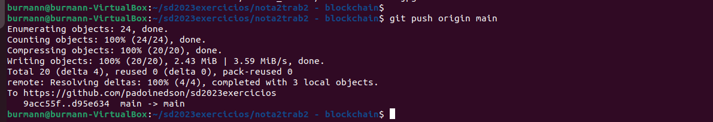

Gabriel Burmann

##Criação da Blockchain
Instalar docker.io

`sudo apt install docker.io`

Baixar o container utilizado durante esse trabalho

 
`$ sudo docker pull ethereum/client-go:release-1.10`

Criar uma pasta “ethereum”

`$ mkdir ethereum`

Dentro dela um arquivo genesis.json

`$ cd ethereum`
`$ nano genesis.json`

Nesse arquivo colocar o seguinte texto:

      {
        "config": {
          "chainId": 2023,
          "homesteadBlock": 0,
          "eip150Block": 0,
          "eip155Block": 0,
          "eip158Block": 0,
          "byzantiumBlock": 0,
          "constantinopleBlock": 0,
          "petersburgBlock": 0,
          "istanbulBlock": 0
        },
        "alloc": {
          "0xc4A94fFF2225326264dDcD88029Cd6925c693dA0": {
            "balance": "1000"
          },
          "0x16e9fc12F9B30d39Eb5063E593f41c3337311218": {
            "balance": "2000"
          },
          "0xa65EC4b469A1A59339AfBF9dAc1cC32e8F55067B": {
            "balance": "3000"
          }
        },
        "coinbase": "0x0000000000000000000000000000000000000000",
        "difficulty": "0x2000",
        "extraData": "",
        "gasLimit": "0x2fefd8",
        "nonce": "0x0000000000000111",
        "mixhash": "0x0000000000000000000000000000000000000000000000000000000000000000",
        "parentHash": "0x0000000000000000000000000000000000000000000000000000000000000000",
        "timestamp": "0x00"
      }

Rodar o container

`$ sudo docker run -d --name ethereum-node -v $HOME/ethereum:/root -p 8545:8545 -p 8544:8544 -p 30301:30301 -p 30302:30302 -it --entrypoint=/bin/sh ethereum/client-go:release-1.10`

Abrir mais 2 terminais
Rodar o seguinte comando nos 3 terminais

`$ sudo docker exec -it ethereum-node sh`

`$ cd /root`

## Criação das Contas
Criar uma conta com o seguinte comando em cada terminal 

Conta 1
`$ geth account new --datadir ~/burmann1`

Conta 2
`$ geth account new --datadir ~/burmann2`

Conta 3
`$ geth account new --datadir ~/burmann3`
  

OBS:Atualizar os dados no arquivo genesis.json com a “Public address of the key” de cada conta nos locais de “alloc”: 

"alloc": {
      "0xC93B051be30FbFCDA3A63145662ec685443Dd66B": {
        "balance": "1000"
      },
      "0x14f947a04e1fa25Fb66664FE155Fe524c1EaF3CD": {
        "balance": "2000"
      },
      "0x16B19C42Df0B71a8f0Dd0033ff97B4D13e1676F8": {
        "balance": "3000"
      }

Após isso, rodar os seguintes comandos em cada terminal:

`$ geth --datadir /root/burmann1/ init genesis.json`

Troque o burmann1 para cada usaurio, burmann2 e burmann3

Em cada terminal
`$ geth --datadir ~/burmann1 --networkid 2023 --http --http.api 'txpool,eth,net,web3,personal,admin,miner' --http.corsdomain '*' --authrpc.port 8547 --allow-insecure-unlock console`

`$ geth --datadir ~/burmann2 --networkid 2023 --http --http.api 'txpool,eth,net,web3,personal,admin,miner' --http.corsdomain '*' --authrpc.port 8546 --port 30302 --http.port 8544 --allow-insecure-unlock console`

`$ geth --datadir ~/burmann3 --networkid 2023 --http --http.api 'txpool,eth,net,web3,personal,admin,miner' --http.corsdomain '*' --authrpc.port 8549 --port 30309 --http.port 8599 --allow-insecure-unlock console`

Adicionar peers em nós, para isso os seguintes comandos deve ser usados em cada terminais:

Os comandos devem estar no formato: 
admin.addPeer("enode://da60fc76469e51bac658128e1f4f024aa80eccdc586cbfca41c6e8692793621688f9ffa194f9635fe9b392b6e2269d7f3ffc3543f2bf8b359bace84d21474437@127.0.0.1:30302")

Terminal 1
$ admin.addPeer("<enode da conta número 2>");

$ admin.addPeer("<enode da conta número 3>");

Terminal 2
$ admin.addPeer("<enode da conta número 1>");

$ admin.addPeer("<enode da conta número 3>");

Terminal 3
$ admin.addPeer("<enode da conta número 2>");

$ admin.addPeer("<enode da conta número 1>");

Conferir o saldo de cada conta:

$ eth.getBalance("0x16B19C42Df0B71a8f0Dd0033ff97B4D13e1676F8")

Usuario 1

Usuario 2 

usuario 3

## Minerar
Iniciar mineração

$ miner.start(10)

Parar a mineração

$ miner.stop()

Conferir o saldo de cada conta novamente

$ eth.getBalance("0x16B19C42Df0B71a8f0Dd0033ff97B4D13e1676F8")

## Fazer uma Transação

eth.sendTransaction({from:"0xC93B051be30FbFCDA3A63145662ec685443Dd66B", to:"0x14f947a04e1fa25Fb66664FE155Fe524c1EaF3CD", value:100, gas:21000})

Transferindo 100 ETH da conta 1 para a 2

eth.sendTransaction({from:"0x14f947a04e1fa25Fb66664FE155Fe524c1EaF3CD", to:"0xC93B051be30FbFCDA3A63145662ec685443Dd66B", value:300, gas:21000})

Transferindo 300 ETH da conta 2 para a conta 3

Iniciar um mineração novamente para registrar as transações

$ miner.start(10)

$ miner.stop()

Conferir o saldo atual em todas as contas

$ eth.getBalance("0xC93B051be30FbFCDA3A63145662ec685443Dd66B")

$ eth.getBalance("0x14f947a04e1fa25Fb66664FE155Fe524c1EaF3CD")

$ eth.getBalance("0x16B19C42Df0B71a8f0Dd0033ff97B4D13e1676F8")

## Minha novidade
Para não precisar abrir terminal para minerar em outro usuário podemos utilizar o miner.setEtherbase("seu_endereco"). Basicamente ele troca o endereco e todas as recompesas da mineração são creditadas na conta associada a esse endereço.
  

## Git

