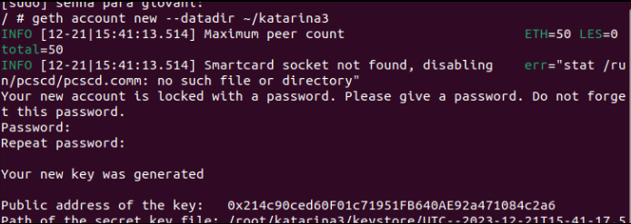
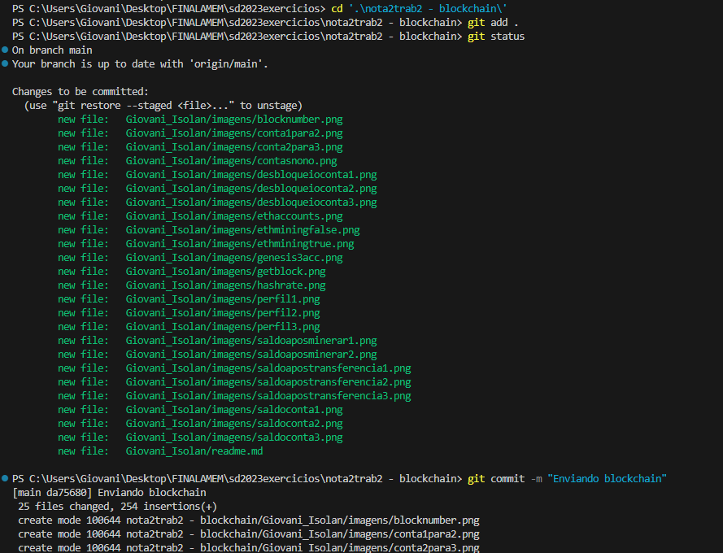

**Blockchain**

Primeiramente devemos atualizar.

    sudo apt update

Crie um caminho chamado 'ethereum' e entre na pasta:

    mkdir ethereum
    cd ethereum
Crie o arquivo genesis.json:

    nano genesis.json

Cole, salve o seguinte conteúdo e pode sair da pasta:

    {
        "config": {
            "chainId": 2023,
            "homesteadBlock": 0,
            "eip150Block": 0,
            "eip155Block": 0,
            "eip158Block": 0,
            "byzantiumBlock": 0,
            "constantinopleBlock": 0,
            "petersburgBlock": 0,
            "istanbulBlock": 0
        },
        "alloc": {
            "0x90bA23C7A92C7d524E5B5cc9D6dA30D65Ba30944": {
                "balance": "5000"
            },
            "0x90F8BE615B29B10B2E4B9BbF3ae17B970c86b955": {
                "balance": "6000"
            }
        },
        "coinbase": "0x0000000000000000000000000000000000000000",
        "difficulty": "0x20000",
        "extraData": "",
        "gasLimit": "0x2fefd8",
        "nonce": "0x0000000000000111",
        "mixhash": "0x0000000000000000000000000000000000000000000000000000000000000000",
        "parentHash": "0x0000000000000000000000000000000000000000000000000000000000000000",
        "timestamp": "0x00"
    }

Apos isso:

Instale o Docker:

        sudo apt install docker 
        sudo apt install docker.io

Baixe a imagem 'ethereum/client-go':

    sudo docker pull ethereum/client-go:release-1.10

Execute o container:

    sudo docker run -d --name ethereum-node -v $HOME/ethereum:/root -p 8545:8545 -p 8544:8544 -p 30301:30301 -p 30310:30310 -p 30320:30320 -p 30330:30330 -it --entrypoint=/bin/sh ethereum/client-go:release-1.10

Agora abra outros 3 terminais necessarios para as contas.

execute isso:

    sudo docker exec -it ethereum-node sh
    cd /root
    ls

Crie as contas usando o comando abaixo para cada conta:

    geth account new --datadir ~/nome-da-sua-conta

Foi criado 3 contas, yasuo1, garen2 e katarina3.

 

Apos isso, no arquivo genesis criado anteriorimente, substitua os valores das chaves no "alloc" pelos valores da chave de sua conta, e atribua os valores de 1000, 2000 e 3000 para as contas.

    {
        "config": {
            "chainId": 2023,
            "homesteadBlock": 0,
            "eip150Block": 0,
            "eip155Block": 0,
            "eip158Block": 0,
            "byzantiumBlock": 0,
            "constantinopleBlock": 0,
            "petersburgBlock": 0,
            "istanbulBlock": 0
        },
        "alloc": {
            "0x65a7f3862cCdDDD0ABb2f71750d200C65e5FC627": {
                "balance": "1000"
            },
            "0x4c4CC7cD985915c644E0242A3cF79e1B7C5fE6B5": {
                "balance": "2000"
            },
            "0x2A44D4a9061286ff933BEe276D6BE88C4f294f83": {
                "balance": "3000"
            }
        },
        "coinbase": "0x0000000000000000000000000000000000000000",
        "difficulty": "0x20000",
        "extraData": "",
        "gasLimit": "0x2fefd8",
        "nonce": "0x0000000000000111",
        "mixhash": "0x0000000000000000000000000000000000000000000000000000000000000000",
        "parentHash": "0x0000000000000000000000000000000000000000000000000000000000000000",
        "timestamp": "0x00"
    }

Inicie os nós na rede para cada conta:

    geth --datadir /root/nome-da-sua-conta/ init genesis.json

Em cada terminal:

    geth --datadir ~/yasuo1 --networkid 2023 --http --http.api 'txpool,eth,net,web3,personal,admin,miner' --http.corsdomain '*' --authrpc.port 8547 --allow-insecure-unlock console

    geth --datadir ~/garen2 --networkid 2023 --http --http.api 'txpool,eth,net,web3,personal,admin,miner' --http.corsdomain '*' --authrpc.port 8546 --port 30302 --http.port 8544 --allow-insecure-unlock console

    geth --datadir ~/katarina3 --networkid 2023 --http --http.api 'txpool,eth,net,web3,personal,admin,miner' --http.corsdomain '*' --authrpc.port 8548 --port 30500 --http.port 30501 --allow-insecure-unlock console

Em cada terminal, use a chave respectiva para verificar o saldo da conta:

    eth.getBalance("Sua chave publica")

    
    eth.getBalance("Sua chave publica")

    eth.getBalance("Sua chave publica")

Inicie a mineração:

    miner.start(10)

de o comando 'miner.stop()' para parar a mineracao

apos isso e necessario desbloquear as contas para poder fazer as transferencias.

    personal.unlockAccount("sua chave")

    personal.unlockAccount("sua chave")

    personal.unlockAccount("sua chave")

Agora foi feito as transferencia entre as contas:

Conta yasuo1 para garen2:

    eth.sendTransaction({from:"chave", to:"chave", value:111, gas:21000})
    

Conta garen2 para katarina3

    eth.sendTransaction({from:"chave", to:"chave", value:222, gas:21000})

Apos isso para minerar a taxa de gas

    miner.start(10)
    miner.stop()

Agora foi verificado o valor das 3 contas apos a nova mineracao:

    eth.getBalance("chave")

    eth.getBalance("chave")

    eth.getBalance("chave")

**Novidades:**

Usei como referencia esse link para as novidades
https://ethereum.stackexchange.com/questions/28703/full-list-of-geth-terminal-commands

 Cada um desses comandos desempenha um papel específico e é crucial para otimizar a utilização da Ethereum, foi testado a maioria, portanto eu peguei 3 que acredito ser necessario para melhorar a minha experiencia com a blockchain

    eth.accounts
 Esse comando é fundamental porque as contas são a base de todas as interações na blockchain. Ter acesso rápido às informações das contas é essencial para enviar, receber e armazenar criptomoedas, bem como para assinar transações. Simplifica a gestão de ativos e a realização de transações, tornando a experiência mais fluida.
 

    eth.blockNumber 
O número do bloco mais recente é importante para rastrear o progresso da blockchain. Permite saber em que ponto a rede está e ajuda na confirmação de transações. Isso é crítico para garantir que as transações sejam executadas no contexto correto e para acompanhar o estado da rede, tornando a utilização da blockchain mais transparente.

    eth.mining
Saber se um nó está minerando é relevante para a segurança e eficiência da rede. Se um nó está minerando (true), significa que está contribuindo para a validação de transações e a segurança da blockchain, o que é importante para a integridade das operações. Se não estiver minerando (false), pode indicar que o nó não está ativamente envolvido na manutenção da rede. Isso ajuda os usuários a entenderem o papel de seu nó na rede e a otimizar sua participação, se necessário.

Mining true:

Mining false:

 
 

**Novidade extra:**

 
Com o comando

    miner.setExtra("testando 123");

Neste exemplo estou inserindo string "testando 123" como parte do campo extra do bloco que eles estão minerando. Isso não afetaria a integridade dos dados principais do bloco, como transações e nonce, mas permitiria que o minerador incluísse informações personalizadas. 

Isso pode ser usado para várias finalidades, como marcar ou identificar blocos de uma maneira específica para fins de rastreamento ou análise, ou mesmo para incluir dados adicionais que não fazem parte dos campos padrão de um bloco Ethereum.

para ver esses valores precisamos seguir mais esses comandos: 

    eth.blockNumber

 que foi demonstrado na novidade acima

    eth.getBlock("numero do bloco")

 

 extraData: Esta é a parte relevante,  e uma sequência de bytes que pode conter informações personalizadas definidas pelos mineradores. no meu exemplo deu esse valor "0x74657374616e646f20313233" é uma representação hexadecimal que pode ser decodificada para a string "testando 123".

 **Print do git**

 
 